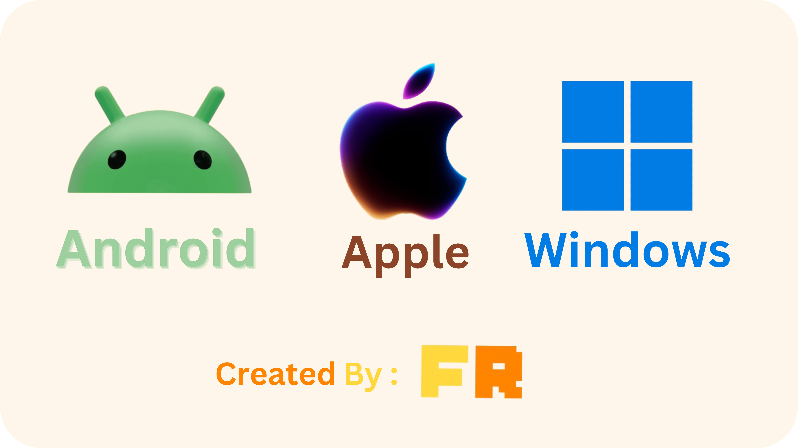

<h1>Awesome Aimw</h1>

<b>AIMW</b> : Android, IOS, MacOS and Windows. A list of awesome projects, libraries, tools, fonts, and dev/design resources

---
<h1 align="center">In case you have any suggestion</h1>

---
<h2 align="center">Go find it</h2>

Pick a platform → browse its categories → open a category → find the project.

<table align="center"><tr>
<td align="center"><a href="#android"> <b>Android</b></a></td>
<td align="center"><a href="#ios"> <b>iOS</b></a></td>
<td align="center"><a href="#macos"> <b>macOS</b></a></td>
<td align="center"><a href="#windows"> <b>Windows</b></a></td>
</tr></table>

---

 <h1 style="display:inline">Android</h1>

867 platform-specific projects

 <b>App Stores & Sideloading (20)</b>

- [apkupdater](https://github.com/rumboalla/apkupdater) — APKUpdater is an open source tool that simplifies the process of finding updates for your installed apps.
- [Aurora Store](https://gitlab.com/AuroraOSS/AuroraStore) — Anonymous Google Play Store frontend.
- [Awesome F-Droid Apps](https://github.com/moneytoo/awesome-fdroid) — Quality F-Droid software collection.
- [client](https://github.com/Droid-ify/client) — Clutterfree F-Droid client, [mirror] https://codeberg.org/droidify/client
- [Droid-ify](https://github.com/Iamlooker/Droid-ify) — Responsive Material You F-Droid client.
- [DSU Sideloader](https://github.com/VegaBobo/DSU-Sideloader) — Dynamic System Updates installer.
- [F-Droid](https://f-droid.org) — Primary open-source Android app repository.
- [Flicky](https://github.com/mlm-games/flicky) — Clean visual F-Droid store browser.
- [florid](https://github.com/Nandanrmenon/florid) — Lightweight minimal F-Droid client.
- [G-Droid](https://gitlab.com/gdroid/gdroidclient) — Alternative F-Droid client with categories.
- [Git Store](https://github.com/Darkmintis/Git-Store) — GitHub-powered software application market.
- [InstallerX-Revived](https://github.com/wxxsfxyzm/InstallerX-Revived) — Modern package installer for Android 14+.
- [IzzyOnDroid](https://gitlab.com/sunilpaulmathew/izzyondroid) — Independent testing repository catalog.
- [IzzyOnDroid F-Droid Repository](https://apt.izzysoft.de/fdroid/)
- [Komi Store](https://github.com/kurikomi-labs/komi-store) — Alternative mobile application store.
- [Neo-Store](https://github.com/NeoApplications/Neo-Store) — Modern Material Design F-Droid client.
- [Obtainium](https://github.com/ImranR98/Obtainium) — Get Android app updates straight from the source.
- [ObtainX](https://github.com/bikram-agarwal/ObtainX) — Get Android app updates straight from the source. And install it any way you want.
- [SAI](https://github.com/Aefyr/SAI) — Advanced split APKs installer.
- [Zap.Store](https://github.com/zapstore/zapstore) — Nostr-based decentralized software store.

 <b>App Patching & Mods (26)</b>

- [adobo](https://github.com/jkennethcarino/adobo) — Patches for Morphe to disable ads, trackers and analytics, remove Reddit ads everywhere, always open Gboard in incognito mode, and much more!
- [ai.noads.NoAdsTelegram](https://github.com/igormsc/ai.noads.NoAdsTelegram) — NoAdsTelegram An Xposed module for the official Telegram app that removes ads (sponsored messages, video ads), enables forwarding and saving of messages, allows saving stories, prevents message deletion (recall), and provides configurable options via preferences. Compatible only with official Telegram.
- [awesome-android-root](https://github.com/awesome-android-root/awesome-android-root) — Discover best root apps, Magisk, KernelSu &amp; LSPosed(xposed) modules &amp; rooting guides
- [Awesome-ReVanced](https://github.com/Jman-Github/Awesome-ReVanced) — Android application patching ecosystems built around ReVanced, Morphe, and compatible community tooling.
- [com.wizpizz.reddidnt](https://github.com/Xposed-Modules-Repo/com.wizpizz.reddidnt) — LSPosed module blocking Reddit app ads.
- [Enhancify](https://github.com/Graywizard888/Enhancify) — The only custom Revancify with extra features and more customizations
- [FirefdsKit](https://github.com/Firefds/FirefdsKit) — Xposed module for Samsung devices (Android 6, 7, 8, 9, 10, 11, 12, 13, 14)
- [Forkgram](https://github.com/Forkgram/TelegramAndroid) — Open-source Telegram fork with privacy tweaks.
- [Gboard-patches](https://github.com/jasonwu1994/Gboard-patches) — Morphe patches for Gboard with practical upgrades for global users and Taiwan-focused enhancements.
- [InstaEclipse](https://github.com/ReSo7200/InstaEclipse) — An Instagram Xposed module with features like Developer Options, Ghost Mode, Ad-Free browsing, and Distraction-Free Mode.
- [inugram](https://github.com/teidesu/inugram) — a very cool and dog-pilled fork (or rather, patchset) of Telegram Android
- [MicroG-RE](https://github.com/MorpheApp/MicroG-RE) — Standalone microG authentication core.
- [NexAlloy](https://github.com/NexAlloy/NexAlloy) — ChsBuffer's LSPosed module, powered by Morphe, ReVanced, and beyond. (formerly ReVanced Xposed)
- [Orion-Store](https://github.com/RookieEnough/Orion-Store) — The ultimate home for modded apps. OrionStore offers instant access to YouTube Morphe, YT Music Morphe, and essential open-source tools without the clutter. No servers, no tracking, just a beautiful, modern gateway to the apps you love.
- [privacy-revanced-patches](https://github.com/jkennethcarino/privacy-revanced-patches) — Privacy Patches for ReVanced to disable ads, trackers and analytics, always open Gboard in incognito mode, and much more!
- [Re-Telegram](https://github.com/Nep-Timeline/Re-Telegram) — Anti-deletion LSPosed module for Telegram.
- [revanced-manager](https://github.com/ReVanced/revanced-manager) — Application to use ReVanced on Android
- [revanced-patches](https://github.com/anddea/revanced-patches) — Modular community app patch repository.
- [revanced-patches](https://github.com/inotia00/revanced-patches) — Patches for ReVanced
- [revanced-patches-arsclib](https://github.com/inotia00/revanced-patches-arsclib) — ARSC library patches for ReVanced.
- [revancex](https://github.com/thunderkex/revancex) — Modern, high-performance Rust patcher &amp; orchestrator for ReVanced, Morphe. Magisk and KernelSU modules with WebUI and dynamic config.
- [Revancify](https://github.com/decipher3114/Revancify) — Mobile TUI patching interface.
- [rvx-builder](https://github.com/inotia00/rvx-builder) — Terminal ReVanced Extended builder.
- [SwiftBackupPrem](https://github.com/Juby210/SwiftBackupPrem) — Swift Backup Premium LSPosed module
- [TeleVip-LSPosed](https://github.com/mustafa1dev/TeleVip-LSPosed) — Unlocks Telegram client premium features.
- [Vector](https://github.com/JingMatrix/Vector) — Modern Xposed framework runtime.

 <b>Video Players (10)</b>

- [Fermata Media Player](https://github.com/AndreyPavlenko/Fermata) — Audio/video player for Android Auto.
- [Just (Video) Player](https://github.com/moneytoo/Player) — Minimalist ExoPlayer media client.
- [Kodi](https://github.com/xbmc/xbmc) — Open-source home entertainment center.
- [Kore](https://github.com/xbmc/Kore) — Official remote control for Kodi.
- [mpv for Android](https://github.com/mpv-android/mpv-android) — Official portable mpv wrapper.
- [mpvExtended](https://github.com/marlboro-advance/mpvex) — A beautiful media player for android, based on mpv-android and built with Jetpack Compose. Forked from mpvKt
- [mpvium](https://github.com/Aryan447/mpvium) — Sane defaults, pro-level control. An Android video player powered by mpv and libmpv.
- [nextplayer](https://github.com/anilbeesetti/nextplayer) — Native lightweight video player.
- [REX-Player](https://github.com/mpvRex/REX-Player) — A modern Android video player powered by libmpv, built with Jetpack Compose.
- [VLC](https://www.videolan.org/vlc/download-android.html) — Universal cross-platform media player.

 <b>Video Streaming & Frontends (19)</b>

- [Aniyomi](https://github.com/aniyomiorg/aniyomi) — Anime and manga streaming hub.
- [Clipious](https://github.com/lamarios/clipious) — Invidious API video frontend client.
- [cloudstream](https://github.com/recloudstream/cloudstream) — Android app for streaming and downloading media.
- [FreeTube Android](https://github.com/MarmadileManteater/FreeTubeAndroid) — Subscription-based private video player.
- [Jellyfin](https://github.com/jellyfin/jellyfin-android) — Self-hosted media library client.
- [LibreTube](https://github.com/libre-tube/LibreTube) — Piped-powered privacy YouTube client.
- [Litube](https://github.com/HydeYYHH/litube) — Ultra-lightweight YouTube frontend.
- [Materialious](https://github.com/Materialious/Materialious) — Material Design Invidious client.
- [Moonlight](https://github.com/moonlight-stream/moonlight-android) — PC game streaming client.
- [MovieFlix](https://github.com/shalenMathew/MovieFlix_App) — Movies and series tracker.
- [NewPipe](https://github.com/TeamNewPipe/NewPipe) — Lightweight streaming media frontend.
- [PeerTube](https://framagit.org/framasoft/peertube/mobile-application) — Decentralized video platform client.
- [PipePipe](https://codeberg.org/NullPointerException/PipePipe) — Multi-platform streaming media player.
- [PlayTube](https://github.com/arslandaim-hub/PlayTube) — Fast streaming video application.
- [ShowCase](https://github.com/WirelessAlien/MovieDB) — ShowCase is a fully open-source android application for exploring and organizing your personal collection of films and television series.
- [SkyTube](https://github.com/ram-on/SkyTube) — Open-source YouTube video client.
- [SmartTube](https://github.com/yuliskov/SmartTube) — Browse media content with your own rules on Android TV
- [Twire](https://github.com/twireapp/Twire) — Ad-free Twitch streaming player.
- [Xtra](https://github.com/crackededed/Xtra) — Emote-enabled Twitch streaming client.

 <b>Video Downloaders (2)</b>

- [dvd](https://github.com/yausername/dvd) — Video downloader powered by yt-dlp.
- [ytdlnis](https://github.com/deniscerri/ytdlnis) — Full-featured audio/video downloader for Android using yt-dlp

 <b>Video Editing & Recording (3)</b>

- [LibreCuts](https://github.com/tharunbirla/LibreCuts) — LibreCuts is a free, open-source video editor for Android that prioritizes simplicity and efficiency.
- [Miniter](https://github.com/mlm-games/miniter) — Fast video clip trimmer.
- [Open Video Editor](https://github.com/devhyper/open-video-editor) — Multi-track video timeline editor.

 <b>Audio Players (19)</b>

- [ArchiveTune](https://github.com/rukamori/ArchiveTune) — The Cutest Music Player With Support Local File and Youtube Music for Android!
- [Auxio](https://github.com/OxygenCobalt/Auxio) — Clean local-only audio player.
- [BoomingMusic](https://github.com/mardous/BoomingMusic) — Clean, fast, and Material-driven Android music player with powerful features.
- [Chocola](https://github.com/sosauce/Chocola) — Chocola is a cute and powerful offline music player for Android!
- [CuteMusic](https://github.com/sosauce/CuteMusic) — Minimalist aesthetic offline player.
- [Dialog Music Player](https://github.com/VishnuSanal/DialogMusicPlayer) — Dialog-driven local music player.
- [dmt](https://github.com/imjyotiraditya/dmt) — a tui-inspired local music player for android. dear music, thanks.
- [Fossify Music Player](https://github.com/FossifyOrg/Music-Player) — Ad-free local music manager.
- [Gramophone](https://github.com/FoedusProgramme/Gramophone) — Monet-inspired local music player.
- [little music player](https://github.com/martinmimigames/little-music-player) — Lightweight local audio player.
- [N-Zik](https://github.com/NEVARLeVrai/N-Zik) — Offline audio player.
- [Odyssey](https://github.com/gateship-one/odyssey) — Music player with folder navigation.
- [phiola](https://github.com/stsaz/phiola) — Fast audio player and converter.
- [Phonograph Plus](https://github.com/chr56/Phonograph_Plus) — Material design audio player.
- [PixelPlayer](https://github.com/PixelPlayerHQ/PixelPlayer) — privacy-first Android music player built with Material 3 Expressive. Play offline, sync lyrics, fine-tune with equalizer presets, and cast to your devices.
- [Retro Music Player](https://github.com/RetroMusicPlayer/RetroMusicPlayer) — Polished Material You audio player.
- [Rhythm](https://github.com/cromaguy/Rhythm) — Your Music, Your Rhythm. An open-source, privacy-first Android music player featuring a beautiful Material 3 Expressive UI. Built entirely in Kotlin.
- [Vanilla Music](https://vanilla-music.github.io/) — Fast lightweight local audio player.
- [Vinyl Music Player](https://github.com/AdrienPoupa/VinylMusicPlayer) — Material-styled audio jukebox.

 <b>Music Streaming & Clients (18)</b>

- [ArchiveTune](https://github.com/vossgraves/ArchiveTune) — The Cutest Material 3 Expressive Music Player With Support Local File and Youtube Music for Android.
- [Bloomee](https://github.com/HemantKArya/BloomeeTunes) — Online and offline music streamer.
- [Deutsia Radio](https://github.com/deutsia/deutsia-radio) — Online radio broadcasting player.
- [Echo Music](https://github.com/EchoMusicApp/Echo-Music) — Streaming and local music player.
- [InnerTune](https://github.com/z-huang/InnerTune) — Material 3 YouTube Music client.
- [Kreate](https://github.com/knighthat/Kreate) — Fast YouTube Music frontend client.
- [LastWave-Native](https://github.com/Clash-Projects/LastWave-Native) — A High-Resolution Lossless Music Streaming &amp; Player with Real-Time Synced Lyrics &amp; Smart Discovery for Android, built with Material 3 Expressive design.
- [Levyra](https://github.com/LUC4N3X/Levyra-deepsound) — Music player for deep audio services.
- [Metrolist](https://github.com/mostafaalagamy/Metrolist) — YouTube Music playlist manager.
- [Music-you](https://github.com/DanielSevillano/music-you) — Material You music streaming player.
- [Musify](https://github.com/gokadzev/Musify) — Streaming music player client.
- [OpenTune](https://github.com/Arturo254/OpenTune) — YouTube Music streaming client.
- [Outer Tune](https://github.com/DD3Boh/OuterTune) — Dynamic fork of InnerTune.
- [SongTube](https://github.com/SongTube/SongTube-App) — YouTube media and music streamer.
- [soundcrowd](https://github.com/soundcrowd/soundcrowd) — Android music player app with support for waveforms, audio tagging via Shazam, and streaming from SoundCloud, YouTube, Spotify, Beatport, and Tidal
- [sunoh](https://github.com/afkcodes/sunoh) — A music app for Android. It plays from YouTube Music, Gaana and Saavn behind one interface, so you search once instead of juggling apps.
- [Transistor](https://codeberg.org/y20k/transistor) — Radio app streaming live stations.
- [vivi-music](https://github.com/vivizzz007/vivi-music) — Vivi-Music is an expressive Material 3–based YouTube Music client for Android.

 <b>Audio Tools, Recording & DSP (17)</b>

- [Audile](https://github.com/AudileTeam/Audile) — An open-source Android app for music recognition that integrates AudD, ACRCloud, and Shazam to perform song identification.
- [Audio Recorder](https://gitlab.com/axet/android-audio-recorder) — Lossless sound recording tool.
- [Audio Spectrum Analyzer](https://github.com/woheller69/audio-analyzer-for-android) — Real-time audio spectrum tool.
- [ChordReader 2](https://github.com/AndInTheClouds/chordreader2) — Guitar chords reader and analyzer.
- [Diatronome](https://github.com/grizzlyfute/Diatronome) — Customizable metronome tool.
- [eSpeak](https://github.com/espeak-ng/espeak-ng) — Compact synthetic speech engine.
- [Fossify Voice Recorder](https://github.com/FossifyOrg/Voice-Recorder) — Clean audio recording tool.
- [Helio](https://github.com/helio-fm/helio-sequencer) — Linear music sequencer and composition tool.
- [Hexpress](https://github.com/jmiskovic/hexpress) — Hexagonal musical keyboard synthesizer.
- [Lyricify](https://github.com/AmanRajAryan/Lyricify) — An advanced Android music tool that fetches accurate metadata and lyrics from APIs, offers a powerful tag editor using TagLib, and features a custom synchronized LyricsView for an immersive playback experience.
- [Metronome](https://github.com/thetwom/toc2) — Precise beat and tempo metronome.
- [RHVoice](https://github.com/RHVoice/RHVoice) — Multilingual open speech synthesizer.
- [SherpaTTS](https://github.com/woheller69/ttsengine) — Fully on-device offline TTS.
- [SongSync](https://github.com/Lambada10/SongSync) — Android app to download lyrics for songs in your music library.
- [Tack](https://github.com/patzly/tack-android) — Clean tempo metronome.
- [TTS Util](https://github.com/Danesprite/tts-util-app)
- [Tuner](https://github.com/thetwom/Tuner) — Instrument pitch tuner.

 <b>Podcasts & Audiobooks (11)</b>

- [AntennaPod](https://github.com/AntennaPod/AntennaPod) — Complete open podcast manager.
- [Anytime Podcast Player](https://github.com/amugofjava/anytime_podcast_player) — Podcast player without subscription fees.
- [Audio Anchor](https://github.com/flackbash/AudioAnchor) — Audiobook and podcast player with bookmarks.
- [Escapepod](https://codeberg.org/y20k/escapepod) — Minimalist local podcast player.
- [FocusPodcast](https://github.com/allentown521/FocusPodcast) — Distraction-free podcast listening.
- [Libre Librivox listener](https://gitlab.com/libre-librivox-listener/libre-librivox-listener) — Public domain audiobook player.
- [Podcini.A](https://github.com/XilinJia/Podcini.A) — Podcast listening application.
- [Podverse](https://github.com/podverse/podverse-fdroid) — Open podcast player with episode sharing.
- [SpotiFlyer](https://github.com/Shabinder/SpotiFlyer) — Multiplatform music downloader.
- [Tsacdop](https://github.com/stonega/tsacdop) — Clean Flutter-based podcast client.
- [Voice](https://github.com/PaulWoitaschek/Voice) — Dedicated audiobook playback application.

 <b>Web Browsers (10)</b>

- [ElixirBrowser](https://github.com/SF-FLAM/ElixirBrowser) — Inspired by Kiwi Browser, an enhanced Chromium for Android with full extension support and UI improvements.
- [FOSS Browser](https://codeberg.org/Gaukler_Faun/FOSS_Browser) — Fully open-source lightweight web browser.
- [Fulguris Web Browser](https://github.com/Slion/Fulguris) — Modern multi-tab Android browser.
- [IronFox](https://gitlab.com/ironfox-oss/IronFox) — Hardened privacy-focused Firefox fork.
- [Lightning](https://github.com/anthonycr/Lightning-Browser) — Lightweight and fast web browser.
- [Monocles Browser](https://codeberg.org/Arne/monocles_browser) — Privacy-focused web browser.
- [OctoDroid](https://github.com/slapperwan/gh4a) — GitHub mobile browser client.
- [Snapdrop &amp; PairDrop for Android](https://github.com/fm-sys/snapdrop-android) — Web browser local file transfer client.
- [Ultimatum](https://github.com/gonzazoid/Ultimatum) — Ultimatum is a chromium fork with webextensions support on Android, anti-detect browser capabilities, web3.0 support and much more
- [WebLibre](https://github.com/FaFre/WebLibre) — Gecko-based libre web browser.

 <b>Messaging & Chat (19)</b>

- [another.im](https://dev.narayana.im/narayana/anotherim) — Lightweight XMPP messenger.
- [ArcaneChat](https://github.com/ArcaneChat/android) — Secure encrypted chat client.
- [blabber.im](https://codeberg.org/kriztan/blabber.im) — XMPP client with push notifications.
- [Cherrygram](https://github.com/arsLan4k1390/Cherrygram) — Feature-packed privacy Telegram client fork.
- [Conversations](https://codeberg.org/iNPUTmice/Conversations) — Modern Jabber and XMPP client.
- [Element X](https://github.com/vector-im/element-x-android) — High-speed Matrix protocol messenger.
- [FluffyChat](https://github.com/krille-chan/fluffychat) — Cute and simple Matrix client.
- [Mercurygram](https://github.com/drizzt/Mercurygram) — Telegram client focused on secure messaging.
- [mollyim-android](https://github.com/mollyim/mollyim-android) — Enhanced and security-focused fork of Signal.
- [monocles chat](https://codeberg.org/monocles/monocles_chat) — Encrypted XMPP communicator.
- [monogram](https://github.com/monogram-android/monogram) — Native Telegram client for Android based on TDLib
- [Mumla](https://gitlab.com/quite/mumla) — Mumble voice chat client.
- [NagramX](https://github.com/risin42/NagramX) — Extended Nagram Telegram build with extra tools.
- [Network Survey](https://github.com/christianrowlands/android-network-survey) — Cellular and Wi-Fi signal surveyor.
- [SchildiChat Next](https://github.com/SchildiChat/schildichat-android-next) — Matrix client with classic messaging UI.
- [Signal-Foss](https://github.com/tw-hx/Signal-Android) — Pure open-source Signal build.
- [Telegram](https://github.com/DrKLO/Telegram) — Official Telegram Android source code.
- [Telegram-Monet](https://github.com/mi-g-alex/Telegram-Monet) — Create themes for telegram using material 3 colors
- [WifiAnalyzer](https://github.com/VREMSoftwareDevelopment/WiFiAnalyzer) — Wi-Fi signal analyzer.

 <b>Social Network Clients (11)</b>

- [FeurStagram](https://github.com/jean-voila/FeurStagram) — Instagram without Reels, feed or ads: an open-source, updatable Instagram app for Android that keeps DMs and stories.
- [FocusGram](https://github.com/Ujwal223/FocusGram) — A free, open-source digital wellness tool for Android. Blocks distracting content, sets time limits, and helps you use instagram intentionally. AGPL-3.0
- [Infinity for Reddit](https://github.com/Docile-Alligator/Infinity-For-Reddit) — Ad-free Reddit client.
- [Manyverse](https://gitlab.com/staltz/manyverse) — Off-grid Scuttlebutt social network.
- [Materialbook](https://github.com/eepiemi/Materialbook) — Ad-free facebook lite for Android. All in Material You colors!
- [piko](https://github.com/crimera/piko) — morphe patches for twitter and instagram
- [QuaX](https://github.com/Teskann/QuaX) — Privacy respecting X client for Android
- [Sealplus](https://github.com/MaheshTechnicals/Sealplus) — Seal Plus - Your go-to Android app for downloading videos &amp; audio from YouTube, Instagram, TikTok, and 1000+ platforms! Features stunning Gradient Dark theme, auto-updates, and modern Material Design 3. Powered by yt-dlp. 100% free &amp; open-source!
- [Squawker](https://github.com/j-fbriere/squawker) — Invidious/Nitter Twitter client.
- [Tuta Calendar](https://github.com/tutao/tutanota) — End-to-end encrypted mailbox client.
- [twitter-apk](https://github.com/lluni/twitter-apk) — Pre-patched Twitter APK releases.

 <b>Privacy & Security (47)</b>

- [Accrescent](https://github.com/accrescent/accrescent) — Security-focused private application store.
- [AdAway](https://github.com/AdAway/AdAway) — System-wide host-based ad blocker.
- [AFWall+](https://github.com/ukanth/afwall) — Root iptables front-end firewall.
- [AirGuard - AirTag tracking protection](https://github.com/seemoo-lab/AirGuard)
- [Android App Permissions by IzzySoft](https://android.izzysoft.de/applists/perms) — IzzySoft permission security handbook.
- [android-foss](https://github.com/offa/android-foss) — A list of Free and Open Source Software (FOSS) for Android – saving Freedom and Privacy.
- [android-ssl-pinning-bypass](https://github.com/ilya-kozyr/android-ssl-pinning-bypass) — The script allows to bypass SSL pinning on Android &gt;= 7 and makes APK file ready for HTTPS traffic inspection
- [AppVerifier BG](https://github.com/RoundSalmon4/AppVerifierBG)
- [Athena](https://github.com/Kin69/Athena) — Athena is a Material You (Material 3) firewall and ad blocker that works seamlessly on both rooted and non-rooted devices.
- [BlockAds](https://github.com/pass-with-high-score/blockads-android) — Simple host-based ad blocker.
- [candy-browser](https://github.com/sk2andy/candy-browser) — Gesture-first Android browser with Material 3 Expressive design and local privacy tools
- [CellularPrivacy – Recommendations](https://github.com/CellularPrivacy/Android-IMSI-Catcher-Detector/wiki/Recommendations) — Cellular privacy protection guide.
- [De1984](https://github.com/dorumrr/de1984) — Tracking surveillance firewall.
- [DNSNet](https://github.com/t895/DNSNet) — Custom DNS changer tool.
- [DroidFS](https://forge.chapril.org/hardcoresushi/DroidFS)
- [DuckDuckGo Privacy Browser](https://github.com/duckduckgo/Android) — Tracking-resistant mobile browser.
- [Exodus](https://github.com/Exodus-Privacy/exodus-android-app)
- [FairEmail](https://github.com/M66B/FairEmail) — Privacy-respecting email application.
- [FairScan](https://github.com/pynicolas/FairScan) — Privacy-friendly mobile document scanner.
- [Fossify Camera](https://github.com/FossifyOrg/Camera) — Ad-free privacy-respecting camera.
- [HeliBoard](https://github.com/Helium314/HeliBoard) — Offline privacy keyboard with glide typing.
- [InstallerX-Security](https://github.com/editinghero/InstallerX-Security) — A Secure App Installer For Elder People To Not Install Unnecessary Malware Apps
- [Is Your Password Secure?](https://github.com/StellarSand/IYPS) — Password strength checker.
- [Karma Firewall](https://github.com/nightflame2/karma-firewall) — Simple per-app internet blocker.
- [Keyoxide](https://codeberg.org/keyoxide/keyoxide-flutter) — Decentralized identity verification client.
- [LANShield](https://github.com/DistriNet/LANShield) — Local network privacy shield.
- [monocles mail](https://codeberg.org/Arne/monocles_mail) — Privacy-focused email client.
- [NetGuard](https://github.com/M66B/NetGuard) — Per-app internet traffic blocker.
- [PaperKnife+](https://github.com/potatameister/PaperKnifePlus) — Privacy-first PDF utility for Android.
- [Password Monitor](https://github.com/StellarSand/Password-Monitor) — Password security monitor.
- [Pdf_Tools](https://github.com/Karna14314/Pdf_Tools) — Privacy-first, offline PDF editor for Android. Merge, split, compress, convert and annotate PDFs — 100% on-device, no internet required.
- [personalDNSfilter](https://github.com/IngoZenz/personaldnsfilter) — Local DNS filter with ad blocking.
- [Picocrypt-NG](https://github.com/Picocrypt-NG/Picocrypt-NG)
- [PilferShush Jammer](https://codeberg.org/kaputnikGo/PilferShushJammer)
- [Privacy Browser](https://gitweb.stoutner.com/?p=PrivacyBrowserAndroid.git;a=summary) — Browser with complete control of data.
- [Privacy Friendly Notes](https://github.com/SecUSo/privacy-friendly-notes) — Cryptographic private notes.
- [Privacy Friendly QR Scanner](https://github.com/SecUSo/privacy-friendly-qr-scanner) — Safe QR code scanner.
- [PrivacyBlur](https://github.com/MATHEMA-GmbH/privacyblur)
- [Rethink DNS + Firewall](https://github.com/celzero/rethink-app) — On-device DNS firewall blocker.
- [Safe Space](https://github.com/aashishksahu/SafeSpace)
- [Saracroche](https://codeberg.org/cbouvat/saracroche-android)
- [Silence](https://github.com/x13a/Silence)
- [Spectre](https://github.com/thomasbuilds/Spectre)
- [Tokn](https://github.com/fthomys/tokn) — Simple one-time token generator.
- [TrackerControl](https://github.com/TrackerControl/tracker-control-android) — Hidden tracker monitor and blocker.
- [v2rayNG](https://github.com/2dust/v2rayNG) — A V2Ray client for Android, support Xray core and v2fly core
- [Valv](https://github.com/Arctosoft/Valv-Android)

 <b>VPN, Proxy & Networking (17)</b>

- [Blokada](https://github.com/blokadaorg/blokada) — Privacy ad blocker and VPN.
- [Calyx VPN](https://gitlab.com/CalyxOS/bitmask_android) — Calyx Institute Bitmask VPN.
- [InviZible Pro](https://github.com/Gedsh/InviZible) — Comprehensive DNSCrypt, Tor, and Purple I2P router.
- [IVPN](https://github.com/ivpn/android-app) — No-logs private VPN client.
- [microg_installer_revived_again](https://github.com/spacealtctrl/microg_installer_revived_again) — Promote microG GmsCore, GsfProxy, Companion/Play Store and MapsV1 to system with privileged permissions
- [Mullvad](https://github.com/mullvad/mullvadvpn-app) — Accountless privacy VPN client.
- [Mysterium VPN](https://github.com/mysteriumnetwork/mysterium-vpn-mobile) — Decentralized P2P VPN node.
- [NekoBox for Android](https://github.com/MatsuriDayo/NekoBoxForAndroid) — Multi-protocol proxy client.
- [NymVPN](https://github.com/nymtech/nym-vpn-client) — Decentralized mixnet VPN client.
- [Orbot](https://github.com/guardianproject/orbot) — Tor proxy routing for Android.
- [ProtonVPN](https://github.com/ProtonVPN/android-app) — Privacy-focused Swiss VPN.
- [Riseup VPN](https://0xacab.org/leap/bitmask_android) — Bitmask-powered activist VPN.
- [ShizuWall](https://github.com/AhmetCanArslan/ShizuWall) — Lightweight, no vpn firewall solution for Android 11+
- [Tailscale](https://github.com/tailscale/tailscale-android) — WireGuard zero-config mesh network.
- [UpVPN](https://github.com/upvpn/upvpn-app) — Serverless VPN client.
- [WG Tunnel](https://github.com/wgtunnel/wgtunnel) — WireGuard tunnel manager.
- [WireGuard](https://git.zx2c4.com/wireguard-android) — High-performance modern VPN tunnel.

 <b>Password Managers & 2FA (13)</b>

- [2fa](https://codeberg.org/979/2fa) — Minimalist 2FA authenticator.
- [Aegis](https://getaegis.app/) — Offline encrypted 2FA authenticator.
- [android](https://github.com/bitwarden/android) — Bitwarden mobile apps (Password Manager and Authenticator) for Android.
- [AuthenticatorPro](https://github.com/jamie-mh/AuthenticatorPro) — Multi-account 2FA app.
- [AuthPass](https://github.com/authpass/authpass) — KeePass-compatible password manager.
- [Ente Auth](https://github.com/ente-io/ente) — End-to-end encrypted 2FA manager.
- [FreeOTP+](https://github.com/helloworld1/FreeOTPPlus) — Enhanced 2FA authenticator.
- [Koofr Vault](https://github.com/koofr/vault)
- [Mauth](https://github.com/X1nto/Mauth) — Fast 2FA authenticator.
- [OpenKeychain](https://github.com/open-keychain/open-keychain) — OpenPGP key manager.
- [Photok](https://github.com/leonlatsch/Photok) — Password-encrypted local photo vault.
- [ProtonPass](https://github.com/protonpass/android-pass) — Encrypted password manager by Proton.
- [Vault](https://github.com/arsvechkarev/Vault) — Secure local data vault.

 <b>File Managers & Archives (8)</b>

- [AmazeFileManager](https://github.com/TeamAmaze/AmazeFileManager) — Material design file manager for Android
- [File Manager](https://gitlab.com/axet/android-file-manager) — Simple open-source file explorer.
- [Fossify File Manager](https://github.com/FossifyOrg/File-Manager) — Clean local file manager.
- [Ghost Commander](https://sourceforge.net/p/ghostcommander/svn/HEAD/tree) — Dual-panel classic file manager.
- [Little File Explorer](https://github.com/martinmimigames/little-file-explorer) — Lightweight minimal file manager.
- [MaterialFiles](https://github.com/zhanghai/MaterialFiles) — Material Design file manager for Android
- [Prism File Explorer](https://github.com/Raival-e/Prism-File-Explorer) — Modern Compose file explorer.
- [save-on-device](https://github.com/lmj0011/save-on-device) — Android app that allows you to save a file shared from another app to your device.

 <b>File Transfer & Remote Access (13)</b>

- [AVNC](https://github.com/gujjwal00/avnc) — VNC remote desktop client.
- [Croc-app](https://github.com/Dking08/croc-app) — Command-line inspired encrypted transfer.
- [Custom Uploader](https://github.com/SrS2225a/custom_uploader) — Image and file uploader to servers.
- [Device Connect](https://github.com/cyanomiko/dcnnt-android) — Wireless device remote management.
- [droidVNC-NG](https://github.com/bk138/droidVNC-NG) — Android VNC remote server daemon.
- [Filester](https://github.com/rouzbehzarei/filester) — Local device wireless file transfer.
- [FTPClient](https://codeberg.org/qwerty287/ftpclient) — Android FTP server and client.
- [KDE Connect](https://invent.kde.org/network/kdeconnect-android) — Desktop-to-mobile sync bridge.
- [ShareX](https://github.com/akanshSirohi/ShareX) — Local network sharing suite.
- [Sharik](https://github.com/marchellodev/sharik) — Offline Wi-Fi file sharing utility.
- [Sharing](https://github.com/Ammar64/Sharing) — Fast local network file transmitter.
- [Warpinator](https://github.com/slowscript/warpinator-android) — Linux Mint local file transfer port.
- [Zorin Connect](https://github.com/ZorinOS/zorin-connect-android) — Zorin OS integration client.

 <b>Cloud Storage & Sync (9)</b>

- [Cryptomator](https://github.com/cryptomator/android) — Client-side cloud storage encryptor.
- [DAVx⁵](https://www.davx5.com/) — CalDAV and CardDAV sync adapter.
- [floccus](https://github.com/floccusaddon/floccus) — Bookmark sync via Nextcloud or WebDAV.
- [Nextcloud](https://github.com/nextcloud/android) — Official Nextcloud private cloud client.
- [Nextcloud News](https://github.com/nextcloud/news-android) — RSS reader syncing with Nextcloud.
- [ownCloud](https://github.com/owncloud/android) — Private cloud storage manager.
- [Seafile](https://github.com/haiwen/seadroid) — High-performance enterprise sync client.
- [Syncthing-Fork](https://github.com/Catfriend1/syncthing-android) — Decentralized continuous folder synchronizer.
- [Syncthing-Lite](https://github.com/Catfriend1/syncthing-lite) — Lightweight Syncthing client.

 <b>Backup & Recovery (4)</b>

- [DataBackup](https://github.com/XayahSuSuSu/Android-DataBackup) — Material You app backup tool.
- [Neo-Backup](https://github.com/NeoApplications/Neo-Backup) — backup manager for android
- [Restoid](https://github.com/hddq/restoid) — Restic backup client for Android.
- [Syncopoli](https://gitlab.com/fengshaun/syncopoli) — Rsync backup client for Android.

 <b>PDF, E-book & Document Tools (12)</b>

- [Kotatsu](https://github.com/KotatsuApp/Kotatsu) — Offline manga and comic reader.
- [Librera Reader](https://github.com/foobnix/LibreraReader) — Customizable all-format document reader.
- [LxReader](https://gitlab.com/coolreader-ng/lxreader) — Modern CoolReader ebook engine fork.
- [MakeACopy](https://github.com/egdels/makeacopy) — Quick paper copy scanner.
- [MJ PDF Reader](https://gitlab.com/mudlej_android/mj_pdf_reader) — Smooth and fast PDF viewer.
- [MuPDF](http://mupdf.com/) — Lightweight graphics-accelerated PDF engine.
- [Myne](https://github.com/Pool-Of-Tears/Myne) — E-book downloader from Project Gutenberg.
- [Neko](https://github.com/nekomangaorg/Neko) — Unofficial MangaDex Reader for Android 8+
- [OpenDocument](https://github.com/opendocument-app/OpenDocument.droid) — Viewer for ODF and LibreOffice docs.
- [Orion Viewer](https://github.com/max-kammerer/orion-viewer) — PDF and DjVu viewer for devices.
- [PDF Converter](https://github.com/Swati4star/Images-to-PDF) — Convert images to PDF documents.
- [Secure PDF Viewer](https://github.com/GrapheneOS/PdfViewer) — GrapheneOS sandboxed PDF reader.

 <b>Scanning & OCR (3)</b>

- [OCR](https://github.com/SubhamTyagi/android-ocr) — Optical character recognition scanner.
- [OpenNoteScanner](https://github.com/ctodobom/OpenNoteScanner) — Auto-detect note document scanner.
- [OSS Document Scanner](https://github.com/Akylas/com.akylas.documentscanner) — Document scanner with auto-cropping.

 <b>Office & Productivity (33)</b>

- [Birday](https://github.com/m-i-n-a-r/birday)
- [Butterfly](https://github.com/LinwoodDev/Butterfly) — Visual note taking and sketching.
- [Collabora Office](https://www.collaboraoffice.com/solutions/collabora-office-android-ios/) — Mobile LibreOffice document editor.
- [CSV Editor](https://codeberg.org/bgrayburn/csv-editor) — Tabular CSV spreadsheet editor.
- [Daily You](https://github.com/Demizo/Daily_You) — Personal daily diary journal.
- [Easy Notes](https://github.com/Kin69/EasyNotes) — Simple local notes organizer.
- [Editor](https://github.com/billthefarmer/editor) — Simple text editor with syntax highlighting.
- [Emacs](https://git.savannah.gnu.org/cgit/emacs.git/tree/?h=feature/android) — GNU Emacs port for Android.
- [Etar](https://github.com/Etar-Group/Etar-Calendar)
- [Everyday Tasks](https://github.com/jenspfahl/EverydayTasks) — Everyday recurring task logger.
- [Flux](https://github.com/chindaronit/Flux) — Simple focus and task manager.
- [Fossify Notes](https://github.com/FossifyOrg/Notes) — Minimalist local notes manager.
- [Habit-Maker](https://github.com/dessalines/habit-maker) — Simple habit building application.
- [Jotter](https://github.com/OpenAppsLabs/Jotter) — Quick thoughts capture notepad.
- [KashCal](https://github.com/KashCal/KashCal)
- [LibreOffice Viewer](https://www.libreoffice.org/download-other/#android-ios) — Document viewer for ODF/DOCX/XLSX.
- [Mavinote](https://github.com/bwqr/mavinote) — Simple note taking with sync.
- [My Brain](https://github.com/mhss1/MyBrain) — All-in-one productivity notepad.
- [NotallyX](https://github.com/PhilKes/NotallyX) — Clean Material Design notepad.
- [Notely Voice](https://github.com/tosinonikute/NotelyVoice) — Voice dictation note recorder.
- [Noto](https://github.com/alialbaali/Noto) — Beautiful modern note application.
- [Omni-Notes](https://federicoiosue.github.io/Omni-Notes/) — Feature-rich open-source notepad.
- [PocketPlan](https://github.com/RayLeaf-Studios/PocketPlan) — All-in-one organizer and planner.
- [Quillpad](https://github.com/quillpad/quillpad) — Next-generation Quillnote fork.
- [Read Later](https://github.com/sak96/read_later) — Offline reading bookmark queue.
- [Saber](https://github.com/adil192/saber) — Handwritten notes for stylus and touch.
- [Simple Material Notes](https://github.com/RafhaanShah/Simple-Notes) — Clean Material Design notepad.
- [Simple Notes Sync](https://github.com/inventory69/simple-notes-sync) — Offline-first notes with synchronization.
- [Sobriety](https://github.com/KiARC/Sobriety) — Addiction recovery days tracker.
- [Squircle CE](https://github.com/massivemadness/Squircle-CE) — Mobile code syntax editor.
- [TaskManager](https://github.com/RohitKushvaha01/TaskManager) — Native Android task manager utility.
- [Tasks.org](https://github.com/tasks/tasks) — Full-featured CalDAV task manager.
- [TimePlanner](https://github.com/v1tzor/TimePlanner) — Time management and schedule planner.

 <b>Notes & Knowledge (6)</b>

- [m3-Markdown-Badges](https://github.com/ziadOUA/m3-Markdown-Badges) — A Material You inspired markdown badge collection.
- [Markor](https://github.com/gsantner/markor) — Markdown and todo.txt editor.
- [neutriNote](https://github.com/appml/neutrinote) — Plain text outliner and markdown.
- [Nextcloud Notes](https://github.com/nextcloud/notes-android) — Markdown notes synced to Nextcloud.
- [Notally](https://github.com/OmGodse/Notally) — Minimalist local notes app.
- [Orgzly](https://github.com/orgzly/orgzly-android) — Outliner for notes and tasks in Org mode.

 <b>Tasks, Time & Habits (15)</b>

- [1List](https://github.com/lolo-io/OneList) — Simple checklist todo app.
- [Chompass](https://codeberg.org/fitguy/chompass) — Calorie counting and food diary.
- [Drip](https://dripapp.org/) — Menstrual cycle and fertility tracking.
- [Easy Diary](https://github.com/hanjoongcho/aaf-easydiary) — Offline diary with calendar view.
- [Fossify Calendar](https://github.com/FossifyOrg/Calendar)
- [Gadgetbridge](https://codeberg.org/Freeyourgadget/Gadgetbridge) — Companion app for smartwatches without vendor clouds.
- [Grit](https://github.com/shub39/Grit) — A Simple todo list and habit tracker for Android
- [hEARtest](https://github.com/woheller69/audiometry) — Hearing test and audiometry check.
- [jtx Board](https://github.com/TechbeeAT/jtxBoard) — Notes and journal with iCalendar support.
- [Loop Habit Tracker](https://github.com/iSoron/uhabits) — Detailed habit streak recorder.
- [OpenHabitTracker](https://github.com/Jinjinov/OpenHabitTracker) — Open-source personal habit tracker.
- [Paseo](https://gitlab.com/pardomi/paseo) — Private daily step counter pedometer.
- [Red Moon](https://github.com/LibreShift/red-moon) — Blue light screen filter overlay.
- [Simple Time Tracker](https://github.com/Razeeman/Android-SimpleTimeTracker)
- [Table Habit](https://github.com/FriesI23/mhabit) — Minimalist habit tracker.

 <b>Email (6)</b>

- [addy.io Android](https://github.com/anonaddy/addy-android) — Anonymous email alias manager.
- [K-9 Mail](https://github.com/thundernest/k-9) — Classical open-source email client.
- [Ltt.rs](https://codeberg.org/iNPUTmice/lttrs-android) — JMAP protocol mobile mail client.
- [SimpleLogin](https://github.com/simple-login/Simple-Login-Android) — Email shield and alias forwarding.
- [Sterna Mail](https://codeberg.org/emon/sterna-mail) — Clean webmail client.
- [thunderbird-android](https://github.com/thunderbird/thunderbird-android) — Thunderbird for Android – Open Source Email App for Android (fka K-9 Mail)

 <b>Photos & Galleries (13)</b>

- [Aves](https://github.com/deckerst/aves) — Advanced image viewer and tagger.
- [Cryptocam](https://gitlab.com/cryptocam/cryptocam) — Directly encrypt photos upon capture.
- [FadCam](https://github.com/anonfaded/FadCam) — Modern camera application.
- [Fossify Gallery](https://github.com/FossifyOrg/Gallery) — Clean offline photo gallery.
- [FreeDcam](https://github.com/KillerInk/FreeDcam) — Professional manual camera capture tool.
- [Gallery](https://github.com/IacobIonut01/Gallery)
- [Image Toolbox](https://github.com/T8RIN/ImageToolbox) — Batch image processor and converter.
- [Libre Camera](https://github.com/iakmds/librecamera) — Lightweight camera application.
- [ObscuraCam](https://github.com/guardianproject/ObscuraCam) — Blur faces and remove photo metadata.
- [Open Camera](https://sourceforge.net/projects/opencamera/) — Manual control camera app.
- [ReFra](https://github.com/IacobIonut01/ReFra) — Media Gallery app for Android made with Jetpack Compose
- [Secure Camera](https://github.com/GrapheneOS/Camera) — GrapheneOS private camera application.
- [Stingle Photos](https://github.com/stingle/stingle-photos-android)

 <b>Maps & Navigation (20)</b>

- [Alpi Maps](https://github.com/Akylas/alpimaps) — Outdoor sports offline mapping.
- [Bimba](https://git.apiote.xyz/Bimba.git) — Public transit routing map.
- [CoMaps](https://codeberg.org/comaps/comaps) — Community-led collaborative OSM maps.
- [Compass](https://github.com/Kr0oked/Compass) — Simple and clean sensor compass.
- [Geo Share](https://github.com/jakubvalenta/geoshare) — Location sharing without tracking.
- [GraphHopper Maps](https://github.com/boldtrn/graphhopper-maps-capacitor) — Road routing and directions map.
- [MBCompass](https://github.com/CompassMB/MBCompass) — Material Design direction compass.
- [OpenTopoMap Viewer](https://github.com/Pygmalion69/OpenTopoMapViewer) — Topographical contour map viewer.
- [OpenTracks](https://github.com/OpenTracksApp/OpenTracks) — Private GPS sports route tracker.
- [Organic Maps](https://github.com/organicmaps/organicmaps) — Fast offline OpenStreetMap navigator.
- [OsmAnd~](http://osmand.net/) — Full-featured offline GPS navigation.
- [RadarWeather](https://github.com/woheller69/weather) — Weather radar precipitation map.
- [Sky Map](https://github.com/sky-map-team/stardroid)
- [Trail Sense](https://github.com/kylecorry31/Trail-Sense) — Wilderness navigation and survival tools.
- [Trailence](https://github.com/trailence/trailence-front) — Hiking tracks and trail recorder.
- [Transito](https://git.sr.ht/~mil/transito) — Fast public transport directions.
- [Transportr](https://github.com/grote/transportr) — Public transport routing without ads.
- [Trekarta](https://github.com/andreynovikov/trekarta) — Topographical offline hiking maps.
- [Vespucci](https://github.com/MarcusWolschon/osmeditor4android) — Full-featured OpenStreetMap mobile editor.
- [μlogger](https://github.com/bfabiszewski/ulogger-android) — Real-time GPS location tracking client.

 <b>Finance & Crypto (9)</b>

- [Actual](https://actualbudget.org) — Local-first zero-based budgeting client.
- [Arru](https://github.com/KSSidll/Arru) — Simple offline transaction log.
- [CryptoTracker](https://github.com/judemont/cryptotracker) — Cryptocurrency prices portfolio tracker.
- [Firefly III Mobile](https://github.com/firefly-iii) — Personal finance dashboard frontend.
- [GreenStash](https://github.com/Pool-Of-Tears/GreenStash) — Visual financial savings tracker.
- [Money Manager Ex](https://github.com/moneymanagerex/android-money-manager-ex) — Personal financial accounts tracker.
- [My Expenses](https://github.com/mtotschnig/MyExpenses) — Categorized expense budgeting manager.
- [Oinkoin](https://github.com/emavgl/oinkoin) — Piggy bank savings manager.
- [Recurring Expense Tracker](https://github.com/DennisBauer/RecurringExpenseTracker) — Subscription and bill manager.

 <b>Health & Fitness (3)</b>

- [Feeel](https://gitlab.com/enjoyingfoss/feeel) — Simple home workouts and stretches.
- [FitoTrack](https://codeberg.org/jannis/FitoTrack) — Running and workout logger.
- [Flexify](https://github.com/brandonp2412/Flexify) — Weightlifting workout progress tracker.

 <b>Religion & Islamic Apps (6)</b>

- [Al-Minshawi](https://github.com/IslamAlorabI/Al-Minshawi) — Al-Minshawi Telawat Android Application
- [altaqwaa-android](https://github.com/rn0x/altaqwaa-android) — تطبيق إسلامي سهل الإستخدام و جامع للكثير من الميزات التي يحتاجها المسلم في يومه
- [AndBible: Bible Study](https://github.com/AndBible/and-bible) — Offline multi-translation Bible study app.
- [Bhagavad Gita](https://github.com/WirelessAlien/BhagavadGitaApp) — Offline Hindu scripture reader.
- [Dharmik](https://github.com/shub39/Dharmik)
- [PocketDhamma](https://github.com/s4nj1th/pocket-dhamma)

 <b>Weather (10)</b>

- [Atmos Weather](https://github.com/atticuscornett/AtmosWeather) — Minimalist weather condition monitor.
- [Bura](https://github.com/davidtakac/bura) — Open-source weather forecast app.
- [Cirrus](https://github.com/woheller69/omweather) — Open-source weather forecasts without trackers.
- [Clima](https://codeberg.org/Lacerte/clima) — Simple clean forecast client.
- [Geometric Weather](https://github.com/WangDaYnda/GeometricWeather) — Clean weather forecast widgets.
- [Overmorrow Weather](https://github.com/bmaroti9/Overmorrow) — Hourly and daily forecast provider.
- [Rain](https://github.com/darkmoonight/Rain) — Beautiful weather alert companion.
- [Tiny Weather Forecast Germany](https://codeberg.org/Starfish/TinyWeatherForecastGermany) — DWD German open weather data.
- [Weather](https://github.com/sunilpaulmathew/Weather) — Minimalist home screen weather widget.
- [WeatherMaster](https://github.com/PranshulGG/WeatherMaster) — Modern weather forecast dashboard.

 <b>Gaming & Emulation (78)</b>

- [Apple Flinger](https://gitlab.com/ar-/apple-flinger) — Trajectory physics arcade game.
- [Ball2Box](https://github.com/dulvui/ball2box)
- [Beat Feet](https://github.com/beat-game/beat-game) — Stepping rhythm music game.
- [Block Puzzle Stone Wars](https://github.com/SoltauFintel/blockpuzzle)
- [Braincup](https://github.com/SimonSchubert/Braincup) — Cognitive memory brain training.
- [Breakout 71](https://gitlab.com/lecarore/breakout71)
- [Burger Party](https://github.com/agateau/burgerparty) — Fast-paced restaurant cooking game.
- [CDLC Player](https://github.com/tilk/cdlc_player)
- [Cemu](https://github.com/SSimco/Cemu) — Nintendo Wii U emulator.
- [Chess](https://github.com/jcarolus/android-chess) — Clean offline chess game.
- [CrossWords](http://xwords.sourceforge.net/source.php) — Crossword puzzle solver game.
- [DekaDico](https://github.com/vivekthazhathattil/dekadico)
- [Destination Sol](https://github.com/MovingBlocks/DestinationSol) — 2D space exploration arcade RPG.
- [Dooz](https://github.com/yamin8000/Dooz)
- [DroidFish](https://github.com/peterosterlund2/droidfish) — Stockfish chess analysis game.
- [Eden](https://git.eden-emu.dev/eden-emu/eden) — Experimental console emulation engine.
- [Endless Sky](https://github.com/thewierdnut/endless-mobile) — Space trade and combat sim.
- [Everest](https://github.com/mwageringel/everest)
- [Falling Blocks](https://github.com/Sajeg/falling-blocks) — Classic falling tetromino puzzle.
- [Feudal Tactics](https://github.com/Sesu8642/FeudalTactics)
- [Flang](https://codeberg.org/jannis/FlangAndroid)
- [Flowit](https://github.com/Flowit-Game/Flowit)
- [Flycast](https://github.com/flyinghead/flycast) — Sega Dreamcast and arcade emulator.
- [Forkyz](https://gitlab.com/Hague/forkyz) — Clue and word puzzle player.
- [Freebloks](https://github.com/shlusiak/Freebloks-Android) — Block placement board game.
- [Gauguin](https://github.com/meikpiep/gauguin)
- [Geoperion](https://github.com/vulnerabbity/Geoperion)
- [Godot Editor](https://github.com/godotengine/godot) — 2D/3D mobile game engine.
- [Gurgle](https://github.com/billthefarmer/gurgle)
- [Halma](https://github.com/Crazy-Marvin/Halma)
- [J2ME Loader](https://github.com/nikita36078/J2ME-Loader) — Classic Java ME phone game emulator.
- [Lato](https://gitlab.com/ar-/lato)
- [Lemuroid](https://github.com/Swordfish90/Lemuroid) — Simple multi-console game runner.
- [Lexica](https://github.com/lexica/lexica) — Letter grid word search game.
- [LibreSudoku](https://github.com/kaajjo/Libre-Sudoku) — Clean Sudoku puzzle solver.
- [Lichess](https://github.com/lichess-org/mobile) — Official Lichess online chess client.
- [lidraughts](https://github.com/roepstoep/lidraughts)
- [Luanti](https://github.com/minetest/minetest) — Voxel sandbox game engine.
- [Mental Math](https://codeberg.org/Mental-Math/MentalMath)
- [Mill](https://github.com/calcitem/Sanmill)
- [Mindustry](https://github.com/Anuken/Mindustry) — Factory logistics strategy game.
- [Minesweeper - Antimine](https://github.com/lucasnlm/antimine-android) — Guess-free classic minesweeper.
- [Minute Maze](https://gitlab.com/ygingras/minute-maze)
- [MTG Familiar](https://github.com/AEFeinstein/mtg-familiar) — Magic The Gathering game companion.
- [Mupen64Plus FZ](https://github.com/mupen64plus-ae) — Nintendo 64 mobile emulator.
- [Open Chaos Chess](https://github.com/CorruptedArk/open-chaos-chess) — Random rules chess game.
- [Open Sudoku](https://gitlab.com/opensudoku/opensudoku)
- [Open Surge](https://github.com/alemart/opensurge) — Retro 2D platformer jump game.
- [OpenTTD](https://github.com/n-ice-community/commandergenius) — Transport Tycoon Deluxe simulator.
- [PianOli](https://github.com/nicolasbrailo/PianOli) — Musical piano instrument game.
- [Pixel Wheels](https://github.com/agateau/pixelwheels) — Top-down retro pixel racer.
- [Planes](https://github.com/xxxcucus/planes)
- [Pocket Broomball](https://github.com/dulvui/pocket-broomball)
- [PPSSPP](https://github.com/hrydgard/ppsspp) — Sony PSP gaming emulator.
- [Puzzle Games](https://github.com/sidhant947/puzzle)
- [Quick Calculation](https://github.com/SubhamTyagi/quick-calculation)
- [Quinb](https://gitlab.com/deepdaikon/Quinb)
- [RetroArch](https://github.com/libretro/RetroArch) — Multi-system console emulator frontend.
- [Revengate](https://gitlab.com/ygingras/revengate)
- [RUTMath](https://github.com/przemarbor/RUTMath)
- [Shattered Pixel Dungeon](https://github.com/00-Evan/shattered-pixel-dungeon) — Traditional roguelike dungeon crawler.
- [Simon Tatham&#x27;s Puzzles](https://github.com/chrisboyle/sgtpuzzles) — Collection of 40 logic puzzle games.
- [Simple Sudoku Game](https://git.harrault.fr/android/org.benoitharrault.sudoku)
- [Sleuth](https://codeberg.org/BWPanda/sleuth)
- [Space Vertex Multiplayer](https://github.com/smart-fun/spacevertex)
- [Sudoku](https://github.com/TheSunCat/Sudoku)
- [Super Retro Mega Wars](https://github.com/retrowars/retrowars) — Retro multiplayer space combat.
- [SuperTuxKart](https://github.com/supertuxkart/stk-code) — 3D mascot arcade racing game.
- [termux-app](https://github.com/termux/termux-app) — Termux - a terminal emulator application for Android OS extendible by variety of packages.
- [The Powder Toy](https://github.com/The-Powder-Toy/The-Powder-Toy) — Physics simulation sandbox game.
- [TriPeaks](https://github.com/mimoguz/tripeaks-gdx) — TriPeaks solitaire card game.
- [Tux Math](https://gitlab.com/Afrikalan/tuxmath-android)
- [UnCiv](https://github.com/yairm210/UnCiv) — Civilization V mechanics clone.
- [Vita3K](https://github.com/Vita3K/Vita3K) — PlayStation Vita system emulator.
- [Word Tracer](https://github.com/plhosk/wordtracer) — Vocabulary word puzzle game.
- [WordleSolver](https://github.com/billthefarmer/wordlesolver)
- [Xeonjia](https://gitlab.com/deepdaikon/Xeonjia)
- [Zoysii](https://gitlab.com/deepdaikon/Zoysii)

 <b>System, Root & Kernel (58)</b>

- [ACVTool](https://github.com/pilgun/acvtool)
- [Adaptive Theme](https://github.com/xlexip/adaptive-theme)
- [adns](https://github.com/eyalm2000/adns) — Android's Private DNS Supercharged
- [android_samsung_imsservice](https://github.com/jameskdev/android_samsung_imsservice) — An attempt to enable IMS on samsung devices
- [APatch](https://github.com/bmax121/APatch) — KernelPatch-based root framework.
- [APK Editor Studio](https://github.com/kefir500/apk-editor-studio)
- [APK2Url](https://github.com/n0mi1k/apk2url)
- [APKLab](https://github.com/APKLab/APKLab)
- [Apktool](https://github.com/iBotPeaches/Apktool)
- [APKToolGUI](https://github.com/AndnixSH/APKToolGUI)
- [AppManager](https://github.com/MuntashirAkon/AppManager) — Deep application permission inspector.
- [aShell You](https://github.com/DP-Hridayan/aShellYou) — Local ADB shell runner.
- [Auditor](https://github.com/GrapheneOS/Auditor)
- [AutoPie](https://github.com/cryptrr/AutoPie)
- [awesome-shizuku](https://github.com/timschneeb/awesome-shizuku) — Curated list of awesome Android apps making use of Shizuku
- [BCL](https://github.com/MuntashirAkon/BatteryChargeLimiter)
- [Canta](https://github.com/samolego/Canta) — Uninstall any Android app without root (with power of Shizuku). Debloat your device as you wish, no PC required.
- [Captive Portal Controller](https://github.com/MuntashirAkon/CaptivePortalController) — Captive portal login controller.
- [Dark theme](https://github.com/phstudio2/Darktheme)
- [De-Bloater](https://github.com/sunilpaulmathew/De-Bloater) — Root debloater script tool.
- [Dhizuku](https://github.com/iamr0s/Dhizuku) — Share Device Owner privileges with apps.
- [Ever-Call-Recorder](https://github.com/hari161008/Ever-Call-Recorder) — Ever Call Recorder is the best NON ROOT Open - Source Call recorder which uses Shizuku to record both side calls and gives you them as audio files
- [ExtremeROM](https://github.com/ExtremeXT/ExtremeROM) — Work-in-progress custom ROM for various Samsung Galaxy devices.
- [Hail](https://github.com/aistra0528/Hail) — Disable / Hide / Suspend / Uninstall Android apps without root.
- [Headwind MDM Agent](https://github.com/h-mdm/hmdm-android) — Android open-source MDM agent.
- [Insular](https://gitlab.com/secure-system/Insular)
- [Inure App Manager (Trial)](https://github.com/Hamza417/Inure) — Elegant app manager and profiler.
- [KernelSU](https://github.com/rsuntk/KernelSU) — Personal fork of KernelSU project.
- [KernelSU](https://github.com/tiann/KernelSU) — A Kernel based root solution for Android
- [KernelSU](https://kernelsu.org)
- [LibChecker](https://github.com/zhaobozhen/LibChecker) — App architecture and library analyzer.
- [LogFox](https://github.com/F0x1d/LogFox) — Mobile system logcat viewer.
- [Magisk](https://github.com/topjohnwu/Magisk) — Systemless rooting and module manager.
- [MintOS](https://github.com/pascua28/MintOS) — Work-in-progress custom firmware for Samsung Galaxy devices.
- [Nix-on-Droid](https://github.com/nix-community/nix-on-droid) — Nix package manager for Android.
- [NodeLook](https://github.com/nodelook/android)
- [NoMoreBackground](https://github.com/adil192/no_more_background) — Kill background battery-hogging apps.
- [OrangeFox Recovery](https://orangefox.download) — Advanced custom recovery.
- [OTA on Rooted Device](doc/Install-Rooted-OTA.md) — Guide for installing OTAs with root.
- [PCAPdroid](https://github.com/emanuele-f/PCAPdroid) — Non-root network packet analyzer.
- [Permission Pilot](https://github.com/d4rken-org/permission-pilot) — App permissions visualizer.
- [Pitch Black Recovery Project](https://pitchblackrecovery.com) — TWRP-based custom recovery.
- [PlayIntegrityFix](https://github.com/KOWX712/PlayIntegrityFix) — Android integrity verdict patch.
- [PlayIntegrityFix](https://github.com/tryigit/PlayIntegrityFix) — Google H*ck is a module designed to bypass play integrity checks, especially for China Roms, and offers advanced configuration and development capabilities.
- [PlayIntegrityFork](https://github.com/osm0sis/PlayIntegrityFork) — Fix Play Integrity &lt;A13 verdicts, allowing custom fields and props
- [SaverTuner](https://codeberg.org/s1m/savertuner)
- [Shelter](https://cgit.typeblog.net/Shelter)
- [shevery](https://github.com/HmnDev-Tech/shevery) — Shevery - Modernized Android manager with Jetpack Compose, Material 3, and compatibility enhancements.
- [Shizuku](https://github.com/RikkaApps/Shizuku)
- [Shizuku](https://github.com/thedjchi/Shizuku) — Using system APIs directly with adb/root privileges from normal apps through a Java process started with app_process.
- [SKYHAWK Recovery Project](https://skyhawkrecovery.github.io)
- [sorry-google](https://github.com/rushiranpise/sorry-google) — Minimal stub APKs that block Google from automatically installing or updating unwanted system apps. Each stub declares the same package name as the target app but is signed with a different key, causing a signature mismatch that prevents the original from being pushed.
- [SuperFreezZ](https://gitlab.com/SuperFreezZ/SuperFreezZ) — Freeze background battery drains.
- [SystemUI Tuner](https://github.com/zacharee/Tweaker) — Customize Android UI and status bar.
- [Treble Info](https://gitlab.com/TrebleInfo/TrebleInfo) — Project Treble and GSI compatibility checker.
- [TWRP](https://twrp.me) — Leading Android custom recovery.
- [UpgradeAll](https://github.com/DUpdateSystem/UpgradeAll) — Multi-source update checker for apps.
- [Wattz](https://github.com/dubrowgn/wattz) — Power charging speed monitor.

 <b>System Cleanup & Debloat (5)</b>

- [Android Debloat List](https://github.com/MuntashirAkon/android-debloat-list) — Known OEM bloatware packages list.
- [Battery Tool](https://github.com/Domi04151309/BatteryTool) — Battery monitor and optimizer.
- [EinkBro](https://github.com/plateaukao/browser) — Browser optimized for E-Ink devices.
- [SD Maid 2/SE](https://github.com/d4rken-org/sdmaid-se) — File system maintenance tool.
- [Universal Android Debloater GUI](https://github.com/Universal-Debloater-Alliance/universal-android-debloater) — Cross-platform desktop ADB debloater.

 <b>System Monitoring & Diagnostics (2)</b>

- [CircleToSearch](https://github.com/AKS-Labs/CircleToSearch) — CircleToSearch with multi search engine support for all android
- [running_services_monitor](https://github.com/biplobsd/running_services_monitor) — Monitor running services on your Android device. With a clean and intuitive interface, you can easily view system and user apps, check their status efficiently.

 <b>Launchers & Keyboards (41)</b>

- [8VIM](https://github.com/flide/8VIM) — Small screen handwriting gesture keyboard.
- [AnySoftKeyboard](https://anysoftkeyboard.github.io/) — Multi-language customizable keyboard.
- [BlissLauncher](https://gitlab.e.foundation/e/os/BlissLauncher3) — /e/OS default desktop launcher.
- [CCLauncher](https://github.com/mlm-games/cclauncher) — Simple and clean launcher.
- [Discreet Launcher](https://github.com/falzonv/discreet-launcher) — Distraction-free clean home screen.
- [Dragon Launcher](https://github.com/Elnix90/Dragon-Launcher) — Simple lightweight home launcher.
- [Easy Launcher](https://github.com/DroidWorksStudio/EasyLauncher) — Accessible launcher for seniors.
- [fcitx5-android](https://github.com/fcitx5-android/fcitx5-android) — Fcitx5 input method framework.
- [FlorisBoard](https://github.com/florisboard/florisboard) — Modern customizable modular keyboard.
- [Fokus Launcher](https://github.com/luantak/FokusLauncher) — Productivity minimalist app launcher.
- [Fossify Keyboard](https://github.com/FossifyOrg/Keyboard) — Open-source private keyboard.
- [Fossify Launcher](https://github.com/FossifyOrg/Launcher) — Clean open-source home launcher.
- [FutharkBoard](https://github.com/DrMaxNix/futharkboard) — Runic alphabet keyboard layout.
- [Geto](https://github.com/JackEblan/Geto) — App inspection and launcher helper.
- [GifBoard](https://github.com/gifboard/gifboard) — Search and send animated GIFs.
- [Hacker&#x27;s Keyboard](https://github.com/klausw/hackerskeyboard) — Full 5-row PC keyboard layout.
- [Hex Launcher](https://github.com/MrMannWood/launcher) — Minimalist hexagonal grid launcher.
- [Indic Keyboard](https://gitlab.com/indicproject/indic-keyboard) — Native Indian languages keyboard.
- [KISS](http://kisslauncher.com/) — Lightning fast search-based launcher.
- [KryptEY](https://github.com/amnesica/KryptEY) — Encrypted message input keyboard.
- [Kvaesitso](https://kvaesitso.mm20.de/) — Search-centric unified desktop launcher.
- [LaunchTime](https://github.com/quaap/LaunchTime) — Time-based application launcher.
- [Lawnchair](https://github.com/LawnchairLauncher/lawnchair) — Pixel-like customizable home launcher.
- [LeanType](https://github.com/LeanBitLab/LeanType) — Minimalist efficient keyboard.
- [Lunar Launcher](https://github.com/iamrasel/lunar-launcher) — Minimal and aesthetic home launcher.
- [Murine Launcher](https://github.com/alesimula/Murine-launcher) — Material Design app launcher.
- [Neo-Launcher](https://github.com/NeoApplications/Neo-Launcher) — Feature-packed modern launcher.
- [Olauncher](https://github.com/tanujnotes/Olauncher) — Minimalist text-based home screen.
- [OpenBoard](https://github.com/dslul/openboard) — AOSP-based offline software keyboard.
- [PaperLaunch](https://github.com/devmil/PaperLaunch) — Sidebar app launcher drawer.
- [Pie Launcher](https://github.com/markusfisch/PieLauncher) — Dynamic pie menu launcher.
- [Simple Keyboard](https://github.com/rkkr/simple-keyboard) — Ultra-light keyboard without permissions.
- [Stroke Input Method (筆畫輸入法)](https://github.com/stroke-input/stroke-input-android) — Chinese five-stroke input engine.
- [Thumb-Key](https://github.com/dessalines/thumb-key) — Ergonomic keyboard for thumb typing.
- [Traditional T9](https://github.com/sspanak/tt9) — 9-key predictive keypad keyboard.
- [Trime](https://github.com/osfans/trime) — Rime input method engine frontend.
- [Unexpected Keyboard](https://github.com/Julow/Unexpected-Keyboard) — Lightweight keyboard with extra characters.
- [Urik](https://github.com/urikdev/Urik) — Simple fast input keyboard.
- [Yagni Launcher](https://github.com/JackEblan/YagniLauncher) — Barebones text home screen.
- [YAM Launcher](https://codeberg.org/ottoptj/yamlauncher) — Yet Another Minimalist Launcher.
- [µLauncher](https://launcher.jrpie.de/) — Micro launcher for quick access.

 <b>AI & LLM Tools (1)</b>

- [FrostKeys](https://github.com/AshwinSoni-01/FrostKeys) — FrostKeys: An elegant, privacy-first Android keyboard with Frosted Glass/Background Blur UI and Gemini AI integration. Based on HeliBoard.

 <b>AI Coding & Agents (2)</b>

- [OpenCode Mobile](https://github.com/dzianisv/opencode-mobile) — Mobile code workspace client.
- [ReTerminal](https://github.com/RohitKushvaha01/ReTerminal) — Touch-friendly terminal companion.

 <b>Code Editors & IDEs (4)</b>

- [Acode](https://acode.foxdebug.com/) — Web IDE and mobile code editor.
- [TermuC](https://github.com/RainbowC0/TermuC) — C development environment for Termux.
- [web-to-app](https://github.com/shiaho777/web-to-app) — The most full featured web-to-app toolkit on Android, a complete APK workshop that runs entirely on your phone
- [Xed-Editor (Karbon)](https://github.com/Xed-Editor/Xed-Editor) — Lightweight code editor.

 <b>Developer Tools & APIs (3)</b>

- [Json List](https://github.com/SlaVcE14/JsonList)
- [Titan-Downloader](https://github.com/dhs964057117/Titan-Downloader) — A Download Engine Support Multitask、Breakpoint-resume、High-concurrency、Simple to use、Single/NotSingle-process,and multiple protocols such as HTTP/HTTPS and HLS. It also supports File Path/Content URI/Document URI.
- [Torrent-Search-API](https://github.com/theriturajps/Torrent-Search-API) — API for 1337x, NyaaSi, YTS, PirateBay, Torlock, EzTvio, TorrentGalaxy, Rarbg, Zooqle, KickAss, Bitsearch, Glodls, MagnetDL, Limetorrent, TorrentFunk, TorrentProject and Ettv Central Unoffical API

 <b>Databases & Data Tools (2)</b>

- [KeePassDX](https://github.com/Kunzisoft/KeePassDX) — Local KeePass database manager.
- [Memento](https://github.com/mwarning/Memento) — Personal database notepad.

 <b>UI, Design & Fonts (30)</b>

- [Android-Iconics](https://github.com/mikepenz/Android-Iconics) — Android-Iconics - Use any icon font, or vector (.svg) as drawable in your application.
- [Arcticons](https://github.com/Arcticons-Team/Arcticons)
- [Dark Mode Live Wallpaper](https://github.com/cvzi/darkmodewallpaper)
- [Delta Icon Pack](https://delta-icons.github.io)
- [Doodle](https://github.com/patzly/doodle-android)
- [Easy Watermark](https://github.com/rosuH/EasyWatermark)
- [Exif Thumbnail Adder](https://github.com/tenzap/exif-thumbnail-adder)
- [FFShare](https://github.com/caydey/ffshare)
- [Fossify Paint](https://github.com/FossifyOrg/Paint)
- [FreePaint](https://github.com/pastthepixels/FreePaint)
- [galaxy](https://github.com/uiverse-io/galaxy) — The largest Open-Source UI Library! Community-made and free to use. Made with either CSS or Tailwind.
- [GIF Live Wallpaper](https://github.com/redwarp/gif-wallpaper)
- [ImagePipe](https://codeberg.org/Starfish/Imagepipe)
- [Kompact](https://git.naxod.com/luca/Kompact)
- [Lawnicons](https://github.com/LawnchairLauncher/lawnicons)
- [Materials Live Wallpaper](https://github.com/Reminimalism/MaterialsLiveWallpaper)
- [Metadata Remover](https://github.com/Crazy-Marvin/MetadataRemover)
- [Palette-Cycle](https://github.com/ManApart/palette-cycle)
- [Paperize](https://github.com/Anthonyy232/Paperize)
- [Peristyle](https://github.com/Hamza417/Peristyle)
- [Pocket Paint](https://github.com/Catrobat/Paintroid)
- [PxerStudio](https://github.com/BennyKok/PxerStudio)
- [Scrambled Exif](https://gitlab.com/juanitobananas/scrambled-exif)
- [Slideshow Wallpaper](https://github.com/Doubi88/SlideshowWallpaper)
- [Tux Paint](https://github.com/tux4kids/Tuxpaint-Android)
- [Wall You](https://github.com/you-apps/WallYou)
- [WallFlow](https://github.com/ammargitham/WallFlow)
- [WallMan](https://gitlab.com/colorata/wallman)
- [Wave Lines Live Wallpaper](https://github.com/markusfisch/WaveLinesWallpaper)
- [Zade&#x27;s Wallpaper](https://github.com/zadeviggers/wallpaper)

 <b>Learning & Courses (29)</b>

- [Aard 2](https://github.com/itkach/aard2-android)
- [AnkiDroid](https://github.com/ankidroid/Anki-Android)
- [Atomic - Periodic Table](https://github.com/JLindemann42/Atomic-Periodic-Table.Android)
- [Brainf](https://github.com/fredhappyface/android.brainf)
- [Bubble](https://github.com/woheller69/level)
- [Ciyue](https://github.com/mumu-lhl/Ciyue)
- [comprehensive-rust](https://github.com/google/comprehensive-rust) — This is the Rust course used by the Android team at Google. It provides you the material to quickly teach Rust.
- [DeepL](https://github.com/sakusaku3939/DeepLAndroid)
- [Digits](https://github.com/foxtrotdev/learn-digits) — Number learning puzzle game.
- [Flash Deck](https://github.com/rh-id/a-flash-deck)
- [freeDictionaryApp](https://github.com/yamin8000/freeDictionaryApp)
- [GCompris](https://invent.kde.org/education/gcompris.git) — Educational suite for children.
- [Git+ Coach](https://github.com/vishal2376/git-coach)
- [Linux Command Library](https://github.com/SimonSchubert/LinuxCommandLibrary)
- [Notification Dictionary](https://github.com/tirkarthi/NotificationDictionary)
- [Offline Translator](https://github.com/DavidVentura/offline-translator)
- [Open Android Projects](doc/OpenAndroidProjects.md)
- [phyphox](https://github.com/phyphox/phyphox-android)
- [PSLab](https://github.com/fossasia/pslab-android)
- [QDict](https://github.com/marmistrz/QDict)
- [QuickDic](https://github.com/rdoeffinger/Dictionary)
- [QuizFlow](https://github.com/judemont/quizflow)
- [Seamless](https://github.com/woheller69/seamless)
- [SilverDict](https://github.com/Crissium/SilverDict-mobile)
- [SimplyTranslate Mobile](https://github.com/ManeraKai/simplytranslate_mobile)
- [SkillApp](https://github.com/Jaimies/SkillApp) — Track hours spent learning skills.
- [Snow](https://github.com/sahej-dev/Snow)
- [Translate You](https://github.com/you-apps/TranslateYou)
- [Wikipedia](https://github.com/wikimedia/apps-android-wikipedia)

 <b>Curated Lists & Guides (5)</b>

- [Fossdroid](https://fossdroid.com) — Open-source mobile application index.
- [Guardian Project](https://guardianproject.info) — Secure mobile apps initiative.
- [List of free and open-source Android applications](https://en.wikipedia.org/wiki/List_of_free_and_open-source_Android_applications) — Wikipedia FOSS app directory.
- [Material-You-app-list](https://github.com/nyas1/Material-You-app-list) — A well organized &amp; frequently updated collection of apps that support material you design.
- [OpenApk](https://github.com/mobilenetworkltd/openapk) — Open-source Android package listings.

 <b>General Utilities (130)</b>

- [5G](https://github.com/OpenAppsLabs/5G)
- [Aggregator](https://github.com/tughi/aggregator-android)
- [Amadz](https://github.com/msusman1/Amadz)
- [Amaze File Utilities](https://github.com/TeamAmaze/AmazeFileUtilities)
- [android-titanium-browser](https://github.com/jqssun/android-titanium-browser) — Secure open-source Android browser with support for extensions
- [ArchiveTune](https://github.com/koiverse/ArchiveTune)
- [Aria2App](https://github.com/devgianlu/Aria2App) — Remote aria2 download controller.
- [ArityCalc](https://github.com/woheller69/Arity)
- [Audile](https://github.com/aleksey-saenko/MusicRecognizer)
- [Bangumi](https://github.com/czy0729/Bangumi)
- [Barcode Scanner](https://gitlab.com/Atharok/BarcodeScanner) — Fast QR and barcode decoder.
- [BendyStraw](https://codeberg.org/mm-dev/bendy-straw)
- [BetterCounter](https://github.com/albertvaka/bettercounter)
- [Binary Eye](https://github.com/markusfisch/BinaryEye) — Material barcode and Aztec scanner.
- [Briar](https://code.briarproject.org/briar/briar) — Peer-to-peer encrypted mesh communicator.
- [Cams](https://github.com/vladpen/cams)
- [capyreader](https://github.com/jocmp/capyreader) — Distraction-free compact feed reader.
- [Catima](https://github.com/CatimaLoyalty/Android) — Loyalty card barcode wallet.
- [Chronal](https://github.com/cognitivitydev/Chronal)
- [Chronos](https://github.com/meenbeese/Chronos)
- [Coffee](https://github.com/mueller-ma/Coffee) — Screen awake timeout keep-alive toggle.
- [Coffee](https://github.com/OpenAppsLabs/Coffee)
- [Connect You](https://github.com/you-apps/ConnectYou) — Material You contact manager.
- [ConnectBot](https://github.com/connectbot/connectbot)
- [Converter NOW](https://github.com/ferraridamiano/ConverterNOW)
- [Cuppa](https://github.com/ncosgray/cuppa_mobile)
- [CuteCalc](https://github.com/sosauce/CuteCalc)
- [DailyAL](https://github.com/JICA98/DailyAL)
- [Data Monitor](https://github.com/itsdrnoob/DataMonitor)
- [DeadHash](https://github.com/CodeDead/DeadHash-android)
- [Dhaaga (Lite)](https://github.com/suvam0451/dhaaga) — Lightweight microblogging client.
- [Dicio](https://github.com/Stypox/dicio-android)
- [Download Navi](https://github.com/TachibanaGeneralLaboratories/download-navi) — Multi-threaded file download manager.
- [Ensemble](https://github.com/CollotsSpot/Ensemble)
- [Eternity](https://codeberg.org/Bazsalanszky/Eternity) — Lemmy and link aggregator browser.
- [Fedilab](https://codeberg.org/tom79/Fedilab) — Multi-account Fediverse client.
- [Feeder](https://github.com/spacecowboy/Feeder) — Material RSS and Atom reader.
- [Fennec](https://hg.mozilla.org/releases/mozilla-esr68) — Telemetry-free Firefox mobile build.
- [FFUpdater](https://github.com/Tobi823/ffupdater) — Browser updater from source repositories.
- [Flashy](https://github.com/Crazy-Marvin/Flashy)
- [Flow](https://github.com/A-EDev/Flow)
- [FluxDown](https://github.com/zerx-lab/FluxDown) — Modern file download manager.
- [Futon](https://github.com/AppFuton/Futon)
- [GmsCore](https://github.com/fromhgbwithluv/GmsCore) — Free implementation of Play Services
- [GmsCore](https://github.com/microg/GmsCore) — Free Google Play Services replacement.
- [Hacki](https://github.com/Livinglist/Hacki) — Clean Hacker News client.
- [HandyNewsReader](https://github.com/yanus171/Handy-News-Reader)
- [HexViewer](https://github.com/Keidan/HexViewer)
- [Home Assistant](https://github.com/home-assistant/android)
- [Husky](https://github.com/captainepoch/husky) — Pleroma and Mastodon client.
- [Jami](https://git.jami.net/savoirfairelinux/jami-client-android) — Peer-to-peer audio and video calls.
- [Jerboa](https://github.com/dessalines/jerboa) — Official native Lemmy client.
- [Jitsi Meet](https://github.com/jitsi/jitsi-meet) — Video conferencing without account tracking.
- [Just Delete Me](https://github.com/AmanoTeam/JustDeleteMe)
- [Kahon](https://github.com/AmanoTeam/Kahon)
- [Keep Alive](https://github.com/keepalivedev/KeepAlive)
- [KeyStoreViewer](https://github.com/qdsfdhvh/KeyStoreViewer)
- [Launch Chat](https://github.com/vinaygopinath/launch-chat) — Open decentralized team chat.
- [LenovoControlled](https://github.com/rookwane-ui/LenovoControlled) — It's a copy of the original "Lenovo Controller" app with some UI modifications.
- [Leon](https://github.com/svenjacobs/leon)
- [LibreTorrent](https://github.com/proninyaroslav/libretorrent) — Feature-packed BitTorrent client.
- [Liedgutverzeichnis](https://codeberg.org/LiedgutDatenbank/Liedgutverzeichnis)
- [Linkora](https://github.com/LinkoraApp/Linkora)
- [LinkSheet](https://github.com/LinkSheet/LinkSheet) — Advanced URL intent handler.
- [Lumolight](https://github.com/BitMavrick/Lumolight)
- [Mastodon](https://github.com/mastodon/mastodon-android)
- [Megalodon](https://github.com/sk22/megalodon) — Feature-rich Mastodon client.
- [Meshenger](https://github.com/meshenger-app/meshenger-android) — Local Wi-Fi calls without servers.
- [Messages](https://github.com/an1ndra/Messages)
- [Messages](https://github.com/PVOT-OSS/Messages)
- [Middor](https://github.com/nktnet1/middor)
- [mldl-android](https://github.com/Anik200/mldl-android)
- [Moshidon](https://github.com/LucasGGamerM/moshidon) — Material You Mastodon fork.
- [Motion Eye](https://github.com/JairajJangle/motioneye-android)
- [Musekit](https://github.com/Kwasow/Musekit)
- [Native Alpha](https://github.com/cylonid/NativeAlphaForAndroid) — Web apps sandbox browser wrapper.
- [Navit](https://github.com/navit-gps/navit)
- [Nekome](https://github.com/Chesire/Nekome)
- [NewsBlur](https://github.com/samuelclay/NewsBlur)
- [NFCGate](https://github.com/nfcgate/nfcgate)
- [nira-browser](https://github.com/prirai/nira-browser) — Android browser with multiple profiles, PWAs, extension and tab groups based on Geckoview
- [Noice](https://github.com/ashutoshgngwr/noice)
- [Noten Learnen](https://github.com/MelvilQ/noten-lernen)
- [NumberHub](https://github.com/Myzel394/NumberHub)
- [Nunti](https://gitlab.com/ondrejfoltyn/nunti)
- [Odysee](https://github.com/OdyseeTeam/odysee-android-floss) — Decentralized LBRY video client.
- [Offline Web Search](https://github.com/rumca-js/OfflineWebSearch)
- [Omni](https://github.com/FoedusProgramme/Omni)
- [OONI Probe](https://github.com/ooni/probe-multiplatform)
- [Openlib](https://github.com/dstark5/Openlib) — Open library book finder and downloader.
- [OpenTasker](https://github.com/SysAdminDoc/OpenTasker)
- [Orgro](https://orgro.org/)
- [piko-newx](https://github.com/crimera/piko-newx) — New X on Android compatible piko builds
- [PixelDroid](https://gitlab.shinice.net/pixeldroid/PixelDroid) — Client for Pixelfed photo sharing.
- [PlugBrain](https://github.com/msbelaid/PlugBrain)
- [Practice Suite](https://codeberg.org/Berker/practice_suite)
- [Qalculate](https://github.com/jherkenhoff/qalculate-android)
- [Quik](https://github.com/octoshrimpy/quik)
- [ReaDrops](https://github.com/readrops/Readrops)
- [ReadYou](https://github.com/Ashinch/ReadYou) — Material You RSS feed aggregator.
- [RedReader](https://github.com/QuantumBadger/RedReader) — Low-bandwidth Reddit reader.
- [SchildiChat](https://github.com/SchildiChat/SchildiChat-android)
- [Screen Time](https://github.com/markusfisch/ScreenTime)
- [Seal](https://github.com/JunkFood02/Seal) — User-friendly video/audio downloader.
- [ShizuCallRecorder](https://github.com/kitsumed/ShizuCallRecorder)
- [Smart Edge](https://github.com/Imtiaz-Official/Smart-Edge)
- [Smart Island](https://github.com/agupta07505/SmartIsland)
- [Stay Put](https://codeberg.org/y20k/stayput)
- [Stealth](https://gitlab.com/cosmosapps/stealth) — Anonymous read-only Reddit frontend.
- [Tarnhelm](https://github.com/lz233/Tarnhelm)
- [Tempus](https://github.com/eddyizm/tempus)
- [Threema Libre](https://github.com/threema-ch/threema-android) — Completely open-source Threema build.
- [Thud](https://github.com/aerotoad/Thud)
- [Thunder](https://github.com/thunder-app/thunder) — Open-source Lemmy client.
- [Timeto.me](https://github.com/Medvedev91/timeto.me)
- [Tor Browser](https://gitlab.torproject.org/tpo/applications/tor-browser) — Official anonymous Tor browser.
- [Torrent Client](https://gitlab.com/axet/android-torrent-client) — Simple torrent downloader.
- [TorrentSearch](https://github.com/prajwalch/TorrentSearch) — An Android app for searching torrents across multiple providers - fast, detailed, and packed with actions.
- [TorrServe](https://github.com/YouROK/TorrServe) — Torrent streaming server on device.
- [Track &amp; Graph](https://github.com/SamAmco/track-and-graph)
- [Tusky](https://codeberg.org/tusky/Tusky) — Clean native Mastodon client.
- [Untracker](https://github.com/zhanghai/Untracker) — Removes tracking parameters from URLs.
- [UntrackMe](https://framagit.org/tom79/nitterizeme) — Redirects web links to private frontends.
- [Voice Notify](https://github.com/pilot51/voicenotify)
- [VolumeScroll](https://github.com/YeapGuy/VolumeScroll)
- [Voyager](https://github.com/aeharding/voyager) — Fast Lemmy client in Compose.
- [Webview Kiosk](https://github.com/nktnet1/webview-kiosk) — Full-screen kiosk display browser.
- [Whisper](https://github.com/woheller69/whisperIME)
- [WiFi Walkie Talkie](https://github.com/js-labs/WalkieTalkie) — Push-to-talk over local Wi-Fi.
- [Wire](https://github.com/wireapp/wire-android) — End-to-end encrypted collaboration.

 <b>Calculators & Converters (6)</b>

- [Calculator You](https://github.com/forzzzzz/Calculator-You)
- [Currencies](https://github.com/sal0max/currencies) — Offline currency exchange calculator.
- [Fossify Calculator](https://github.com/FossifyOrg/Calculator)
- [OpenCalc](https://github.com/Darkempire78/OpenCalc) — Modern calculator application.
- [Unitto](https://github.com/sadellie/unitto) — Unit converter and calculator.
- [yetCalc](https://github.com/Yet-Zio/yetCalc) — Advanced scientific programmer calculator.

 <b>Clocks, Timers & Reminders (12)</b>

- [Box, Box!](https://github.com/BrightDV/BoxBox) — Interval timer for boxing workouts.
- [Chess Clock](https://github.com/ChessCom/android-chessclock)
- [Chrono](https://github.com/vicolo-dev/chrono) — Stopwatch and timer application.
- [Clock](https://github.com/BlackyHawky/Clock)
- [Clock You](https://github.com/you-apps/ClockYou)
- [Fossify Clock](https://github.com/FossifyOrg/Clock)
- [Goodtime](https://github.com/goodtime-productivity/Goodtime) — Pomodoro study focus timer.
- [Meditation](https://github.com/nyxkn/meditation) — Mindfulness meditation timer without tracking.
- [MedTimer](https://github.com/Futsch1/medTimer) — Offline pill and dose reminder.
- [Simple Alarm Clock](https://github.com/yuriykulikov/AlarmClock)
- [Simple Chess Clock](https://github.com/simenheg/simple-chess-clock)
- [Smart EggTimer](https://github.com/woheller69/eggtimer)

 <b>Contacts & Calling (10)</b>

- [Cheogram](https://git.singpolyma.net/cheogram-android) — SMS and gateway Jabber client.
- [EteSync](https://github.com/etesync/android) — End-to-end encrypted contacts and calendar sync.
- [Fossify Contacts](https://github.com/FossifyOrg/Contacts) — Ad-free contacts address book.
- [Fossify Phone](https://github.com/FossifyOrg/Phone) — Clean dialer with call blocking.
- [Fossify SMS Messenger](https://github.com/FossifyOrg/Messages)
- [Koler](https://github.com/Chooloo/koler) — Stylized swipe phone dialer.
- [OpenContacts](https://gitlab.com/sultanahamer/OpenContacts)
- [quick-search](https://github.com/teja2495/quick-search) — An universal search app for Android which can search apps, shortcuts, contacts, files, calendar events, notes, settings and the internet.
- [SMS Import / Export](https://github.com/tmo1/sms-ie)
- [SpamBlocker (Call &amp; SMS)](https://github.com/aj3423/SpamBlocker)

 <b>Automation & Device Control (2)</b>

- [Automation](https://git.server47.de/jens/Automation)
- [Smart AutoClicker](https://github.com/Nain57/Smart-AutoClicker)

 <b>Clipboard, Text & URL Tools (2)</b>

- [LinkHub](https://github.com/AmrDeveloper/LinkHub) — Bookmark and web link manager.
- [URLCheck](https://github.com/TrianguloY/UrlChecker) — URL inspection and query editor.

 <b>Reading & Books (5)</b>

- [baca.](https://github.com/ilhamdanials/baca.) — A privacy-first, local e-book reader built with Material 3 Expressive design
- [Book Reader](https://gitlab.com/axet/android-book-reader) — Minimalist ebook document reader.
- [Book&#x27;s Story](https://github.com/Acclorite/book-story) — Open-source story and book reader.
- [KOReader](https://github.com/koreader/koreader) — Versatile document and ebook reader.
- [Openreads](https://github.com/mateusz-bak/openreads) — Reading log and book tracker.

 <b>Device & Hardware Utilities (8)</b>

- [Chip Defense](https://github.com/ochadenas/cpudefense) — Hardware chip tower defense game.
- [CPU Info](https://github.com/kamgurgul/cpu-info) — CPU and hardware specification viewer.
- [EtchDroid](https://github.com/EtchDroid/EtchDroid) — Flashes OS images to USB drives.
- [FlashDim](https://github.com/cyb3rko/flashdim) — Flashlight brightness dimmer tool.
- [Granular Volume: Quiet Dial](https://github.com/Rzuss/granular-volume) — Fine-step volume control dial.
- [Key Mapper](https://github.com/keymapperorg/KeyMapper) — Hardware button action remapper.
- [Nova Video Player](https://github.com/nova-video-player/aos-AVP) — Hardware-accelerated movie player.
- [USB Descriptor Explorer](https://github.com/iodn/android-usb-device-info)

---

 <h1 style="display:inline">iOS</h1>

77 platform-specific projects

 <b>App Stores & Sideloading (6)</b>

- [althea](https://github.com/vyvir/althea) — althea sideloads applications to iOS/iPadOS!
- [Asspp](https://github.com/Lakr233/Asspp) — The App Store for your multi-account eco system.
- [idevice_pair](https://github.com/jkcoxson/idevice_pair) — Generate pair records for iOS and save them
- [iloader](https://github.com/nab138/iloader) — Sideloading utility for iOS packages.
- [IPAPatch](https://github.com/Naituw/IPAPatch) — Patch iOS Apps, The Easy Way, Without Jailbreak.
- [IPARanger](https://github.com/0xkuj/IPARanger) — GUI desktop interface for ipatool.

 <b>App Patching & Mods (13)</b>

- [Dylibs-for-TrollFools](https://github.com/wuaan204/Dylibs-for-TrollFools)
- [FilzaJailedDS](https://github.com/34306/FilzaJailedDS) — Filza Jailed Darksword, support iOS 17.0-26.0.1. This repo open source the tweak inject into the Filza iPA (4.0.0 and back, 4.0.2 seems crash something)
- [FuckElon](https://github.com/ghl3m0n/FuckElon) — A custom IPA that removes the X branding while keeping the new like, retweet etc. icons.
- [MaxTube](https://github.com/Mark02-2012/MaxTube) — The best fork of YTPlus, the incredible enhancer for the YouTube app on iOS. Features over 100 customizable options, updated to the latest version without any subscription, and packed with even more tweaks than the original.
- [Reddit](https://github.com/Thefaresmostafa/Reddit) — The most updated and moded version of Reddit for Ios
- [RyukGram](https://github.com/faroukbmiled/RyukGram) — RyukGram, The Instagram tweak for iOS power users.
- [SafariPlus](https://github.com/opa334/SafariPlus) — Tweak for iOS App "Safari" - Various enhancements
- [SCInsta](https://github.com/SoCuul/SCInsta) — A feature-rich tweak for Instagram on iOS!
- [Twitter-aka-X](https://github.com/Thefaresmostafa/Twitter-aka-X) — Awesome tweak for Twitter
- [YouTube](https://github.com/Thefaresmostafa/YouTube) — The most updated and moded version of YouTube for Ios
- [ytkace](https://github.com/itzzace/ytkace) — YTKACE is a free, open-source YouTube enhancer and downloader for iOS with SponsorBlock, background playback, player controls, and interface customization.
- [YTLite](https://github.com/dayanch96/YTLite) — A flexible enhancer for YouTube on iOS
- [YTLiteDiarrhea](https://github.com/diarrhea3/YTLiteDiarrhea) — As of 4/19/26, YouTube Plus is now Patreon-exclusive. This fork serves as an archive for the last functional free versions, for both iOS 15 (20.21.6) and iOS 16+ (21.13.6).

 <b>Video Players (7)</b>

- [BMPlayer](https://github.com/BrikerMan/BMPlayer) — Video player supporting multi-orientation gestures.
- [InfusePlus](https://github.com/dayanch96/InfusePlus) — Infuse video player feature enhancer.
- [MobilePlayer](https://github.com/mobileplayer/mobileplayer-ios) — Completely customizable iOS media player.
- [Player](https://github.com/piemonte/Player) — Lightweight video player wrapper in Swift.
- [VersaPlayer](https://github.com/josejuanqm/VersaPlayer) — Versatile AVPlayer implementation for iOS.
- [VLC for iOS](https://github.com/videolan/vlc-ios) — Universal multimedia playback client.
- [ZFPlayer](https://github.com/renzifeng/ZFPlayer) — Full-screen interactive video player.

 <b>Video Streaming & Frontends (1)</b>

- [Streamer-backend](https://github.com/Thefaresmostafa/Streamer-backend) — Swift Vapor backend service that handles all logic for Streamer App

 <b>Music Streaming & Clients (1)</b>

- [YTMusic](https://github.com/Thefaresmostafa/YTMusic) — The most updated and moded version of YouTube Music for Ios

 <b>Audio Tools, Recording & DSP (6)</b>

- [AudioKit](https://github.com/audiokit/AudioKit) — Audio synthesis, processing, and analysis platform.
- [AudioPlayer](https://github.com/delannoyk/AudioPlayer) — AVPlayer audio feature wrapper.
- [Beethoven](https://github.com/vadymmarkov/Beethoven) — Real-time audio pitch detection library.
- [EZAudio](https://github.com/syedhali/EZAudio) — Real-time audio processing and visualization.
- [FDWaveformView](https://github.com/fulldecent/FDWaveformView) — Audio waveform visualizer component.
- [FluidAudio](https://github.com/FluidInference/FluidAudio) — Core ML speech recognition and diarization.

 <b>Privacy & Security (2)</b>

- [CryptoSwift](https://github.com/krzyzanowskim/CryptoSwift) — Pure Swift cryptographic algorithms library.
- [RNCryptor](https://github.com/RNCryptor/RNCryptor) — Cross-platform AES encryption wrapper.

 <b>VPN, Proxy & Networking (4)</b>

- [Moya](https://github.com/Moya/Moya) — Network abstraction layer for Swift.
- [socket.io-client-swift](https://github.com/socketio/socket.io-client-swift) — Socket.IO client library for iOS.
- [SocketRocket](https://github.com/facebook/SocketRocket) — Conforming Objective-C WebSocket client.
- [Starscream](https://github.com/daltoniam/Starscream) — Advanced WebSocket client for Swift.

 <b>Password Managers & 2FA (4)</b>

- [Bitwarden](https://github.com/bitwarden/mobile) — Cross-platform password vault manager.
- [KeychainAccess](https://github.com/kishikawakatsumi/KeychainAccess) — Simple wrapper for Keychain in Swift.
- [Locksmith](https://github.com/matthewpalmer/Locksmith) — Protocol-oriented Keychain management library.
- [Valet](https://github.com/square/Valet) — Secure storage in iOS Keychain.

 <b>Backup & Recovery (1)</b>

- [CoreStore](https://github.com/JohnEstropia/CoreStore) — Architected Core Data framework stack.

 <b>Tasks, Time & Habits (2)</b>

- [FSCalendar](https://github.com/WenchaoD/FSCalendar) — Customizable interactive calendar component.
- [JTAppleCalendar](https://github.com/patchthecode/JTAppleCalendar) — Configurable range-selection calendar engine.

 <b>Developer Tools & APIs (8)</b>

- [Alamofire](https://github.com/Alamofire/Alamofire) — Elegant Swift HTTP networking library.
- [APIKit](https://github.com/ishkawa/APIKit) — Type-safe web API client framework.
- [FeedKit](https://github.com/nmdias/FeedKit) — RSS, Atom, and JSON feed parser.
- [Get](https://github.com/kean/Get) — Modern async/await Web API client.
- [HandyJSON](https://github.com/alibaba/handyjson) — Swift model serialization library.
- [ObjectMapper](https://github.com/tristanhimmelman/ObjectMapper) — JSON to model conversion framework.
- [PureLayout](https://github.com/PureLayout/PureLayout) — Powerful multi-platform Auto Layout API.
- [SwiftyJSON](https://github.com/SwiftyJSON/SwiftyJSON) — Safe, painless JSON data parsing.

 <b>Databases & Data Tools (5)</b>

- [FMDB](https://github.com/ccgus/fmdb) — Objective-C wrapper around SQLite.
- [GRDB.swift](https://github.com/groue/GRDB.swift) — High-performance SQLite toolkit for Swift.
- [MMKV](https://github.com/Tencent/MMKV) — High-performance key-value storage engine.
- [Realm](https://github.com/realm/realm-cocoa) — Mobile database alternative to CoreData.
- [SQLite.swift](https://github.com/stephencelis/SQLite.swift) — Type-safe Swift layer over SQLite3.

 <b>UI, Design & Fonts (12)</b>

- [Cartography](https://github.com/robb/Cartography) — Declarative Auto Layout DSL builder.
- [DeckTransition](https://github.com/HarshilShah/DeckTransition) — Apple Music style modal card transitions.
- [Hero](https://github.com/HeroTransitions/Hero) — Dynamic view controller transition framework.
- [Lottie](https://github.com/airbnb/lottie-ios) — Vector animation renderer for After Effects.
- [Masonry](https://github.com/SnapKit/Masonry) — Auto Layout DSL for Objective-C.
- [MBProgressHUD](https://github.com/jdg/MBProgressHUD) — Translucent background activity indicator HUD.
- [MessageKit](https://github.com/MessageKit/MessageKit) — In-app chat interface framework.
- [SnapKit](https://github.com/SnapKit/SnapKit) — Expressive Auto Layout DSL for Swift.
- [SPStorkController](https://github.com/IvanVorobei/SPStorkController) — Modal sheet transition replicating Apple apps.
- [SVProgressHUD](https://github.com/SVProgressHUD/SVProgressHUD) — Clean, lightweight progress HUD.
- [TinyConstraints](https://github.com/roberthein/TinyConstraints) — Syntactic sugar for NSLayoutConstraint.
- [ViewAnimator](https://github.com/marcosgriselli/ViewAnimator) — Animates UI views with one line.

 <b>General Utilities (4)</b>

- [Cache](https://github.com/hyperoslo/Cache) — Generalized hybrid memory and disk cache.
- [Disk](https://github.com/saoudrizwan/Disk) — Persists structs and data to storage.
- [PINCache](https://github.com/pinterest/PINCache) — Fast thread-safe parallel object cache.
- [YYCache](https://github.com/ibireme/YYCache) — High-performance iOS cache framework.

 <b>Screenshots & Capture (1)</b>

- [appscreen](https://github.com/YUZU-Hub/appscreen) — Create screenshots for the iOS App Store

---

 <h1 style="display:inline">macOS</h1>

693 platform-specific projects

 <b>App Stores & Sideloading (4)</b>

- [Amazing Tic Tac Toe](https://github.com/Aries-Sciences-LLC/Tic-Tac-Toe) — Fun Tic Tac Toe game equipped with multiplayer (local and online) and leveled single player available on the App Store.
- [AppStoreReviewTimes](https://github.com/arbel03/AppStoreReviewTimes) — Gives you indication about the average iOS / macOS app stores review times.
- [Easy Share Uploader](https://github.com/Aries-Sciences-LLC/Easy-Share-Uploader) — Allows users to easily host their local images to the internet through multiple services and available on App Store.
- [Quick Weather](https://github.com/Aries-Sciences-LLC/Quick-Weather) — Simple and elegant menubar weather app on the App Store.

 <b>App Patching & Mods (1)</b>

- [OpenCore Legacy Patcher](https://github.com/dortania/OpenCore-Legacy-Patcher) — OpenCore Legacy Patcher is a tool for installing new MacOS versions on legacy macs.

 <b>Video Players (10)</b>

- [BeardedSpice](https://github.com/beardedspice/beardedspice) — Control web based media players with the media keys found on Mac keyboards.
- [IINA](https://github.com/iina/iina) — The modern video player for macOS.
- [MacMorpheus](https://github.com/emoRaivis/MacMorpheus) — 3D 180/360 video player for macOS for PSVR with head tracking.
- [MenuTube](https://github.com/edanchenkov/MenuTube) — Catch YouTube into your macOS menu bar!
- [Movie Monad](https://github.com/lettier/movie-monad) — Desktop video player built with Haskell that uses GStreamer and GTK+.
- [MPlayerX](https://github.com/niltsh/MPlayerX) — Classic macOS media player.
- [QuickLook Video](https://github.com/Marginal/QLVideo) — This package allows macOS Finder to display thumbnails, static QuickLook previews, cover art and metadata for most types of video files.
- [Subler](https://bitbucket.org/galad87/subler/src) — Subler is an macOS app created to mux and tag mp4 files.
- [VLC](https://www.videolan.org/vlc/index.html) — Universal cross-platform media player.
- [WebTorrent Desktop](https://github.com/webtorrent/webtorrent-desktop) — Streaming torrent app. For Mac, Windows, and Linux.

 <b>Video Downloaders (1)</b>

- [Pillager](https://github.com/Pjirlip/Pillager) — macOS Video Downloader written in Swift and Objective-C.

 <b>Video Editing & Recording (16)</b>

- [Acid.Cam.v2.OSX](https://github.com/lostjared/Acid.Cam.v2.OSX) — Acid Cam v2 for macOS distorts video to create art.
- [AppleEvents](https://github.com/insidegui/AppleEvents) — Unofficial Apple Events keynote viewer.
- [Blender](https://projects.blender.org/) — Blender is the free and open source 3D creation suite. It supports the entirety of the 3D pipeline: modeling, rigging, animation, simulation, rendering, compositing, motion tracking, and video editing.
- [Conferences.digital](https://github.com/zagahr/Conferences.digital) — Best way to watch the latest and greatest videos from your favourite developer conferences for free on your Mac.
- [Datamosh](https://github.com/maelswarm/Datamosh) — Datamosh video effects creator.
- [Face Data](https://github.com/xiaohk/FaceData) — macOS application used to auto-annotate landmarks from a video.
- [Gifted](https://github.com/vdel26/gifted) — Turn any short video into an animated GIF quickly and easily.
- [GNU Gatekeeper](https://github.com/willamowius/gnugk) — Video conferencing server for H.323 terminals.
- [HandBrake](https://github.com/HandBrake/HandBrake) — HandBrake is a video transcoder available for Linux, Mac, and Windows.
- [Nugget](https://github.com/cartesiancs/nugget-app) — Video editing software designed for motion effects and versatility.
- [OpenShot](https://github.com/OpenShot/openshot-qt) — Easy to use, quick to learn, and surprisingly powerful video editor.
- [Quick Caption](https://github.com/LumingYin/Caption) — Transcribe and generate caption files (SRT, ASS and FCPXML) without manually entering time codes.
- [Vid Quiz Creator](https://github.com/sahil-a/vidquizcreator) — macOS application to insert quizzes within video playback and play those videos to receiving devices using the LISNR API.
- [VLC](https://github.com/videolan/vlc) — VLC is a free and open source cross-platform multimedia player
- [Yape](https://github.com/leonspok/Yape) — Yet Another PiP Extension. Finds all HTML5 videos on a webpage and allows you to play them in Picture-in-Picture mode from the Safari toolbar.
- [Yoda](https://github.com/whoisandy/yoda) — Nifty macOS application which enables you to browse and download videos from YouTube.

 <b>Audio Players (12)</b>

- [Aural Player](https://github.com/kartik-venugopal/aural-player) — Aural Player is a audio player application for the macOS platform. Inspired by the classic Winamp player for Windows, it is designed to be to-the-point and easy to use.
- [Clementine](https://github.com/clementine-player/Clementine) — Clementine is a modern music player and library organizer for Windows, Linux and macOS.
- [Cog](https://bitbucket.org/losnoco/cog/src) — Cog is an open source audio player for macOS. The basic layout is a single-paned playlist interface with two retractable drawers, one for navigating the user's music folders and another for viewing audio file properties, like bitrate.
- [DeezPlayer](https://github.com/imanel/deezplayer) — Deezer Desktop app for Windows, Linux and macOS.
- [fre:ac](https://github.com/enzo1982/freac) — The fre:ac audio converter project.
- [iTunes Graphs](https://github.com/Zac-Garby/iTunes-Graphs) — macOS app to visualise your iTunes library as graphs.
- [jmc](https://github.com/jcm93/jmc) — jmc is new macOS media organizer.
- [Mous Player](https://github.com/bsdelf/mous) — Simple yet powerful audio player for BSD/Linux/macOS.
- [Pulp](https://github.com/bazalp/pulp) — Audio sample collection manager.
- [Scope](https://github.com/billthefarmer/audiotools/tree/master/Scope/swift) — Audio oscilloscope visualizer.
- [Sonora](https://github.com/sonoramac/Sonora) — Minimal, beautifully designed music player for macOS.
- [Tuner](https://github.com/billthefarmer/ctuner) — Musical instrument pitch tuner.

 <b>Music Streaming & Clients (13)</b>

- [Carol](https://github.com/AnaghSharma/Carol) — A minimal and beautiful lyrics app that stays in the menu bar of macOS.
- [ChordDetector](https://github.com/cemolcay/ChordDetector) — Tiny menu bar app that listens iTunes and Spotify to detect chords of songs!
- [LyricGlow](https://github.com/ateymoori/lyricglow) — macOS application displaying synchronized lyrics with animated word-by-word glow effects for Spotify, Apple Music, and YouTube Music.
- [Lyricism](https://github.com/lyc2345/Lyricism) — macOS app to show you lyric what currently iTunes or Spotify is playing.
- [lyricsify](https://github.com/mamal72/lyricsify-mac) — Simple Spotify lyrics viewer menu bar app for macOS in Swift.
- [LyricsX](https://github.com/ddddxxx/LyricsX) — Universal desktop lyric display tool.
- [Plug](https://github.com/wulkano/Plug) — Discover and listen to music from Hype Machine.
- [ShazamScrobbler](https://github.com/ShazamScrobbler/shazamscrobbler-macos) — Scrobble vinyl, radios, movies to Last.fm.
- [SoundCleod](https://github.com/salomvary/soundcleod) — SoundCloud for macOS and Windows.
- [Spotify-Cli-Mac](https://github.com/ersel/spotify-cli-mac) — Control Spotify without leaving your terminal. :notes:
- [SpotMenu](https://github.com/kmikiy/SpotMenu) — Spotify and iTunes in your menu bar.
- [SpotSpot](https://github.com/will-stone/SpotSpot) — Spotify mini-player controller.
- [YouTube-Music](https://github.com/steve228uk/YouTube-Music) — Desktop wrapper for music.youtube.com.

 <b>Audio Tools, Recording & DSP (16)</b>

- [Audacity](https://github.com/audacity/audacity) — Free, open source, cross-platform audio software
- [AUHost](https://github.com/vgorloff/AUHost) — Application which hosts AudioUnits v3 using AVFoundation API.
- [AutoMute](https://github.com/yonilevy/automute) — Automatically mute the sound when headphones disconnect / Mac awake from sleep.
- [Background Music](https://github.com/kyleneideck/BackgroundMusic) — Background Music, a macOS audio utility: automatically pause your music, set individual apps' volumes and record system audio.
- [BlackHole](https://github.com/ExistentialAudio/BlackHole) — BlackHole is a modern macOS virtual audio driver that allows applications to pass audio to other applications with zero additional latency.
- [eqMac2](https://github.com/bitgapp/eqMac) — System-wide audio equalizer utility.
- [HomeRec](https://github.com/melissa-pereira-deel/home-rec) — Lightweight native macOS app for recording system audio as high-quality WAV files using ScreenCaptureKit.
- [Kyapchar](https://github.com/vishaltelangre/Kyapchar) — Simple screen and microphone audio recorder for macOS.
- [Lilypond UI](https://github.com/doches/lilypond-ui) — Create beautiful musical scores with LilyPond.
- [PDF Archiver](https://github.com/PDF-Archiver/PDF-Archiver) — Nice tool for tagging and archiving tasks.
- [Screenpipe](https://github.com/screenpipe/screenpipe) — 24/7 screen and audio recording with AI-powered search. Local-first, privacy-focused rewind alternative.
- [shairport-sync](https://github.com/mikebrady/shairport-sync) — macOS/Linux/FreeBSD/OpenBSD Airplay audio receiver.
- [spicetify-cli](https://github.com/spicetify/spicetify-cli) — Command-line tool to customize the official Spotify client. Supports Windows, MacOS and Linux.
- [StargateDAW](https://github.com/stargatedaw/stargate) — An all-in-one digital audio workstation (DAW) and plugin suite
- [Suohai](https://github.com/Sunnyyoung/Suohai) — Audio input/output source lock for macOS.
- [Tickeys](https://github.com/yingDev/Tickeys) — Instant audio feedback for typing. macOS version.

 <b>Podcasts & Audiobooks (13)</b>

- [Cumulonimbus](https://github.com/z-------------/CPod) — Simple cross-platform podcast app.
- [Doughnut](https://github.com/dyerc/Doughnut) — Podcast player and library for mac
- [gPodder](https://github.com/gpodder/gpodder) — gPodder is a simple, open source podcast client.
- [iTunes-Volume-Control](https://github.com/alberti42/iTunes-Volume-Control) — This app allows you to control the iTunes volume using volume up and volume down hotkeys.
- [Karaoke Forever](https://github.com/bhj/KaraokeEternal) — Host awesome karaoke parties where everyone can queue songs from their phone's browser. Plays MP3+G and MP4 with WebGL visualizations.
- [LocalRadio](https://github.com/dsward2/LocalRadio) — LocalRadio is software for listening to "Software-Defined Radio" on your Mac and mobile devices.
- [mkchromecast](https://github.com/muammar/mkchromecast) — Cast macOS and Linux Audio/Video to your Google Cast and Sonos Devices.
- [NoiseBuddy](https://github.com/insidegui/NoiseBuddy) — Control the listening mode on your AirPods Pro in the Touch Bar or Menu Bar.
- [PlayStatus](https://github.com/nbolar/PlayStatus) — PlayStatus is a macOS app that allows the control of Spotify and iTunes music playback from the menu bar.
- [PodcastMenu](https://github.com/insidegui/PodcastMenu) — PodcastMenu is a simple app which puts [Overcast](https://overcast.fm/) on your Mac's menu bar so you can listen to your favorite podcasts while you work.
- [Podlive for macOS](https://github.com/Podlive/podlive-macos) — macOS client to listen to live streaming podcasts (only). It currently supports all livestreams broadcasting via Ultraschall with [Studio Link On Air](https://studio-link.de).
- [Spotify4BigSur](https://github.com/fabiusBile/Spotify4BigSur) — Spotify widget for Notification Center.
- [Winds](https://github.com/GetStream/Winds) — A Beautiful Open Source RSS &amp; Podcast App Powered by Getstream.io

 <b>Web Browsers (3)</b>

- [Beaker Browser](https://github.com/beakerbrowser/beaker) — Beaker is an experimental peer-to-peer Web browser.
- [Chromium](https://chromium.googlesource.com/chromium/src/) — Chromium is an open-source browser project that aims to build a safer, faster, and more stable way for all users to experience the web.
- [Min Browser](https://github.com/minbrowser/min) — A fast and efficient minimal web browser.

 <b>Messaging & Chat (14)</b>

- [Adium](https://github.com/adium/adium) — Instant messaging application that can connect to XMPP (Jabber), IRC and more.
- [Beagle IM](https://github.com/tigase/beagle-im) — Powerful XMPP client with support for file transfer, VoIP and end-to-end encryption.
- [Caprine](https://github.com/sindresorhus/caprine#features) — Elegant Facebook Messenger desktop app.
- [Element](https://github.com/vector-im/element-web) — Element is a collaboration app (currently Electron) for the [Matrix](https://matrix.org/) protocol.
- [Franz](https://github.com/meetfranz/franz) — Franz is messaging application for services like WhatsApp, Slack, Messenger and many more.
- [Goofy](https://github.com/danielbuechele/goofy) — Unofficial Facebook Messenger client.
- [Messenger](https://github.com/rsms/fb-mac-messenger) — macOS app wrapping Facebook's Messenger for desktop.
- [Rambox](https://github.com/ramboxapp/community-edition) — Cross Platform messaging and emailing app that combines common web applications into one.
- [Seaglass](https://github.com/neilalexander/seaglass) — A truly native [Matrix](https://matrix.org/blog/home/) client for macOS.
- [Signal Desktop](https://github.com/signalapp/Signal-Desktop) — Electron app that links with your Signal Android or Signal iOS app.
- [Telegram](https://github.com/overtake/TelegramSwift) — Source code of Telegram for macOS on Swift.
- [Telegram Desktop](https://github.com/telegramdesktop/tdesktop) — Telegram Desktop messaging app.
- [Textual](https://github.com/Codeux-Software/Textual) — Textual is an IRC client for macOS.
- [The GitHub Matrix Screensaver](https://github.com/winterbe/github-matrix-screensaver) — The GitHub Matrix Screensaver for macOS.

 <b>Social Network Clients (5)</b>

- [Keyframes Player](https://github.com/insidegui/KeyframesPlayer) — Simple macOS app to preview animations created with Facebook's keyframes framework.
- [Leviathan](https://github.com/Swiftodon/Leviathan) — Leviathan is a iOS and macOS client application for the Mastodon social network.
- [Privacy Redirect for Safari](https://github.com/smmr-software/privacy-redirect-safari) — Redirect Twitter, YouTube, Reddit, Google Maps, Google Search, and Google Translate to privacy friendly alternatives.
- [Ramme](https://github.com/terkelg/ramme) — Unofficial Instagram Desktop App.
- [RedditOS](https://github.com/Dimillian/RedditOS) — A SwiftUI Reddit client for macOS.

 <b>Privacy & Security (15)</b>

- [Cloaker](https://github.com/spieglt/cloaker) — simple drag-and-drop, password-based file encryption.
- [Cryptomator](https://github.com/cryptomator/cryptomator) — Multi-platform transparent client-side encryption of your files in the cloud.
- [LinkLiar](https://github.com/halo/LinkLiar) — Keep your MAC address random for privacy (intuitive GUI for ifconfig)
- [LuLu](https://github.com/objective-see/LuLu) — LuLu is macOS firewall application that aims to block unauthorized (outgoing) network traffic.
- [macOS GateKeeper Helper](https://github.com/wynioux/macOS-GateKeeper-Helper) — Simple macOS GateKeeper script. It helps you to control your GateKeeper.
- [OnionShare](https://github.com/onionshare/onionshare) — Securely and anonymously share files, host websites, and chat with friends using the Tor network.
- [Pareto Security](https://github.com/paretoSecurity/pareto-mac/) — A MenuBar app to automatically audit your Mac for basic security hygiene.
- [SaneHosts](https://github.com/sane-apps/SaneHosts) — System-level ad and tracker blocker via /etc/hosts with 200+ curated blocklists and Touch ID protection.
- [SaneSales](https://github.com/sane-apps/SaneSales) — Universal indie sales tracker for LemonSqueezy, Gumroad, and Stripe with on-device privacy.
- [ShadowsocksX-NG](https://github.com/shadowsocks/ShadowsocksX-NG) — Next Generation of ShadowsocksX.
- [stronghold](https://github.com/alichtman/stronghold) — Easily configure macOS security settings from the terminal.
- [Tribler](https://github.com/Tribler/tribler) — Privacy enhanced BitTorrent client with P2P content discovery.
- [Tunnelblick](https://github.com/Tunnelblick/Tunnelblick) — Tunnelblick is a graphic user interface for OpenVPN on macOS.
- [UnTouchID](https://github.com/HMAKT99/UnTouchID) — Use your phone's fingerprint to authenticate on any Mac.
- [VeraCrypt](https://github.com/veracrypt/VeraCrypt) — Disk encryption with strong security based on TrueCrypt.

 <b>VPN, Proxy & Networking (9)</b>

- [clashX](https://github.com/yichengchen/clashX) — A rule based custom proxy with GUI for Mac base on clash.
- [Nmap](https://github.com/nmap/nmap) — Nmap - the Network Mapper.
- [rvc-mac](https://github.com/riboseinc/cryptode-mac) — Ribose VPN Client macOS Menu App.
- [Specht](https://github.com/zhuhaow/Specht) — Rule-based proxy app built with Network Extension for macOS.
- [SpechtLite](https://github.com/zhuhaow/SpechtLite) — Rule-based proxy app for macOS.
- [VPN Bypass](https://github.com/GeiserX/VPN-Bypass) — Route specific domains and services around your corporate VPN while keeping the rest of your traffic protected.
- [WireGuard](https://git.zx2c4.com/wireguard-apple/) — Fast, Modern, Secure VPN Tunnel.
- [Wireshark](https://github.com/wireshark/wireshark) — Wireshark is the world’s foremost and widely-used network protocol analyzer. It lets you see what’s happening on your network at a microscopic level and is the de facto (and often de jure) standard across many commercial and non-profit enterprises, government agencies, and educational institutions.
- [Wireshark](https://gitlab.com/wireshark/wireshark/-/tree/master) — Wireshark is the world’s foremost and widely-used network protocol analyzer. It lets you see what’s happening on your network at a microscopic level and is the de facto (and often de jure) standard across many commercial and non-profit enterprises, government agencies, and educational institutions.

 <b>Password Managers & 2FA (5)</b>

- [Bitwarden Menu](https://github.com/jnsdrtlf/bitwarden-menubar) — Bitwarden Password Manager in your menu bar
- [Buttercup Desktop](https://github.com/buttercup/buttercup-desktop) — Secure password manager for mac and other platforms.
- [KeeWeb](https://github.com/keeweb/keeweb) — Cross-platform password manager compatible with KeePass.
- [Padlock](https://github.com/padloc/padloc) — A minimal, open source password manager for macOS.
- [Swifty](https://github.com/swiftyapp/swifty) — Free and offline password manager.

 <b>File Managers & Archives (17)</b>

- [Apple Juice](https://github.com/raphaelhanneken/apple-juice) — Battery gauge notification utility.
- [cd to...](https://github.com/jbtule/cdto) — Finder Toolbar app to open the current directory in the Terminal
- [ClearDisk](https://github.com/bysiber/cleardisk) — Visualize and clean developer caches to reclaim disk space on macOS.
- [dupeGuru](https://github.com/arsenetar/dupeguru/) — dupeGuru is a tool to find duplicate files on your computer. It can scan using file names and file contents.
- [Finder Go](https://github.com/onmyway133/FinderGo) — macOS app and Finder Sync Extension to open Terminal, iTerm, Hyper from Finder.
- [FiScript](https://github.com/Mortennn/FiScript) — Execute custom scripts from the MacOS context menu (CTRL+click) in Finder.
- [Gas Mask](https://github.com/2ndalpha/gasmask) — Hosts file manager for macOS.
- [Imagine](https://github.com/meowtec/Imagine) — Imagine is a desktop app for compression of PNG and JPEG, with a modern and friendly UI.
- [Keka](https://github.com/aonez/Keka) — Keka is a full featured file archiver, as easy as it can be.
- [MacPacker](https://github.com/sarensw/MacPacker/) — Archive manager for macOS. Preview (nested) archives without extracting them. Extract single files.
- [muCommander](https://github.com/mucommander/mucommander) — A lightweight, cross-platform file manager with a dual-pane interface.
- [OpenInCode](https://github.com/sozercan/OpenInCode) — Finder toolbar app to open current folder in Visual Studio Code.
- [OpenInTerminal](https://github.com/Ji4n1ng/OpenInTerminal) — Finder Toolbar app for macOS to open the current directory in Terminal, iTerm, Hyper or Alacritty.
- [PeaZip](https://github.com/peazip/PeaZip) — Free file archiver utility and open source file compression and encryption tool supporting 200+ formats.
- [Quick Look plugins](https://github.com/sindresorhus/quick-look-plugins) — List of useful Quick Look plugins for developers.
- [SaneClick](https://github.com/sane-apps/SaneClick) — Finder extension with 51+ right-click actions for file management, image conversion, and developer tools.
- [zoxide](https://github.com/ajeetdsouza/zoxide) — zoxide is a smarter cd command for your terminal.

 <b>File Transfer & Remote Access (6)</b>

- [Deluge](https://github.com/deluge-torrent/deluge) — Lightweight cross-platform BitTorrent client.
- [Flying Carpet](https://github.com/spieglt/flyingcarpet) — cross-platform file transfer over ad-hoc wifi, like AirDrop but for Mac/Windows/Linux.
- [NitroShare](https://github.com/nitroshare/nitroshare-desktop) — Transferring files from one device to another
- [qBittorrent](https://github.com/qbittorrent/qBittorrent) — Qt BitTorrent media client.
- [Rhea](https://github.com/timonus/Rhea) — macOS status bar app for quickly sharing files and URLs.
- [Transmission](https://github.com/transmission/transmission) — Official Transmission BitTorrent client repository.

 <b>Cloud Storage & Sync (2)</b>

- [Cyberduck](https://github.com/iterate-ch/cyberduck) — Cyberduck is a libre server and cloud storage browser for Mac and Windows with support for FTP, SFTP, WebDAV, Amazon S3, OpenStack Swift, Backblaze B2, Microsoft Azure &amp; OneDrive, Google Drive and Dropbox.
- [R2Drop](https://github.com/superhumancorp/r2drop) — Native macOS menu bar application for uploading files to Cloudflare R2 storage.

 <b>Backup & Recovery (8)</b>

- [backy](https://github.com/vdbsh/backy) — Tiny multiprocessing utility for file backups.
- [FileZilla](https://sourceforge.net/projects/filezilla/) — Free open-source FTP, FTPS, and SFTP client.
- [Mackup](https://github.com/lra/mackup) — Keep your application settings in sync (macOS/Linux).
- [shallow-backup](https://github.com/alichtman/shallow-backup) — Easily create lightweight documentation of installed applications, dotfiles, and more.
- [Syncalicious](https://github.com/zenangst/Syncalicious) — Keeping multiple macOS preferences in sync can be painful, but it shouldn't be.
- [UrBackup](https://github.com/uroni/urbackup_backend) — UrBackup is Client/Server network backup for Windows, macOS and Linux.
- [Vorta](https://github.com/borgbase) — Simple and Secure Offsite Backups
- [Vorta](https://github.com/borgbase/vorta) — BorgBackup GUI desktop client.

 <b>PDF, E-book & Document Tools (5)</b>

- [calibre](https://github.com/kovidgoyal/calibre) — cross platform e-book manager.
- [Dnote](https://github.com/dnote/dnote) — A simple command line notebook with multi-device sync and web interface.
- [Jupyter Notebook Viewer](https://github.com/tuxu/nbviewer-app) — Notebook viewer for macOS.
- [Markout](https://github.com/maxmilian/markout) — Native Markdown editor with live preview, offline KaTeX math, Mermaid diagrams, and HTML/PDF export.
- [Stirling-PDF](https://github.com/Stirling-Tools/Stirling-PDF) — Locally hosted web application that allows you to perform various operations on PDF files

 <b>Scanning & OCR (1)</b>

- [ScreenTranslate](https://github.com/hcmhcs/screenTranslate) — Capture any area or select text to translate instantly, fully on-device with Apple Vision OCR and Apple Translation.

 <b>Office & Productivity (52)</b>

- [App Fair](https://github.com/App-Fair/App) — Find and install macOS apps from Homebrew Cask and Fairground App catalogs.
- [BibDesk](https://sourceforge.net/projects/bibdesk/) — Use BibDesk to edit and manage your bibliography
- [Bye-AppQuit](https://github.com/designsbymuzeer/Bye-Mac-App) — A minimal native macOS app to quickly view and Bulk kill running processes.
- [Chime](https://github.com/ChimeHQ/Chime) — Fast developer text editor.
- [Condution](https://github.com/Shabang-Systems/Condution) — Create tasks, manage due dates, and filter with powerful perspectives.
- [ControlPlane](https://github.com/dustinrue/ControlPlane) — Automate running tasks based on where you are or what you do.
- [CotEditor](https://github.com/coteditor/CotEditor) — Lightweight Plain-Text Editor for macOS.
- [Dockit](https://github.com/xicheng148/Dockit) — An application that can dock any window to the edge of the screen.
- [DropPoint](https://github.com/GameGodS3/DropPoint) — Make drag-and-drop easier using DropPoint. Helps to drag content without having to open side-by-side windows.
- [espanso](https://github.com/espanso/espanso) — Cross-platform Text Expander, a powerful replacement for Alfred Snippets
- [far2l](https://github.com/elfmz/far2l) — Linux/Mac fork of FAR Manager v2
- [File Architect](https://github.com/filearchitect/app) — Create file and folder structures from plain text descriptions.
- [Freeter](https://github.com/FreeterApp/Freeter) — App that allows you to gather everything you need for work in one place, organized by projects and workflows, and have a quick access to them.
- [FSNotes](https://github.com/glushchenko/fsnotes) — Notes manager for macOS/iOS: modern notational velocity (nvALT) on steroids.
- [Geany](https://github.com/geany/geany) — Geany is a powerful, stable and lightweight programmer's text editor that provides tons of useful features without bogging down your workflow.
- [Ice](https://github.com/jordanbaird/Ice) — Ice is a versatile menu bar manager that goes beyond hiding and showing items to offer a rich set of productivity features.
- [Kiwix](https://github.com/kiwix/apple) — Kiwix for iOS and macOS, build on Swift.
- [Layout Designer for UICollectionView](https://github.com/amirdew/CollectionViewPagingLayout) — A simple but powerful tool that helps you make complex layouts for UICollectionView.
- [linked](https://github.com/lostdesign/linked) — Your daily journal app, diary or anything else to unclutter your mind. Let linked help you get focused by writing down what is in your mind on a daily basis.
- [Linked Ideas](https://github.com/fespinoza/LinkedIdeas) — macOS application to write down and connect ideas.
- [macOrganizer](https://github.com/shubhambatra3019/macOrganizer) — macOS app for organizing files or removing unnecessary files.
- [Manta](https://github.com/hql287/Manta) — Flexible invoicing desktop app with beautiful &amp; customizable templates.
- [micro](https://github.com/zyedidia/micro) — A terminal-based text editor that aims to be easy to use and intuitive, while also taking advantage of the capabilities of modern terminals.
- [Middleclick](https://github.com/artginzburg/MiddleClick-Ventura) — Emulate a scroll wheel click with three finger Click or Tap on MacBook trackpad and Magic Mouse
- [notable](https://github.com/jmcfarlane/notable) — Simple note taking application.
- [NoteTaker](https://github.com/insidegui/NoteTaker) — Simple note taking app for macOS and iOS which uses Realm and CloudKit for syncing.
- [Noto](https://github.com/brunophilipe/noto) — Plain text editor for macOS with customizable themes.
- [Pennywise](https://github.com/kamranahmedse/pennywise) — Pennywise opens any website or media in a small floating window that remains on top of all other applications. It's a great alternative to Helium.
- [Pomodoro Cycle](https://github.com/ziulev/pomodoro-cycle-app) — Pomodoro Cycle for macOS
- [Qilin Editor](https://github.com/qilin-editor/qilin-app) — Text editor for exact sciences with built-in KaTeX/AsciiMath support.
- [Quicksilver](https://github.com/quicksilver/Quicksilver) — Quicksilver is a fast macOS productivity application that gives you the power to control your Mac quickly and elegantly.
- [Quickwords](https://github.com/quickwords/quickwords) — Write anything in a matter of seconds. Create snippets that can substitute text, execute tedious tasks and more.
- [Sessions](https://github.com/AlexPerathoner/Sessions) — Safari extension to save your working sessions
- [Simplenote](https://github.com/Automattic/simplenote-macos) — Simplest way to keep notes.
- [Speed Reader](https://github.com/LumingYin/SpeedReader) — Read faster with the power of silencing vocalization with SpeedReader.
- [Spotter](https://github.com/spotter-application/spotter) — Productivity tool, the main function is to search and launch external application actions and applications themselves, so you can stay focused on your current task. Kind of spotlight or alfred alternative.
- [Strategr](https://github.com/khrykin/StrategrDesktop) — No-fuss time management.
- [stretchly](https://github.com/hovancik/stretchly) — Cross-platform electron app that reminds you to take breaks when working with computer.
- [SubEthaEdit](https://github.com/subethaedit/SubEthaEdit) — General purpose plain text editor for macOS. Widely known for its live collaboration feature.
- [TextMate](https://github.com/textmate/textmate) — TextMate is a graphical text editor for macOS.
- [Time to Leave](https://github.com/thamara/time-to-leave) — Log work hours and get notified when it's time to leave the office and start to live.
- [TimeScribe](https://github.com/WINBIGFOX/timescribe) — Simple and free working time recording.
- [Tincta](https://github.com/CodingFriends/Tincta) — One-window text editor with syntax highlighting.
- [tmpNote](https://github.com/buddax2/tmpNote) — Very simple macOS app to make temporary notes.
- [Toggl Desktop](https://github.com/toggl-open-source/toggldesktop) — Toggl Desktop app for Windows, Mac and Linux.
- [TrelloApp](https://github.com/jlong/TrelloApp) — Unofficial wrapper application for Trello.com written in Swift. This is almost a "Hello World" for a site specific browser.
- [Tusk](https://github.com/klaudiosinani/tusk) — Unofficial, third-party, community driven Evernote app with a handful of useful features.
- [Ultra TabSaver](https://github.com/Swift-open-source/UltraTabSaver) — Ultra TabSaver is an open-source Tab Manager for Safari
- [Watson](https://github.com/TailorDev/Watson) — A CLI application for time tracking.
- [Whale](https://github.com/1000ch/whale) — Unofficial Trello app.
- [Xournal++](https://github.com/xournalpp/xournalpp/) — Take handwritten notes with ease
- [Yomu](https://github.com/sendyhalim/Yomu) — Manga reader app for macOS.

 <b>Notes & Knowledge (14)</b>

- [Boostnote](https://github.com/BoostIO/BoostNote-Legacy) — Note-taking application made for programmers just like you.
- [Gingko](https://github.com/gingko/client) — Tree-structured markdown editor for macOS, Windows, and Linux.
- [MacDown](https://github.com/MacDownApp/macdown) — Markdown editor with live preview.
- [Mark Text](https://github.com/marktext/marktext/) — Realtime preview markdown editor for macOS Windows and Linux.
- [markdown-quicklook](https://github.com/ruspg/markdown-quicklook) — Rendered Markdown Quick Look preview with syntax highlighting, YAML front matter, configurable fonts/colors, and a menu bar toggle.
- [MarkEdit](https://github.com/MarkEdit-app/MarkEdit) — MarkEdit is a free and open-source Markdown editor, for macOS. It's just like TextEdit on Mac but dedicated to Markdown.
- [mxMarkEdit](https://github.com/maxnd/mxMarkEdit) — A visual editor of Markdown document, tasks and tables.
- [Notenik](https://github.com/hbowie/notenik-swift) — Note-taking app with many organizational options.
- [Obsidian plugins &amp; themes](https://github.com/obsidianmd/obsidian-releases) — Community plugins list, theme list, and releases of Obsidian.
- [Pine](https://github.com/lukakerr/Pine) — A modern MacOS markdown editor.
- [QOwnNotes](https://github.com/pbek/QOwnNotes) — Plain-text file notepad and todo-list manager with markdown support and ownCloud / Nextcloud integration.
- [StickyNotes](https://github.com/LumingYin/StickyNotes) — A Windows 10-esque Sticky Notes app implemented in AppKit.
- [Stik](https://github.com/0xMassi/stik_app) — Instant thought capture for macOS. Global hotkey summons a post-it note, type and close. Notes stored as plain markdown files.
- [Zettlr](https://github.com/Zettlr/Zettlr) — A Markdown Editor for the 21st century.

 <b>Tasks, Time & Habits (9)</b>

- [ActivityWatch](https://github.com/ActivityWatch/activitywatch) — Open-source automated time tracker that tracks how you spend time on your devices.
- [Ao](https://github.com/klaudiosinani/ao) — Elegant Microsoft To-Do desktop app.
- [Clendar](https://github.com/vinhnx/Clendar) — Clendar is an universal calendar app. Written in SwiftUI.
- [Firefox](https://hg.mozilla.org/mozilla-central/) — Backed by Mozilla, Thunderbird is an extensible email, newsfeed, chat, and calendaring client.
- [FromScratch](https://github.com/Kilian/fromscratch) — Little app that you can use as a quick note taking or todo app.
- [Itsycal](https://github.com/sfsam/Itsycal) — A tiny calendar for that lives in the Mac menu bar.
- [MeetingBar](https://github.com/leits/MeetingBar) — Menu bar app for your calendar meetings
- [status-bar-todo](https://github.com/Onix-Systems/osx-status-bar-todo) — Simple macOS app to keep TODO-list in status bar.
- [Super Productivity](https://github.com/johannesjo/super-productivity) — Free to do list &amp; time tracker for programmers &amp; designers with Jira integration.

 <b>Email (6)</b>

- [Correo](https://github.com/amitmerchant1990/correo) — Menubar/taskbar Gmail App for Windows and macOS.
- [dejalu](https://github.com/dinhvh/dejalu) — Fast and Simple Email Client.
- [ElectronMail](https://github.com/vladimiry/ElectronMail) — Unofficial desktop app for ProtonMail and Tutanota end-to-end encrypted email providers.
- [Mailspring](https://github.com/Foundry376/Mailspring) — A beautiful, fast and maintained fork of @nylas Mail by one of the original authors
- [SimpleLocalize CLI](https://github.com/simplelocalize/simplelocalize-cli) — Open source tool for managing i18n keys in software projects.
- [SimpleLogin](https://github.com/simple-login/mac-app) — Email Alias solution: protect your real email address.

 <b>Photos & Galleries (10)</b>

- [APNGb](https://github.com/shgodoroja/APNGb) — macOS app which assembles and disassembles animated png files.
- [Crunch](https://github.com/chrissimpkins/Crunch) — Insane(ly slow but wicked good) PNG image optimization.
- [Freehand](https://github.com/wddwycc/Freehand) — macOS Status Bar App for quick sketch.
- [Gimp](https://github.com/GNOME/gimp) — Gimp is GNU Image Manipulation Program.
- [ImageAlpha](https://github.com/kornelski/ImageAlpha) — Mac GUI for pngquant, pngnq and posterizer.
- [Inkscape](https://gitlab.com/inkscape/inkscape) — Inkscape is a Free and open source vector graphics editor.
- [InVesalius](https://github.com/invesalius/invesalius3/) — 3D medical imaging reconstruction software
- [PhotoMiner](https://github.com/gergelysanta/photominer) — macOS app for finding and lost forgotten photos on your disks.
- [Seashore](https://github.com/robaho/seashore) — Easy to use macOS image editing application for the rest of us.
- [WebPonize](https://github.com/1000ch/WebPonize) — WebPonize is a macOS App for converting PNG, JPEG, animated (or not) GIF images into WebP.

 <b>Maps & Navigation (2)</b>

- [SensibleSideButtons](https://github.com/archagon/sensible-side-buttons) — Small menu bar utility that lets you use your third-party mouse's side buttons for navigation across a variety of apps.
- [WallpaperMenu](https://github.com/diogosantos/WallpaperMenu) — macOS menubar application for navigation through beautiful pictures on the web and set them up as your desktop image.

 <b>Finance & Crypto (5)</b>

- [Bitcoin Core](https://github.com/bitcoin/bitcoin) — Official Bitcoin Core software for running a full Bitcoin node.
- [CoinBar](https://github.com/adamwaite/CoinBar) — macOS menu bar application for tracking crypto coin prices.
- [Copay](https://github.com/bitpay/copay) — A secure bitcoin wallet platform for both desktop and mobile devices.
- [Crypto Bar](https://github.com/geraldoramos/crypto-bar) — macOS menu bar application built with Electron.
- [Float coin](https://github.com/kaunteya/FloatCoin) — Native menu bar app with floating window and support for many Exchanges.

 <b>Weather (1)</b>

- [DatWeatherDoe](https://github.com/inderdhir/DatWeatherDoe) — Simple menu bar weather app for macOS written in Swift.

 <b>Gaming & Emulation (17)</b>

- [0 A.D.](https://svn.wildfiregames.com/public/ps/trunk/) — Real-time strategy game of ancient warfare
- [Alacritty](https://github.com/alacritty/alacritty) — Cross-platform, GPU-accelerated terminal emulator.
- [Battle for Wesnoth](https://github.com/wesnoth/wesnoth) — Turn-based tactical strategy game, featuring both single-player and online multiplayer combat.
- [Bifrost](https://github.com/ishuah/bifrost) — A tiny terminal emulator for serial port communication (macOS/Linux).
- [Boxer](https://github.com/alunbestor/Boxer) — The DOS game emulator that’s fit for your Mac.
- [Chess](https://opensource.apple.com/source/Chess/Chess-410.4.1/) — The chess app that comes with macOS.
- [Dynamic Dark Mode](https://github.com/ApolloZhu/Dynamic-Dark-Mode) — Dynamic Dark Mode is the app you are looking for to power up Dark Mode on macOS Mojave and beyond.
- [iTerm 2](https://github.com/gnachman/iTerm2) — Terminal emulator for macOS that does amazing things.
- [Kitty](https://github.com/kovidgoyal/kitty) — Cross-platform, fast, feature full, GPU based terminal emulator.
- [MiniSim](https://github.com/okwasniewski/MiniSim) — MacOS menu bar app for launching iOS  and Android emulators.
- [OpenEmu](https://github.com/OpenEmu/OpenEmu) — Retro video game emulation for macOS.
- [OpenRCT2](https://github.com/OpenRCT2/OpenRCT2) — Re-implementation of RollerCoaster Tycoon 2.
- [Sabaki](https://github.com/SabakiHQ/Sabaki) — An elegant Go/Baduk/Weiqi board and SGF editor for a more civilized age.
- [Screentendo](https://github.com/AaronRandall/Screentendo) — Turn your screen into a playable level of Mario.
- [Stockfish](https://github.com/daylen/stockfish-mac) — Beautiful, powerful chess application.
- [Terminator](https://github.com/gnome-terminator/terminator) — Terminal emulator that lets you open multiple GNOME terminals in one window.
- [Widelands](https://github.com/widelands/widelands) — Widelands is a free, open source real-time strategy game with singleplayer campaigns and a multiplayer mode. The game was inspired by Settlers II™ (© Bluebyte) but has significantly more variety and depth to it.

 <b>System, Root & Kernel (48)</b>

- [Airpass](https://github.com/alvesjtiago/airpass) — Status bar Mac application to overcome time constrained WiFi networks.
- [AltTab](https://github.com/lwouis/alt-tab-macos) — Switch between open applications on macOS with a Windows-like Alt+Tab experience.
- [Amethyst](https://github.com/ianyh/Amethyst) — Automatic tiling window manager for macOS.
- [AnyBar](https://github.com/tonsky/AnyBar) — macOS menubar status indicator.
- [app-menu](https://github.com/barseghyanartur/app-menu) — The missing Applications Menu for macOS.
- [baRSS – Menu Bar RSS Reader](https://github.com/relikd/barss) — RSS &amp; Atom feed reader that lives in the system status bar.
- [BarTranslate](https://github.com/ThijmenDam/BarTranslate) — A handy (native) menu bar translator app that supports Google Translate.
- [CloudyTabs](https://github.com/josh-/CloudyTabs) — Simple menu bar macOS application for displaying lists of your iCloud Tabs and Reading List.
- [Desktop Profiles](https://github.com/mamiksik/Desktop-Profiles) — An innovative desktop/window manager for macOS
- [DisableMonitor](https://github.com/Eun/DisableMonitor) — Easily disable or enable a monitor on your Mac.
- [DisplayMenu](https://github.com/Kwpolska/DisplayMenu) — Simple (bare-bones) macOS menubar extra to apply display presets.
- [Dozer](https://github.com/Mortennn/Dozer) — Hide MacOS menubar items.
- [Fanny](https://github.com/DanielStormApps/Fanny) — Monitor your Mac's fan speed and CPU temperature from your Notification Center.
- [Grayscale Mode](https://github.com/rkbhochalya/grayscale-mode) — Manage grayscale mode from menu bar.
- [gSwitch](https://github.com/CodySchrank/gSwitch) — macOS status bar app that allows control over the gpu on dual gpu macbooks.
- [Hidden Bar](https://github.com/dwarvesf/hidden) — An ultra-light MacOS utility that helps hide menu bar icons
- [Juice](https://github.com/brianmichel/Juice) — Make your battery information a bit more interesting.
- [KeepingYouAwake](https://github.com/newmarcel/KeepingYouAwake) — Prevents your Mac from going to sleep.
- [KubeContext](https://github.com/turkenh/KubeContext) — import, manage and switch between your Kubernetes contexts on Mac.
- [Latest](https://github.com/mangerlahn/Latest) — Small utility app for macOS that makes sure you know about all the latest updates to the apps you use.
- [Loading](https://github.com/BonzaiThePenguin/Loading) — Simple network activity monitor for macOS.
- [Loop](https://github.com/MrKai77/Loop) — Window management made elegant.
- [Market Bar](https://github.com/mnndnl/market-bar) — Tiny stocks watcher for the menu bar.
- [Menubar Brightness](https://github.com/lucasbento/menubar-brightness) — macOS app to change the screen brightness on the menubar.
- [MenuMeters](https://github.com/yujitach/MenuMeters) — CPU, memory, disk, and network monitoring tools for macOS.
- [Monitor Bar](https://github.com/tidiemme/monitorbar) — Monitor Bar app supports three modes, compact, normal, extra. It monitors battery, Disk, Memory, CPU, Network bandwidth, Wi-Fi.
- [Night Shift Control](https://github.com/isaiasmatewos/night-shift-control) — Night Shift Control is a simple macOS menubar app for controlling Night Shift. It's aim is to bring features from f.lux which are missing from Night Shift such as disabling Night Shift for certain apps.
- [Nocturnal](https://github.com/joshjon/nocturnal) — Menu bar app featuring darker than dark dimming, Night Shift fine tuning, and the ability to turn off TouchBar on MacBook Pro.
- [Overkill](https://github.com/KrauseFx/overkill-for-mac) — Stop iTunes from opening when you connect your iPhone.
- [Phoenix](https://github.com/kasper/phoenix) — Lightweight macOS window and app manager scriptable with JavaScript.
- [Pi Stats](https://github.com/Bunn/PiStats) — macOS app to visualize Pi-hole information.
- [Pika](https://github.com/superhighfives/pika) — Is an easy to use, open-source, native colour picker for macOS.
- [ProfileCreator](https://github.com/ProfileCreator/ProfileCreator) — macOS Application to create standard or customized configuration profiles.
- [PSIBar](https://github.com/nikhilsh/PSIBar) — Quickly hacked up PSI macOS status bar app.
- [Quickeys](https://github.com/alexrosenfeld10/Quickeys) — A mac menu bar app that provides note taking functionality though a quick dropdown menu.
- [Rectangle](https://github.com/rxhanson/Rectangle) — Rectangle is a window manager heavily based on Spectacle, written in Swift.
- [ShiftIt](https://github.com/fikovnik/ShiftIt) — Managing windows size and position.
- [Shifty](https://github.com/thompsonate/Shifty) — macOS menu bar app that gives you more control over Night Shift.
- [Slate](https://github.com/jigish/slate) — Slate is a window management application similar to Divvy and SizeUp
- [Sloth](https://github.com/sveinbjornt/Sloth) — Sloth is an macOS application that displays a list of all open files and sockets in use by all running applications on your system.
- [Spectacle](https://github.com/eczarny/spectacle) — Spectacle allows you to organize your windows without using a mouse.
- [SwiftBar](https://github.com/swiftbar/SwiftBar) — Powerful macOS menu bar customization tool.
- [Turbo Boost Switcher](https://github.com/rugarciap/Turbo-Boost-Switcher) — Turbo Boost Switcher is a little application for Mac computers that allows to enable and/or disable the Turbo Boost feature.
- [Vercel Deployment Menu Bar](https://github.com/andrewk17/vercel-deployment-menu-bar) — Open-source macOS menu bar app to monitor Vercel deployment status in real time.
- [VerticalBar](https://github.com/DeromirNeves/DockSeparator) — macOS application to add a vertical bar to Dock.
- [Window Glue](https://github.com/Conxt/WindowGlue) — A simple macOS menu bar utility that lets you glue two windows together so that they behave (mostly) as one.
- [xbar](https://github.com/matryer/xbar) — Put the output from any script or program into your macOS Menu Bar.
- [Yabai](https://github.com/koekeishiya/yabai) — A tiling window manager for macOS based on binary space partitioning.

 <b>System Cleanup & Debloat (8)</b>

- [Applite](https://github.com/milanvarady/Applite) — User-friendly GUI app for Homebrew Casks. Install, update, and uninstall apps with a single click.
- [Clean-Me](https://github.com/Kevin-De-Koninck/Clean-Me) — Small macOS app that acts as a system cleaner (logs, cache, ...).
- [Cleaner for Xcode](https://github.com/waylybaye/XcodeCleaner) — Cleaner for Xcode.app built with react-native-macOS.
- [Duplicate Finder](https://github.com/powerwolf543/DuplicateFinder) — It's a useful tool that would help you to find all duplicate files which have the same names in the specific folder.
- [ExifCleaner](https://github.com/szTheory/exifcleaner) — Remove image metadata with drag and drop, multi-core batch processing, and dark mode.
- [ImageOptim](https://github.com/ImageOptim/ImageOptim) — GUI image optimizer for Mac.
- [MacOptimizer](https://github.com/ddlmanus/MacOptimizer) — MacOptimizer is a system optimization tool designed specifically for macOS, featuring a modern SwiftUI interface with eight core functional modules:
- [Mole](https://github.com/tw93/Mole) — Clean, uninstall, analyze, optimize, and monitor your Mac. Free open-source CLI, plus a native Mac app.

 <b>System Monitoring & Diagnostics (7)</b>

- [AppPolice](https://github.com/AppPolice/AppPolice) — App for macOS with a minimalistic UI which lets you quickly throttle down the CPU usage of any running process.
- [Diagnostics](https://github.com/macmade/Diagnostics) — Diagnostics is an application displaying the diagnostic reports from applications on macOS.
- [GrandPerspective](https://git.code.sf.net/p/grandperspectiv/source) — Small utility for visualizing disk usage using tree maps.
- [iGlance](https://github.com/iglance/iGlance) — macOS System Monitor (cpu, memory, network, fan and battery) for the Status Bar.
- [MacNTop](https://github.com/CorvidLabs/MacNTop) — macOS menu bar system monitor with retro CRT aesthetics.
- [Smotrite](https://github.com/Lukentui/smotrite-app) — Smotrite is a system monitor for macOS, which just work.
- [Stats](https://github.com/exelban/stats) — macOS system monitor in your menu bar

 <b>Launchers & Keyboards (16)</b>

- [AppGrid](https://github.com/mjolnirapp/AppGrid) — Grid-based keyboard window manager for macOS.
- [calabash-launcher](https://github.com/xing/calabash-launcher) — iOS Calabash Launcher is a macOS app that helps you run and manage Calabash tests on your Mac.
- [Cerebro](https://github.com/cerebroapp/cerebro) — Cross-platform launcher app.
- [Fluor](https://github.com/Pyroh/Fluor) — Handy tool for macOS allowing you to switch Fn keys' mode based on active application.
- [Input Source Pro](https://github.com/runjuu/InputSourcePro/) — Input Source Pro is macOS utility designed for multilingual users who frequently switch input sources.
- [Karabiner](https://github.com/tekezo/Karabiner) — Karabiner (KeyRemap4MacBook) is a powerful utility for keyboard customization.
- [Karabiner-Elements](https://github.com/pqrs-org/Karabiner-Elements) — Karabiner-Elements is a powerful utility for keyboard customization on macOS Sierra (10.12) or later.
- [Kawa](https://github.com/hatashiro/kawa) — Better input source switcher for macOS.
- [Keycastr](https://github.com/keycastr/keycastr) — Keystroke visualizer.
- [LangSwitcher](https://github.com/reg2005/langSwitcher) — Open-source keyboard layout text converter for macOS.
- [MonitorControl](https://github.com/MonitorControl/MonitorControl) — Control your external monitor brightness, contrast or volume directly from a menulet or with keyboard native keys.
- [RustCast](https://github.com/unsecretised/rustcast) — Blazingly fast, customisable multi tool, application launcher
- [SlimHUD - Cyanocitta](https://github.com/AlexPerathoner/SlimHUD) — Replacement for MacOS' volume, brightness and keyboard backlight HUDs.
- [Thor](https://github.com/gbammc/Thor) — Switch the right application ASAP.
- [Ueli](https://github.com/oliverschwendener/ueli) — A keystroke launcher for macOS (and Windows) like Spotlight or Alfred.
- [Unshaky](https://github.com/aahung/Unshaky) — A software attempt to address the "double key press" issue on Apple's butterfly keyboard

 <b>AI & LLM Tools (4)</b>

- [AIQuotaBar](https://github.com/yagcioglutoprak/AIQuotaBar) — See your Claude.ai and ChatGPT usage limits live in your macOS menu bar.
- [Bolo](https://github.com/a692570/bolo) — Voice dictation menubar app using Telnyx STT and LLM APIs.
- [ClaudeUsageBar](https://github.com/yagcioglutoprak/ClaudeUsageBar) — See your Claude.ai and ChatGPT usage limits live in your macOS menu bar.
- [OmniPrompt](https://github.com/nsmet/omniprompt-gpt-mac-app) — Your ultimate GPT companion for seamless access on your Mac

 <b>AI Coding & Agents (90)</b>

- [AppBox](https://github.com/getappbox/AppBox-iOSAppsWirelessInstallation) — Tool for iOS developers to build and deploy Development, Ad-Hoc and In-house (Enterprise) applications directly to the devices from your Dropbox account.
- [AppIcons](https://github.com/kuyawa/AppIcons) — Tool for generating icons in all sizes as required by macOS and iOS apps.
- [Asset Catalog Tinkerer](https://github.com/insidegui/AssetCatalogTinkerer) — App that lets you open .car files and browse/extract their images.
- [Attabench](https://github.com/attaswift/Attabench) — Attabench is a microbenchmarking app for macOS, designed to measure and visualize the performance of Swift code.
- [AVXCAssets Generator](https://github.com/angelvasa/AVXCAssets-Generator) — Takes path for your assets images and creates appiconset and imageset for you in just one click.
- [aws-s3-uploader](https://github.com/RafalWilinski/s3-uploader) — Simple macOS app for uploading files to Amazon Web Services.
- [Board For GitHub](https://github.com/JustinFincher/BoardForGitHub) — Small application to monitor your GitHub project web page in a native macOS app :octocat:!
- [Boop](https://github.com/IvanMathy/Boop) — A scriptable scratchpad for developers.
- [Brisk](https://github.com/br1sk/brisk) — macOS app for submitting radars.
- [Cashew](https://github.com/dhennessy/OpenCashew) — Cashew macOS Github Issue Tracker.
- [ChefInspector](https://github.com/Yasumoto/ChefInspector) — Node and Attribute viewer for Chef
- [CodeEdit](https://github.com/CodeEditApp/CodeEdit) — CodeEdit App for macOS – Elevate your code editing experience. Open source, free forever.
- [ColorSet](https://github.com/DigiDNA/ColorSet) — ColorSet is a macOS utility and framework allowing developers to manage custom interface colors with ease.
- [Console](https://github.com/macmade/Console) — macOS console application.
- [Corectl App for macOS](https://github.com/TheNewNormal/corectl.app) — Corectl App is a macOS Status bar App which works like a wrapper around the corectl command line tool corectld to control the server runtime process.
- [CoreOS VM](https://github.com/TheNewNormal/coreos-osx) — CoreOS VM is macOS status bar app which allows in an easy way to control CoreOS VM on your Mac.
- [Corona Tracker](https://github.com/MhdHejazi/CoronaTracker) — Coronavirus tracker app for iOS &amp; macOS with maps &amp; charts.
- [DevLint](https://github.com/csprasad/DevLint) — A lightweight app for formatting and correcting Swift syntax.
- [Fazm](https://github.com/m13v/fazm) — The fastest AI computer agent for macOS. Takes voice commands and controls your entire desktop.
- [FilterShop](https://github.com/KrisYu/FilterShop) — macOS App to explore CoreImage Filters.
- [Git Interactive Rebase Tool](https://github.com/MitMaro/git-interactive-rebase-tool) — Full feature terminal based sequence editor for interactive rebase.
- [GitBlamePR](https://github.com/maoyama/GitBlamePR) — Mac app that shows pull request last modified each line of a file
- [Gitee](https://github.com/Nightonke/Gitee) — Gitee, macOS status bar application for Github.
- [Github contributions](https://github.com/remirobert/Github-contributions) — GitHub contributions app, for iOS, WatchOS, and macOS.
- [GitHub Desktop](https://github.com/desktop/desktop) — Simple collaboration from your desktop.
- [GithubListener](https://github.com/ad/GithubListener) — Simple app that will notify about new commits to watched repositories.
- [GithubNotify](https://github.com/erik/github-notify) — Simple macOS app to alert you when you have unread GitHub notifications.
- [Gitify](https://github.com/manosim/gitify) — Your GitHub notifications on your menu bar.
- [GitSync](https://github.com/eonist/GitSync) — Minimalist Git synchronization client.
- [GitUp](https://github.com/git-up/GitUp) — The Git interface you've been missing all your life has finally arrived.
- [GitX](https://github.com/gitx/gitx) — Graphical client for the git version control system.
- [GPM](https://github.com/mtgto/GPM) — macOS application for easily operating GitHub Projects.
- [Gridfy](https://github.com/Slllava/gridfy) — Quickly calculate column widths and get correct results for your grid.
- [Hyper](https://github.com/vercel/hyper) — Terminal built on web technologies.
- [IconGenerator](https://github.com/onmyway133/IconGenerator) — macOS app to generate app icons.
- [Icons.app](https://github.com/SAP/macos-icon-generator) — App for macOS which is designed to generate consistent sized icons of an existing application in various states, jiggling (shaking) etc.
- [InjectionIII](https://github.com/johnno1962/InjectionIII) — overdue Swift rewrite of Injection.
- [Insomnia](https://github.com/Kong/insomnia) — Insomnia is a cross-platform REST client, built on top of Electron.
- [iOS Images Extractor](https://github.com/devcxm/iOS-Images-Extractor) — iOS Images Extractor is a Mac app to normalize, decode, and extract images from iOS apps.
- [iSimulator](https://github.com/wigl/iSimulator) — iSimulator is a GUI utility to control the Simulator and manage the app installed on the simulator.
- [iTunesConnect](https://github.com/trulyronak/itunesconnect) — macOS app to let you access iTunesConnect.
- [JustTags](https://github.com/kaphacius/just-tags) — JustTags in a macOS app for working with BERTLV EMV tags.
- [Knuff](https://github.com/KnuffApp/Knuff) — The debug application for Apple Push Notification Service (APNs).
- [KubeMonitor](https://github.com/Daniel-Sanche/KubeMonitor) — KubeMonitor is a macOS app that displays information about your active Kubernetes cluster in your menu bar.
- [KubeSwitch](https://github.com/nsriram/KubeSwitch) — KubeSwitch lists the available kubernetes cluster contexts on the mac, in Mac's Menu bar.
- [Lantern](https://github.com/RoyalIcing/Lantern) — Dedicated Mac app for website auditing and crawling.
- [LayerX](https://github.com/yuhua-chen/LayerX) — Intuitive app to display transparent images on screen.
- [Localizable.strings](https://github.com/cristibaluta/Localizable.strings) — Mac app to localize your iOS and macOS projects.
- [Localization Editor](https://github.com/igorkulman/iOSLocalizationEditor) — Simple macOS editor app to help you manage iOS app localizations by allowing you to edit all the translations side by side.
- [LocalSites](https://github.com/plan44/localSites) — Simple Menu Bar (Status Bar) App for macOS listing local Bonjour websites (as Safari 11 no longer has Bonjour Bookmarks).
- [LocationSimulator](https://github.com/Schlaubischlump/LocationSimulator) — Application to spoof your iOS or iPhoneSimulator location.
- [M-Courtyard](https://github.com/Mcourtyard/m-courtyard) — Desktop app for fine-tuning LLMs on Apple Silicon Macs with zero code. Import documents, generate training datasets with AI, LoRA fine-tune, test, and export to Ollama — entirely offline.
- [macho-browser](https://github.com/dcsch/macho-browser) — Browser for macOS Mach-O binaries.
- [MacVim](https://github.com/macvim-dev/macvim) — Full graphical port of Vim.
- [Menubar Colors](https://github.com/nvzqz/Menubar-Colors) — macOS app for convenient access to the system color panel.
- [Mocker](https://github.com/us/mocker) — Docker-compatible container CLI for macOS, built on Apple's Containerization framework.
- [mongoDB.app](https://github.com/gcollazo/mongodbapp) — The easiest way to get started with mongoDB on the Mac.
- [MongoHub](https://github.com/jeromelebel/MongoHub-Mac) — Add another lightweight Mac Native MongoDB client.
- [MQTTX](https://github.com/emqx/MQTTX) — An elegant Cross-platform MQTT 5.0 desktop client.
- [nodeScratchpad](https://github.com/vsaravind007/nodeScratchpad) — Evaluate Nodejs/JS code snippets from Menubar.
- [Notarize](https://github.com/macmade/Notarize) — Notarization status monitoring tool for macOS, supporting multiple developer accounts
- [Notch So Good](https://github.com/deepshal99/notch-so-good) — A pixel-art crab lives in your MacBook notch and monitors Claude Code sessions with 13 animations, smart notifications, and multi-session support.
- [OpenTerminal](https://github.com/es-kumagai/OpenTerminal) — App for macOS that opens a new Finder window and changes the current directory to the folder launched by the app.
- [osagitfilter](https://github.com/doekman/osagitfilter) — Filter to put OSA languages (AppleScript, JavaScript) into git, as if they where plain text-files.
- [Pasteboard Viewer](https://github.com/sindresorhus/Pasteboard-Viewer) — Inspect the system pasteboards.
- [PodsUpdater](https://github.com/kizitonwose/PodsUpdater) — macOS app which helps you manage dependency releases in your Podfile.
- [ProfilesManager](https://github.com/shaojiankui/ProfilesManager) — Apple iOS/macOS Provisioning Profiles management,.provisionprofile, .mobileprovision files manager tool for mac.
- [PushNotifications](https://github.com/onmyway133/PushNotifications) — macOS app to test push notifications on iOS and Android.
- [Redis.app](https://github.com/jpadilla/redisapp) — The easiest way to get started with Redis on the Mac.
- [ResignTool](https://github.com/InjoyDeng/ResignTool) — This is an app for macOS that can (re)sign apps and bundle them into ipa files that are ready to be installed on an iOS device.
- [Resizr](https://github.com/onurgenes/Resizr) — MacOS application for creating AppIcon for iOS and Android apps.
- [Robo 3T](https://github.com/Studio3T/robomongo) — Robo 3T (formerly Robomongo) is the free lightweight GUI for MongoDB enthusiasts.
- [SmartPush](https://github.com/shaojiankui/SmartPush) — iOS Push Notification Debug App.
- [Streaker](https://github.com/jamieweavis/streaker) — GitHub contribution streak tracking menubar app.
- [Stringz](https://github.com/mohakapt/Stringz) — A lightweight and powerful editor for localizing iOS, macOS, tvOS, and watchOS applications.
- [stts](https://github.com/inket/stts) — macOS app for monitoring the status of cloud services.
- [TableTool](https://github.com/jakob/TableTool) — A simple CSV editor for macOS.
- [TeamStatus-for-GitHub](https://github.com/marcinreliga/TeamStatus-for-GitHub) — macOS status bar application for tracking code review process within the team.
- [Tempo](https://github.com/maoyama/Tempo) — Replace the Git CLI with a clear UI and AI assist.
- [Trailer](https://github.com/ptsochantaris/trailer) — Managing Pull Requests and Issues For GitHub &amp; GitHub Enterprise.
- [TransporterPad](https://github.com/iseebi/TransporterPad) — iOS/Android app deployment tool for macOS.
- [utmapp](https://github.com/utmapp/) — Virtualization for other operating systems.
- [vegvisir](https://github.com/ant4g0nist/vegvisir) — Browser based GUI for **LLDB** Debugger.
- [Vim](https://github.com/vim/vim) — Ubiquitous modal terminal editor.
- [VimR](https://github.com/qvacua/vimr) — Refined Neovim experience for macOS.
- [VSCodium](https://github.com/VSCodium/vscodium) — VSCodium is a community-driven, freely-licensed binary distribution of Microsoft's VS Code with all telemetry removed.
- [wallpapper](https://github.com/mczachurski/wallpapper) — wallpapper is a console application for creating dynamic wallpapers for Mojave.
- [WWDC](https://github.com/insidegui/WWDC) — Unofficial Apple WWDC session viewer.
- [WWDC.srt](https://github.com/ssamadgh/WWDCsrt) — Powerful app for downloading subtitle for each WWDC session video since 2013 in (srt) format.
- [Xit](https://github.com/Uncommon/Xit) — Xit is a graphical tool for working with git repositories.

 <b>Code Editors & IDEs (10)</b>

- [Apache Netbeans](https://github.com/apache/netbeans) — Apache NetBeans is an IDE, Tooling Platform and Application Framework suitable for development in Java, JavaScript, PHP, HTML5, CSS, and more.
- [AuroraEditor](https://github.com/AuroraEditor/AuroraEditor) — Lightweight Code Editor (IDE) for macOS.
- [Brackets](https://github.com/brackets-cont/brackets) — Modern open-source code editor for HTML, CSS and JavaScript that's built in HTML, CSS and JavaScript.
- [Eclipse](https://github.com/eclipse-platform/eclipse.platform) — Eclipse is an open-source integrated development environment (IDE) used in computer programming, featuring a base workspace and an extensible plug-in system for customizing the environment.
- [IntelliJ IDEA Community Edition](https://github.com/JetBrains/intellij-community) — IntelliJ IDEA is an integrated development environment written in Java for developing computer software
- [LiveCode](https://github.com/livecode/livecode) — Rapid application development environment.
- [Oni](https://github.com/onivim/oni) — Oni is a modern take on modal editing code editor focused on developer productivity.
- [Shark](https://github.com/SSBun/Shark) — Cursor IDE workspace manager for macOS.
- [Visual Studio Code](https://github.com/Microsoft/vscode) — Code editor developed by Microsoft.
- [ZeroBraneStudio](https://github.com/pkulchenko/ZeroBraneStudio) — ZeroBrane Studio is a lightweight cross-platform Lua IDE with code completion, syntax highlighting, remote debugger, code analyzer, live coding, and debugging support for various Lua engines.

 <b>Git, CI & DevOps (1)</b>

- [GitAhead](https://github.com/gitahead/gitahead/) — A graphical Git client designed to help you understand and manage your source code history.

 <b>Developer Tools & APIs (15)</b>

- [CocoaRestClient](https://github.com/mmattozzi/cocoa-rest-client) — Native Apple macOS app for testing HTTP/REST endpoints.
- [DevDocs for macOS](https://github.com/dteoh/devdocs-macos) — An unofficial DevDocs API documentation viewer.
- [DevUtils.app](https://github.com/DevUtilsApp/DevUtils-app) — Developer Utilities for macOS, helps you with your tiny daily tasks with just a single click! i.e., JSON Formatter, UUID Generator...
- [fselect](https://github.com/jhspetersson/fselect) — Command-line tool to search files with SQL syntax.
- [GokuRakuJoudo](https://github.com/yqrashawn/GokuRakuJoudo) — Karabiner-Elements configuration manager, rescue to bloated karabiner.json
- [HTTP Toolkit](https://github.com/httptoolkit/httptoolkit-desktop) — HTTP Toolkit is a cross-platform tool to intercept, debug &amp; mock HTTP.
- [j2s](https://github.com/zadr/j2s) — macOS app to convert JSON objects into Swift structs (currently targets Swift 4 and Codable).
- [JSON Editor](https://github.com/fand/json-editor-app) — Dead simple JSON editor using josdejong/jsoneditor
- [JSON Mapper](https://github.com/AppCraft-LLC/json-mapper) — Simple macOS app to generate Swift Object Mapper classes from JSON.
- [JSON to Model class](https://github.com/chanonly123/Json-Model-Generator) — Template based highly customizable macOS app to generate classes from JSON string, supports many languages.
- [JSON-Splora](https://github.com/wellsjo/JSON-Splora) — GUI for editing, visualizing, and manipulating JSON data.
- [JSONExport](https://github.com/Ahmed-Ali/JSONExport) — Desktop application for macOS which enables you to export JSON objects as model classes with their associated constructors, utility methods, setters and getters in your favorite language.
- [Paperless Desktop](https://github.com/thomasbrueggemann/paperless-desktop) — Desktop app that uses the paperless API to manage your document scans.
- [Platypus](https://github.com/sveinbjornt/Platypus) — Mac developer tool that creates application bundles from command line scripts.
- [Requestly](https://github.com/requestly/requestly) — A lightweight open-source API Development, Testing &amp; Mocking platform

 <b>Databases & Data Tools (13)</b>

- [Bdash](https://github.com/bdash-app/bdash) — Simple SQL Client for lightweight data analysis.
- [Beekeeper Studio](https://github.com/beekeeper-studio/beekeeper-studio) — SQL editor and manager with support for SQLite, MySQL, MariaDB, Postgres, CockroachDB, SQL Server, and Amazon Redshift.
- [DB Browser for SQLite](https://github.com/sqlitebrowser/sqlitebrowser) — SQLite database management GUI.
- [DBeaver](https://github.com/dbeaver/dbeaver) — Universal multi-database management suite.
- [DbGate](https://github.com/dbgate/dbgate) — Database manager for MySQL, PostgreSQL, SQL Server, MongoDB, SQLite and others. Runs under Windows, Linux, Mac or as web application.
- [Medis](https://github.com/luin/medis) — Medis is a beautiful, easy-to-use Mac database management application for Redis.
- [Postbird](https://github.com/Paxa/postbird) — PostgreSQL database management client.
- [Postgres.app](https://github.com/PostgresApp/PostgresApp) — The easiest way to get started with PostgreSQL on the Mac.
- [Redis Desktop Manager](https://github.com/uglide/RedisDesktopManager) — Cross-platform open source database management tool for Redis ®
- [reventlou](https://github.com/b3z/reventlou) — Personal database as an information management system.
- [Sequel Ace](https://github.com/Sequel-Ace/Sequel-Ace) — Sequel Ace is a fast, easy-to-use Mac database management application for working with MySQL &amp; MariaDB databases.
- [Sequel Pro](https://github.com/sequelpro/sequelpro) — MySQL/MariaDB database management for macOS.
- [sqlectron](https://github.com/sqlectron/sqlectron-gui) — A simple and lightweight SQL client desktop/terminal with cross database and platform support.

 <b>UI, Design & Fonts (36)</b>

- [500-mac-wallpaper](https://github.com/markcheeky/500-mac-wallpaper) — Simple macOS app for the status bar to automatically download photos from 500px.com to a local folder that can be set as a source of wallpapers.
- [Aerial](https://github.com/JohnCoates/Aerial) — Apple TV Aerial Screensaver for macOS.
- [Artify](https://github.com/NghiaTranUIT/artify-macos) — A macOS application for bringing dedicatedly 18th century Arts to everyone
- [ArtWall](https://github.com/JustinFincher/ASWP-for-macOS) — ArtStation set as wallpapers from artwork.rss
- [Aseprite](https://github.com/aseprite/aseprite) — Animated sprite editor &amp; pixel art tool (Windows, macOS, Linux).
- [BingPaper](https://github.com/pengsrc/BingPaper) — Use Bing daily photo as your wallpaper on macOS.
- [Brooklyn](https://github.com/pedrommcarrasco/Brooklyn) — Screensaver inspired by Apple's Event on October 30, 2018.
- [Desktop Wallpaper Switcher](https://github.com/VioletGiraffe/desktop-wallpaper-switcher) — Win / Linux / macOS tool for managing and cycling desktop wallpapers.
- [Equinox](https://github.com/rlxone/Equinox) — Equinox is an application that allows you to create macOS dynamic wallpapers.
- [FreeCAD](https://github.com/FreeCAD/FreeCAD) — FreeCAD is an open-source 3D parametric modeler
- [Gaphor](https://github.com/gaphor/gaphor) — Gaphor is the simple modeling tool for UML and SysML.
- [GifCapture](https://github.com/onmyway133/GifCapture) — Gif capture app for macOS.
- [Gifcurry](https://github.com/lettier/gifcurry) — Video to GIF maker with a graphical interface capable of cropping, adding text, seeking, and trimming.
- [Gifski](https://github.com/sindresorhus/Gifski) — Convert videos to high-quality GIFs.
- [Image-As-Wallpaper](https://github.com/ved62/Image-As-Wallpaper) — Utility application helps with selection of images for using as desktop wallpaper or in screensaver on Mac computers.
- [InfiniteCanvas](https://github.com/CleanCocoa/InfiniteCanvas) — Proof of concept Mac drawing application.
- [Irvue](https://github.com/leonspok/Irvue-Screensaver) — Screensaver for macOS.
- [LibreCAD](https://github.com/LibreCAD/LibreCAD) — LibreCAD is a free Open Source CAD application for Windows, Apple and Linux. Support and documentation are free from our large, dedicated community of users, contributors and developers.
- [Life Saver](https://github.com/amiantos/lifesaver) — An abstract screensaver based on Conway's Game of Life implemented with SpriteKit
- [macOSLucidaGrande](https://github.com/LumingYin/macOSLucidaGrande) — A small utility to set Lucida Grande as your Mac's system UI font.
- [macSVG](https://github.com/dsward2/macSVG) — macOS application for designing HTML5 SVG (Scalable Vector Graphics) art and animation with a WebKit web view.
- [Material Colors Native](https://github.com/BafS/Material-Colors-native) — Choose your Material colours and copy the hex code.
- [MusaicFM](https://github.com/obrhoff/MusaicFM) — iTunes Screensaver Clone for Spotify and Last.fm
- [Muse](https://github.com/xzzz9097/Muse) — Spotify controller with TouchBar support.
- [Muzei](https://github.com/naman14/Muzei-macOS) — Muzei wallpaper app for macOS.
- [MyTouchbarMyRules](https://github.com/toxblh/MTMR) — App to customize your Touch Bar as you want.
- [Pencil2D Animation](https://github.com/pencil2d/pencil) — Pencil2D is an animation/drawing software for macOS, Windows, and Linux. It lets you create traditional hand-drawn animation (cartoon) using both bitmap and vector graphics.
- [Plash](https://github.com/sindresorhus/Plash) — Converts websites into dynamic wallpapers.
- [Pock](https://github.com/pock/pock) — Display macOS Dock in Touch Bar.
- [pyDailyChanger](https://github.com/IngoMeyer441/pyDailyChanger) — pyDailyChanger is a program that changes your wallpaper daily.
- [Satellite Eyes](https://github.com/tomtaylor/satellite-eyes) — macOS app to automatically set your desktop wallpaper to the satellite view overhead.
- [ScreenToLayers for macOS](https://github.com/duyquoc/ScreenToLayers) — ScreenToLayers is a macOS application to easily capture your screen as a layered PSD file.
- [Sunscreen](https://github.com/davidcelis/Sunscreen) — Sunscreen is a fun, lightweight application that changes your desktop wallpaper based on sunrise and sunset.
- [Touch Bar Preview](https://github.com/touchbar/Touch-Bar-Preview) — Small application to display your designs on the Touch Bar of the new MacBook Pro.
- [Touch Bar Simulator](https://github.com/sindresorhus/touch-bar-simulator) — Use the Touch Bar on any Mac.
- [Touch Emoji](https://github.com/ilyalesik/touch-emoji) — Emoji picker for MacBook Pro Touch Bar.

 <b>Learning & Courses (2)</b>

- [Diurna](https://github.com/ngquerol/Diurna) — Basic/Classic Hacker News app, used as a Cocoa &amp; Swift learning platform.
- [udemy-downloader-gui](https://github.com/FaisalUmair/udemy-downloader-gui) — desktop application for downloading Udemy Courses.

 <b>Curated Lists & Guides (2)</b>

- [awesome-mac](https://github.com/jaywcjlove/awesome-mac) —  This project is dedicated to collecting high-quality macOS software and organizing them systematically by different categories for easy search and use.
- [open-source-mac-os-apps](https://github.com/serhii-londar/open-source-mac-os-apps) — Awesome list of open source applications for macOS. https://t.me/s/opensourcemacosapps

 <b>Apple Developer Tools (17)</b>

- [Assets](https://github.com/e7711bbear/Assets) — Assets is a macOS app that manages assets for your development projects (Xcode, web, etc).
- [eul](https://github.com/gao-sun/eul) — macOS status monitoring app written in SwiftUI.
- [Iconizer](https://github.com/raphaelhanneken/iconizer) — Create Xcode image catalogs (xcassets) on the fly.
- [Iconology](https://github.com/liamrosenfeld/Iconology) — Edit icons and then export to Xcode, icns, ico, favicon, macOS iconset, or a custom collection.
- [iOScanX](https://github.com/alessiomaffeis/iOScanX) — Cocoa application for semi-automated iOS app analysis and evaluation.
- [Localizations](https://github.com/e7711bbear/Localizations) — Localizations is an macOS app that manages your Xcode project localization files (.strings).
- [nef](https://github.com/bow-swift/nef-plugin) — This Xcode extension enables you to make a code selection and export it to a snippets. Available on Mac AppStore.
- [QorumLogs](https://github.com/Esqarrouth/QorumLogs) — Swift Logging Utility for Xcode &amp; Google Docs.
- [redis-pro](https://github.com/cmushroom/redis-pro) — Redis management with SwiftUI.
- [Rugby](https://github.com/swiftyfinch/Rugby) — Cache CocoaPods for faster rebuild and indexing Xcode project.
- [Slime](https://github.com/Mas0nSun/Slime) — App icon assets generator written in SwiftUI
- [Swiftcord](https://github.com/SwiftcordApp/Swiftcord) — Native Discord client built in Swift &amp; SwiftUI. Light on your RAM and CPU.
- [Swimat](https://github.com/Jintin/Swimat) — Swimat is an Xcode plug-in to format your Swift code.
- [ThenGenerator](https://github.com/87kangsw/ThenGenerator) — Xcode Source Editor Extension for 'Then'
- [Unused](https://github.com/jeffhodnett/Unused) — Mac app for checking Xcode projects for unused resources.
- [Xcodes.app](https://github.com/RobotsAndPencils/XcodesApp) — The easiest way to install and switch between multiple versions of Xcode.
- [xib2Storyboard](https://github.com/novemberfiveco/xib2Storyboard) — Tool to convert Xcode .xib to .storyboard files.

 <b>General Utilities (76)</b>

- [AdGuard for Safari](https://github.com/adguardteam/adguardforsafari) — The most advanced ad blocking extension for Safari
- [App Downloader](https://github.com/yep/app-downloader) — Easily search and download macOS apps from the huge `homebrew cask` app catalog.
- [ArchiveMounter](https://github.com/ivoronin/ArchiveMounter) — Mounts archives like disk images.
- [Betaflight Configurator](https://github.com/betaflight/betaflight-configurator) — Cross platform configuration tool for the Betaflight firmware.
- [BetterPiP](https://github.com/Capevace/BetterPiP) — Use native picture-in-picture with browsers such as Google Chrome for HTML5 videos.
- [Bitwarden](https://github.com/bitwarden/desktop) — Cross-platform password management solutions for individuals, teams, and business organizations.
- [Brave Browser](https://github.com/brave/brave-browser) — Brave browser for Desktop and Laptop computers running Windows, macOS, and Linux.
- [browserosaurus](https://github.com/will-stone/browserosaurus) — macOS tool that prompts you to choose a browser when opening a link.
- [Cakebrew](https://github.com/brunophilipe/Cakebrew) — Manage your Homebrew formulas with style using Cakebrew.
- [CAM](https://github.com/hanayik/CAM) — macOS camera recording using ffmpeg
- [Catch](https://github.com/mipstian/catch/) — Catch: Broadcatching made easy.
- [ChipMunk](https://github.com/esrlabs/chipmunk) — Log analysis tool.
- [ChitChat](https://github.com/stonesam92/ChitChat) — Native Mac app wrapper for WhatsApp Web.
- [CoreLocationCLI](https://github.com/fulldecent/corelocationcli) — Get the physical location of your device and prints it to standard output
- [Crypter](https://github.com/HR/Crypter) — Crypter is an innovative, convenient and secure cross-platform crypto app that simplifies secure password generation and management by requiring you to only remember one bit, the MasterPass.
- [Electronic WeChat](https://github.com/geeeeeeeeek/electronic-wechat) — Better WeChat on macOS and Linux.
- [Extream Download Manager](https://github.com/subhra74/xdm) — a powerful tool to increase download speeds up to 500%
- [Finicky](https://github.com/johnste/finicky) — Rule-based browser routing utility.
- [Funky](https://github.com/thecatalinstan/Funky) — Easily toggle the function key on your Mac on a per app basis.
- [Galeri](https://github.com/michealparks/galeri) — Perpetual artwork streaming app.
- [Get It](https://github.com/Kevin-De-Koninck/Get-It) — Native macOS video/audio downloader. Think of it as a youtube downloader that works on many sites.
- [Google Allo for Desktop](https://github.com/kelyvin/Google-Allo-For-Desktop) — Native macOS &amp; Windows desktop app for Google Allo.
- [Gramps](https://github.com/gramps-project/gramps) — A genealogy program that is both intuitive for hobbyists and feature-complete for professional genealogists.
- [Gray](https://github.com/zenangst/Gray) — Pick between the light appearance and the dark appearance on a per-app basis with the click of a button
- [GroupMe](https://github.com/dcrousso/GroupMe) — Unofficial GroupMe client.
- [hacker-menu](https://github.com/owenthereal/hacker-menu) — Hacker News Delivered to Desktop.
- [Helium](https://github.com/JadenGeller/Helium) — Floating picture-in-picture browser.
- [homebrew-cask](https://github.com/Homebrew/homebrew-cask) — A CLI workflow for the administration of macOS applications distributed as binaries
- [Hosts](https://github.com/specialunderwear/Hosts.prefpane) — Cocoa GUI for /etc/hosts.
- [Is It Private?](https://github.com/ffittschen/IsItPrivate) — A Safari Extension providing a toolbar icon that changes its visual appearance if Private Browsing is enabled.
- [KeePassXC](https://github.com/keepassxreboot/keepassxc) — Cross-platform community-driven port of the Windows application "Keepass Password Safe"
- [Lepton](https://github.com/hackjutsu/Lepton) — Democratizing Code Snippets Management (macOS/Win/Linux).
- [Letters](https://github.com/klaaspieter/letters) — Teach your kids the alphabet and how to type.
- [Lunar](https://github.com/alin23/lunar) — Intelligent adaptive brightness for your external displays.
- [mac-sound-fix](https://github.com/dragstor/mac-sound-fix) — Mac Sound Re-Enabler.
- [macGist](https://github.com/Bunn/macGist) — Simple app to send pasteboard items to GitHub's Gist.
- [MacPass](https://github.com/MacPass/MacPass) — Native macOS KeePass client.
- [Maria](https://github.com/shincurry/Maria) — macOS native app/widget for aria2 download tool.
- [Meme Maker](https://github.com/MemeMaker/Meme-Maker-Mac) — Meme Maker macOS application for meme creation.
- [MessagesHistoryBrowser](https://github.com/glaurent/MessagesHistoryBrowser) — macOS application to comfortably browse and search through your Messages.app history.
- [MiddleDrag](https://github.com/NullPointerDepressiveDisorder/MiddleDrag) — Three-finger trackpad gestures for middle-click and middle-drag.
- [Monolingual](https://github.com/IngmarStein/Monolingual) — Remove unnecessary language resources from macOS
- [Mos](https://github.com/Caldis/Mos) — Smooth your mouse's scrolling and reverse the mouse scroll direction
- [Motrix](https://github.com/agalwood/Motrix) — A full-featured download manager.
- [nix-package-manager](https://github.com/NixOS/nix) — Nix is a reproducible package manager alternative to Homebrew, with over 80,000 packages.
- [Noti](https://github.com/jariz/Noti/) — Receive Android notifications on your mac (with PushBullet).
- [NVM](https://github.com/nvm-sh/nvm) — Node Version Manager.
- [OpenRocket](https://github.com/openrocket/openrocket) — OpenRocket is a cross-platform utility tool to model and simulate model rockets and their flight characteristics.
- [otter-browser](https://github.com/OtterBrowser/otter-browser) — Otter Browser aims to recreate the best aspects of the classic Opera (12.x) UI using Qt5.
- [PageExtender](https://github.com/fphilipe/PageExtender.app) — Extend pages with your own CSS and JS files.
- [PB for Desktop](https://github.com/sidneys/pb-for-desktop) — Receive native push notifications on macOS, Windows and Linux.
- [PiPifier](https://github.com/arnoappenzeller/PiPifier) — PiPifier is a native macOS 10.12 Safari extension that lets you use every HTML5 video in Picture in Picture mode.
- [PiPTool](https://github.com/bfmatei/PiPTool) — Add the Picture-in-Picture Functionality to YouTube, Netflix, Plex and other video broadcasting services in macOS.
- [PlugNPlayMac](https://github.com/Piero24/PlugNPlayMac) — A script to automate tasks when connect a device to your Mac
- [Product Hunt](https://github.com/producthunt/producthunt-osx) — share and discover your favorite new products and applications.
- [Quail](https://github.com/1000ch/quail) — Unofficial [esa](https://esa.io) app.
- [React Native Debugger](https://github.com/jhen0409/react-native-debugger) — Desktop app for inspecting your React Native projects. macOS, Linux, and Windows.
- [Reactotron](https://github.com/infinitered/reactotron) — Desktop app for inspecting your React JS and React Native projects. macOS, Linux, and Windows.
- [RktMachine](https://github.com/woofwoofinc/rktmachine) — Menu bar macOS app for running rkt in a macOS hypervisor CoreOS VM.
- [RocketChat](https://github.com/RocketChat/Rocket.Chat.Electron) — Free open source chat system for teams. An alternative to Slack that can also be self hosted.
- [Ruby.app](https://github.com/gosu/ruby-app) — macOS app that contains a full Ruby installation (for use with Ruby/Gosu).
- [seb-mac](https://github.com/SafeExamBrowser/seb-mac) — Safe Exam Browser for macOS and iOS.
- [Simpo](https://github.com/KeliCheng/Simpo) — macOS menubar app to post status quickly.
- [SlowQuitApps](https://github.com/dteoh/SlowQuitApps) — Add a global delay to Command-Q to stop accidental app quits.
- [SwiftyBeaver](https://github.com/SwiftyBeaver/SwiftyBeaver) — Convenient logging during development &amp; release in Swift.
- [syncthing-macosx](https://github.com/syncthing/syncthing-macos) — Frugal nativemacOS macOS Syncthing application bundle.
- [Telephone](https://github.com/64characters/Telephone) — SIP softphone for macOS.
- [The Blockstack Browser](https://github.com/stacks-network/blockstack-browser) — Blockstack is an internet for decentralized apps where users own their data. The Blockstack Browser allows you to explore the Blockstack internet.
- [Torchat-Mac](https://github.com/javerous/TorChat-Mac) — TorChat for Mac is a macOS native and unofficial port of torchat.
- [ToTheTop](https://github.com/zenangst/ToTheTop) — Small macOS application to help you scroll to the top.
- [Vagrant Manager](https://github.com/lanayotech/vagrant-manager) — Manage your vagrant machines in one place with Vagrant Manager for macOS.
- [Vienna](https://github.com/ViennaRSS/vienna-rss) — Vienna is a RSS/Atom newsreader for macOS.
- [WhatsAppBar](https://github.com/aldychris/WhatsAppBar) — Send WhatsApp message from menu bar.
- [Wire Desktop](https://github.com/wireapp/wire-desktop) — Standalone Electron app for the chatapp Wire.
- [YouTube Downloader for macOS](https://github.com/DenBeke/YouTube-Downloader-for-macOS) — Simple menu bar app to download YouTube movies on your Mac. I wrote this as a test project to learn more about app development on macOS.
- [Übersicht](https://github.com/felixhageloh/uebersicht) — Keep an eye on what's happening on your machine and in the world.

 <b>Calculators & Converters (3)</b>

- [Calculeta](https://github.com/varol/Calculeta) — Calculator for macOS which working on statusbar.
- [Numi](https://github.com/nikolaeu/numi) — Beautiful calculator app for macOS
- [PercentCalculator](https://github.com/cemolcay/PercentCalculator) — A menu bar application that calculates percents.

 <b>Clocks, Timers & Reminders (12)</b>

- [Blink Eye](https://github.com/nomandhoni-cs/blink-eye) — An Open-Source minimalist Eye Care reminder &amp; Break Timer app for Windows, macOS, and Linux.
- [Claude Usage Monitor](https://github.com/theDanButuc/Claude-Usage-Monitor) — Native macOS menu bar app that tracks Claude.ai usage with colour-coded icons and reset timers.
- [Clocker](https://github.com/n0shake/Clocker) — macOS app to plan and organize through timezones.
- [CornerCal](https://github.com/ekreutz/CornerCal) — Simple, clean calendar and clock app for macOS.
- [Epoch Flip Clock Screensaver](https://github.com/chrstphrknwtn/epoch-flip-clock-screensaver) — Unix epoch timestamp flip clock screensaver.
- [MinimalClock](https://github.com/mattiarossini/MinimalClock) — Simple and elegant screensaver that displays the time.
- [Predator](https://github.com/vpeschenkov/Predator) — A predator-inspired clock screensaver for macOS
- [Repose](https://github.com/fikrikarim/repose) — Break reminder for macOS that automatically pauses during meetings.
- [SelfControl](https://github.com/SelfControlApp/selfcontrol) — macOS app to block your own access to distracting websites etc for a predetermined period of time. It can not be undone by the app or by a restart – you must wait for the timer to run out.
- [Thyme](https://github.com/joaomoreno/thyme) — The task timer for OS X.
- [Timer](https://github.com/michaelvillar/timer-app) — Simple Timer app for Mac.
- [TomatoBar](https://github.com/ivoronin/TomatoBar) — Pomodoro Technique Timer for macOS with Touch Bar support.

 <b>Contacts & Calling (1)</b>

- [Notes](https://github.com/SauvageP/Notes) — Notes is a macOS application built to create notes, using text amongst other formats: images, videos, contacts, and etc.

 <b>Automation & Device Control (10)</b>

- [Dorothy](https://github.com/Charlie85270/Dorothy) — Desktop app to orchestrate multiple AI CLI agents simultaneously with automations, Kanban management, and remote control via Telegram.
- [Hammerspoon](https://github.com/Hammerspoon/hammerspoon) — Staggeringly powerful macOS desktop automation with Lua.
- [KeyHolder](https://github.com/Clipy/KeyHolder) — Record shortcuts in macOS, like Alfred.app.
- [KiCad](https://gitlab.com/kicad/code/kicad) — A software suite for electronic design automation.
- [Nudge](https://github.com/mikusnuz/nudge) — Free, open-source window manager with keyboard shortcuts and drag-to-edge snapping.
- [OnlySwitch](https://github.com/jacklandrin/OnlySwitch) — All-in-One status bar button, hide MacBook Pro's notch, dark mode, AirPods, Shortcuts
- [PowerShell](https://github.com/powershell/powershell) — PowerShell is a cross-platform automation and configuration tool/framework that works well with your existing tools.
- [SaneBar](https://github.com/sane-apps/SaneBar) — Privacy-first menu bar manager with Touch ID lock, Always-Hidden Zone, and automation triggers.
- [Shuttle](https://github.com/fitztrev/shuttle) — Simple SSH shortcut menu for macOS.
- [SwitchShuttle](https://github.com/s00d/switchshuttle) — Simple commands shortcut menu for macOS.

 <b>Clipboard, Text & URL Tools (13)</b>

- [Clear Clipboard Text Format](https://github.com/LumingYin/ClipboardClear) — Easily clear the format of your clipboard text with Clear Clipboard Text Format.
- [Clipboard](https://github.com/Slackadays/Clipboard) — An easy-to-use clipboard manager with time saving features that work across all terminals.
- [ClipFlow](https://github.com/praneeth552/clipflow) — Clipboard history manager for macOS with terminal-style navigation, image previews, and cursor-following popup.
- [ClipMenu](https://github.com/naotaka/ClipMenu) — Clipboard manager for macOS.
- [Clipy](https://github.com/Clipy/Clipy) — Clipy is a Clipboard extension app for macOS.
- [CopyQ](https://github.com/hluk/CopyQ) — Clipboard manager with advanced features
- [Flycut](https://github.com/TermiT/flycut) — Clean and simple clipboard manager for developers.
- [Maccy](https://github.com/p0deje/Maccy) — Lightweight search-as-you-type clipboard manager.
- [Plain Pasta](https://github.com/hisaac/PlainPasta) — Plaintextify your clipboard
- [SaneClip](https://github.com/sane-apps/SaneClip) — Clipboard manager with Touch ID protection, AES-256-GCM encryption, and sensitive data detection.
- [Soduto](https://github.com/soduto/Soduto) — Soduto is a KDEConnect compatible application for macOS. It gives AirDrop like integration and allows file and clipboard sharing between your phones, desktops and tablets.
- [TRex](https://github.com/amebalabs/TRex) — TRex is the easiest way to copy the uncopyable text from images, YouTube videos, Zoom calls and more. If you can see it - you can copy it. TRex captures any text right into your Clipboard with magic of OCR.
- [Yippy](https://github.com/mattDavo/Yippy) — macOS open source clipboard manager

 <b>Screenshots & Capture (10)</b>

- [Android tool for Mac](https://github.com/mortenjust/androidtool-mac) — One-click screenshots, video recordings, app installation for iOS and Android
- [CaptuocrToy](https://github.com/sfragrance/CaptuocrToy) — Tool to capture screenshot and recognize text by online ocr apis.
- [Flameshot](https://github.com/flameshot-org/flameshot) — Powerful yet simple to use screenshot software.
- [Kap](https://github.com/wulkano/kap) — Screen recorder application built with web technology.
- [Katana](https://github.com/bluegill/katana) — Katana is a simple screenshot utility for macOS that lives in your menubar.
- [Mac Screenshot Tracker](https://github.com/instance01/mac-screenshot-tracker) — An open source, free and hackable screenshot tracker. Re-watch what you've been working on!
- [mac2imgur](https://github.com/mileswd/mac2imgur) — Simple Mac app designed to make uploading images and screenshots to Imgur quick and effortless.
- [Screenbar](https://github.com/crilleengvall/Screenbar) — macOS menubar app for automating screenshots.
- [ScreenCat](https://github.com/maxogden/screencat) — ScreenCat is a screen sharing + remote collaboration application.
- [ScreenHint](https://github.com/salemhilal/ScreenHint) — A simple screenshotting utility for thinking clearly.

 <b>Reading & Books (1)</b>

- [ECheck](https://github.com/josejuanqm/ECheck) — Small tool to validate epub files for macOS.

 <b>Device & Hardware Utilities (6)</b>

- [Akku](https://github.com/jariz/Akku) — The missing macOS bluetooth headset battery indicator app.
- [AnnePro-mac](https://github.com/msvisser/AnnePro-mac) — macOS application for controlling AnnePro keyboard over bluetooth.
- [Balena Etcher](https://github.com/balena-io/etcher) — Flash OS images to SD cards &amp; USB drives, safely and easily.
- [HoRNDIS](https://github.com/jwise/HoRNDIS) — Android USB tethering driver for macOS.
- [waveSDR](https://github.com/getoffmyhack/waveSDR) — macOS native desktop Software Defined Radio application using the RTL-SDR USB device.
- [wechsel](https://github.com/friedrichweise/wechsel) — manage bluetooth connections with your keyboard.

---

 <h1 style="display:inline">Windows</h1>

227 platform-specific projects

 <b>App Stores & Sideloading (1)</b>

- [AppGroup](https://github.com/iandiv/AppGroup) — App Group lets you organize, customize, and launch your apps.

 <b>App Patching & Mods (7)</b>

- [Eco-Youtube_Music](https://github.com/Abhishek890/Eco-Youtube_Music) — A Eco YT extension
- [ExplorerPatcher](https://github.com/valinet/ExplorerPatcher) — Restores classic Windows taskbar and system tray functionality.
- [LastChat](https://github.com/Cocolalilal/LastChat) — A Fork of Rikkahub with an overhauled UI and feature additions
- [ModernZ](https://github.com/Samillion/ModernZ) — A sleek and modern OSC for mpv. This project is a fork of ModernX that enhances functionality by adding more features while preserving the core standards of mpv's OSC.
- [windows11](https://github.com/awesome-windows11/windows11) — Windows 11 Settings, Tweaks, Scripts
- [winutil](https://github.com/ChrisTitusTech/winutil) — Chris Titus Tech's Windows Utility - Install Programs, Tweaks, Fixes, and Updates
- [YTP](https://github.com/diorhc/YTP) — Youtube +

 <b>Video Players (2)</b>

- [mpvRx](https://github.com/Riteshp2001/mpvRx) — The most Powerful, Efficient + Feature-packed media player fork you’ll find anywhere.
- [Screenbox](https://github.com/huynhsontung/Screenbox) — LibVLC-based media player for the Universal Windows Platform

 <b>Video Streaming & Frontends (4)</b>

- [BetterYTM](https://github.com/Sv443/BetterYTM) — Tons of Enhancements for YouTube Music and YouTube
- [SpotX](https://github.com/SpotX-Official/SpotX) — SpotX patcher used for patching the desktop version of Spotify
- [streamrip](https://github.com/nathom/streamrip) — A scriptable music downloader for Qobuz, Tidal, SoundCloud, and Deezer
- [VueTorrent](https://github.com/VueTorrent/VueTorrent) — The sleekest looking WEBUI for qBittorrent made with Vuejs!

 <b>Video Downloaders (1)</b>

- [yt-dlp](https://github.com/yt-dlp/yt-dlp) — A feature-rich command-line audio/video downloader

 <b>Video Editing & Recording (2)</b>

- [olive](https://github.com/olive-editor/olive) — Free open-source non-linear video editor
- [Photoshop-Animation](https://github.com/sbaril/Photoshop-Animation) — Scripts &amp; Panels for Photoshop Animations

 <b>Audio Players (3)</b>

- [Audion](https://github.com/dupitydumb/Audion) — An open-source music player for your local library featuring synchronized lyrics, themes, and plugins.
- [lrcget](https://github.com/tranxuanthang/lrcget) — Utility for mass-downloading LRC synced lyrics for your offline music library.
- [pear-desktop](https://github.com/pear-devs/pear-desktop) — Pear is extension for music player

 <b>Music Streaming & Clients (3)</b>

- [better-lyrics](https://github.com/better-lyrics/better-lyrics) — Better Lyrics for YouTube Music - Enhance YouTube Music with beautiful time-synced lyrics, multilingual support, real-time translations and more
- [BitChord](https://github.com/kushagrasinghx/BitChord) — BitChord - A modern YouTube music client with clean aesthetics inspired from Apple Music
- [Orchard](https://github.com/SFG5453/Orchard) — The power-user desktop client for YouTube Music.

 <b>Audio Tools, Recording & DSP (4)</b>

- [HaramMute](https://github.com/Y-Elsayed/HaramMute) — HaramMute automatically mutes background music while keeping speech clear for a halal, mindful browsing experience.
- [karakeep](https://github.com/karakeep-app/karakeep) — A self-hostable bookmark-everything app (links, notes and images) with AI-based automatic tagging and full text search
- [OmniVoice](https://github.com/k2-fsa/OmniVoice) — High-Quality Voice Cloning TTS for 600+ Languages
- [voice-pro](https://github.com/abus-aikorea/voice-pro) — Gradio WebUI for creators and developers, featuring key TTS (Edge-TTS, kokoro) and zero-shot Voice Cloning (E2 &amp; F5-TTS, CosyVoice), with Whisper audio processing, YouTube download, Demucs vocal isolation, and multilingual translation.

 <b>Podcasts & Audiobooks (1)</b>

- [VoiceStudio](https://github.com/debpalash/VoiceStudio) — VoiceStudio is the open-source, fully-local ElevenLabs alternative — voice cloning, voice design, video dubbing, dictation, transcription &amp; audiobook creation in 646 languages.

 <b>Web Browsers (5)</b>

- [chrome](https://github.com/awesome-windows11/chrome) — Awesome Chrome (Chromium)
- [desktop](https://github.com/zen-browser/desktop) — Zen Browser: Focused, customizable Firefox fork with vertical tabs.
- [just-the-browser](https://github.com/corbindavenport/just-the-browser) — Remove AI features, telemetry data reporting, sponsored content, product integrations, and other annoyances from web browsers.
- [ladybird](https://github.com/LadybirdBrowser/ladybird) — Independent web browser built from scratch.
- [uBlock](https://github.com/gorhill/uBlock) — uBlock Origin - An efficient blocker for Chromium and Firefox. Fast and lean.

 <b>Browser Extensions (1)</b>

- [TMDB-Player](https://github.com/TomasTNunes/TMDB-Player) — An open-source browser extension that lets you stream your favorite movies and TV shows directly through the TMDB website—for free!

 <b>Messaging & Chat (5)</b>

- [Telegami](https://github.com/aoya111/Telegami) — Fold Telegram to your will.
- [telegram-action](https://github.com/appleboy/telegram-action) — GitHub Action that sends a Telegram message.
- [Telegram-OSINT](https://github.com/The-Osint-Toolbox/Telegram-OSINT) — In-depth repository of Telegram OSINT resources covering, tools, techniques &amp; tradecraft.
- [telegram.sh](https://github.com/fabianonline/telegram.sh) — Send telegram messages right from your command line.
- [unlim-cloud](https://github.com/inulute/unlim-cloud) — UnlimCloud provides unlimited cloud storage for your files, utilizing Telegram as the storage solution. Simply log in using your Telegram ID, and you are good to go.

 <b>Social Network Clients (1)</b>

- [Twitter-UI-Customizer](https://github.com/Ablaze-MIRAI/Twitter-UI-Customizer) — Twitter を思いのままに。

 <b>Privacy & Security (15)</b>

- [AFFiNE](https://github.com/toeverything/AFFiNE) — There can be more than Notion and Miro. AFFiNE(pronounced [ə‘fain]) is a next-gen knowledge base that brings planning, sorting and creating all together. Privacy first, open-source, customizable and ready to use.
- [Atlas](https://github.com/Atlas-OS/Atlas) — An open and lightweight modification to Windows, designed to optimize performance, privacy and usability.
- [awesome-privacy](https://github.com/pluja/awesome-privacy) — Awesome Privacy - A curated list of services and alternatives that respect your privacy because PRIVACY MATTERS.
- [bazarr](https://github.com/LavX/bazarr) — Enhanced subtitle management built on Bazarr. No tracking · Provider Hub plugin catalog + Marketplace (61 providers) · Distribution Hub multi-tenant subtitle API · bilingual/trilingual subtitles · AI translation via OpenRouter · translate from embedded tracks · multi-engine sync · OpenSubtitles.org plugin · API key encryption · security hardening
- [BitBetter](https://github.com/jakeswenson/BitBetter) — Modify bitwarden to provide my own licensing for self hosting
- [degoogle](https://github.com/tycrek/degoogle) — A huge list of alternatives to Google products. Privacy tips, tricks, and links.
- [ente](https://github.com/ente/ente) — End-to-end encrypted cloud for everything.
- [HeliBoard](https://github.com/HeliBorg/HeliBoard) — Customizable and privacy-conscious open-source keyboard
- [Minimalistic-offensive-security-tools](https://github.com/InfosecMatter/Minimalistic-offensive-security-tools) — Security and penetration testing tools.
- [PaperKnife](https://github.com/potatameister/PaperKnife) — Privacy-first PDF utility (Zero-Server Architecture). Merge, split, compress, and edit PDFs 100% locally on your device. No uploads, no servers, no tracking.
- [privacy.sexy](https://github.com/undergroundwires/privacy.sexy) — Privacy enforcement script generator.
- [Telephone-OSINT](https://github.com/The-Osint-Toolbox/Telephone-OSINT) — Phone lookup tools
- [Windows-Defender-Application-Control-Hardening](https://github.com/simeononsecurity/Windows-Defender-Application-Control-Hardening) — Pre-configured WDAC policies.
- [Windows-Defender-Hardening](https://github.com/simeononsecurity/Windows-Defender-Hardening) — Security hardening script for Windows Defender.
- [Windows-Optimize-Harden-Debloat](https://github.com/simeononsecurity/Windows-Optimize-Harden-Debloat) — Automated performance optimization script.

 <b>Password Managers & 2FA (2)</b>

- [obsidian-quran-vault](https://github.com/AmmarCodes/obsidian-quran-vault) — Structured Quran vault for Obsidian.
- [pearpass-app-mobile](https://github.com/tetherto/pearpass-app-mobile) — PearPass is an open-source, privacy-first password manager with peer-to-peer syncing and end-to-end encryption.

 <b>PDF, E-book & Document Tools (5)</b>

- [filebrowser](https://github.com/filebrowser/filebrowser) — File Browser provides a file managing interface within a specified directory and it can be used to upload, delete, preview and edit your files.
- [FileExplorer](https://github.com/conaticus/FileExplorer) — Fast file explorer written with Tauri and React.
- [Frog](https://github.com/TenderOwl/Frog) — Extract text from any image, video, QR Code and etc.
- [HermesOffice](https://github.com/criptogus/HermesOffice) — AI-native office suite (Docs, Sheets, Slides, PDF) where the Hermes Agent is the brain — open standards, byte-preserving round-trip, 100% local.
- [VERT](https://github.com/VERT-sh/VERT) — The next-generation file converter. Open source, fully local* and free forever.

 <b>Office & Productivity (2)</b>

- [AppFlowy](https://github.com/AppFlowy-IO/AppFlowy) — Bring projects, wikis, and teams together with AI. AppFlowy is the AI collaborative workspace where you achieve more without losing control of your data. The leading open source Notion alternative.
- [Office-Tool](https://github.com/YerongAI/Office-Tool) — Office Tool Plus localization projects.

 <b>Religion & Islamic Apps (6)</b>

- [altaqwaa-desktop](https://github.com/rn0x/altaqwaa-desktop) — Islamic desktop suite with prayer times, Athkar, and Quran for Windows/Linux.
- [awesome-islamic-open-source-apps](https://github.com/tarekeldeeb/awesome-islamic-open-source-apps) — A maintained list of open source Islamic projects, grouped by app types and programming languages
- [cms-backend](https://github.com/Itqan-community/cms-backend) — Itqan CMS — Quranic Content Management System — Backend
- [noor-app](https://github.com/haith2m/noor-app) — Islamic Desktop App
- [quran-database](https://github.com/gaitco/quran-database) — A complete, structured Quran database — verses, translations and metadata, free for any project.
- [quran-lumen-api](https://github.com/AbdullahGhanem/quran-lumen-api) — quran lumen api with quran database

 <b>Gaming & Emulation (3)</b>

- [FreezeToStock](https://github.com/rcmaehl/FreezeToStock) — The quickest way to low background CPU usage | Temporarily Pause Non-Required Processes and Services before Gaming | Download under Releases
- [ghostty](https://github.com/ghostty-org/ghostty) — Ghostty is a fast, feature-rich, and cross-platform terminal emulator that uses platform-native UI and GPU acceleration.
- [hydra](https://github.com/hydralauncher/hydra) — Hydra Launcher is an open-source gaming platform created to be the single tool that you need

 <b>System, Root & Kernel (3)</b>

- [ForceDoze](https://github.com/theblixguy/ForceDoze) — Enable Doze mode immediately after screen off and turn off motion sensing to get best battery life
- [librefind](https://github.com/jksalcedo/librefind) — Discover and replace proprietary apps with FOSS alternatives
- [universal-gms-doze](https://github.com/gloeyisk/universal-gms-doze) — Patches Google Play services app and certain processes/services to be able to use battery optimization

 <b>System Cleanup & Debloat (6)</b>

- [Nilesoft Shell](https://nilesoft.org) — Highly customizable modern context menu engine.
- [ThisIsWin11](https://github.com/builtbybel/ThisIsWin11) — The practical Windows 11 debloater and customization tool.
- [twinkle-tray](https://github.com/xanderfrangos/twinkle-tray) — Multi-monitor brightness controller in the tray.
- [Win-Debloat-Tools](https://github.com/LeDragoX/Win-Debloat-Tools) — Re-imagining Windows like a minimal OS install, already debloated with minimal impact for most functionality.
- [Win10BloatRemover](https://github.com/Fs00/Win10BloatRemover) — CLI debloating tool disabling background tracking services.
- [Windows-11-Fixer](https://github.com/99natmar99/Windows-11-Fixer) — All-in-one personalization and debloat software.

 <b>Launchers & Keyboards (1)</b>

- [linoffice](https://github.com/eylenburg/linoffice) — Microsoft Office Launcher for Linux

 <b>AI & LLM Tools (6)</b>

- [ai-hedge-fund](https://github.com/virattt/ai-hedge-fund) — An AI Hedge Fund Team
- [BetterGravity](https://github.com/YashjitPal/BetterGravity) — The extensible power-user platform for Google Antigravity. Adds a native In-App Browser, animated Desktop Pets, revamped Gemini UI, and custom BYOK Gemini Pro keys.
- [Flip-LLM](https://github.com/eager-flipstudio/Flip-LLM) — Flip LLM API — Access 35+ AI models (Mistral, Llama 4, DeepSeek, GLM, Qwen 3, Kimi K2, Phi 3, Minimax) through a single unified REST API. Features session memory via Firebase RTDB, custom system prompts, multi-turn conversations, and support for cURL, Python, JavaScript &amp; Java. Fast • Free • No Auth Required • Built by Aquib
- [gemini-api-quickstart](https://github.com/google-gemini/gemini-api-quickstart) — Get up and running with the Gemini API in under 5 minutes (with Python)
- [openclaude](https://github.com/Gitlawb/openclaude) — runs anywhere. uses anything
- [Windows-MCP](https://github.com/CursorTouch/Windows-MCP) — MCP server for Windows desktop control.

 <b>AI Coding & Agents (17)</b>

- [athas](https://github.com/athasdev/athas) — A lightweight, cross-platform code editor, built with Tauri (Rust and React) with Git support, AI agents, vim keybindings.
- [chatgpt-vscode](https://github.com/mpociot/chatgpt-vscode) — A VSCode extension that allows you to use ChatGPT
- [claude-skills](https://github.com/alirezarezvani/claude-skills) — 380 Claude Code skills &amp; agent skills &amp; plugins (30+ Agents, 70+ custom commands, 380+ skills, customizable references, scripts)for Claude Code, Codex, Gemini CLI, Cursor, and 8 more coding agents — engineering, marketing, product, compliance, C-level advisory, research, business operations, commercial &amp; finance, and your daily productivity skills.
- [developer-portfolios](https://github.com/emmabostian/developer-portfolios) — A list of developer portfolios for your inspiration
- [flutterfire](https://github.com/firebase/flutterfire) — A collection of Firebase plugins for Flutter apps.
- [free-claude-code](https://github.com/Alishahryar1/free-claude-code) — Use Claude Code, Codex, Pi, and OpenCode (and 6 other harnesses) for free (1.3B+ free tokens) from your terminal, app, IDE, or phone, and now from the browser with native browser sessions (multi-harness + multi-model) like OpenClaw (voice supported + ToS friendly)
- [jan](https://github.com/janhq/jan) — Jan is an open source alternative to ChatGPT that runs 100% offline on your computer.
- [OmniRoute](https://github.com/diegosouzapw/OmniRoute) — Never stop coding. Free MIT AI gateway: one endpoint, 352 providers (150+ free), 1200+ models Kimi, Claude, GPT, Gemini, GLM, DeepSeek, MiniMax. Works with Claude Code, Codex, Cursor, OpenCode, Cline &amp; Copilot. Quota-aware auto-fallback, RTK+Caveman compression saves 15-95% tokens, MCP/A2A, Desktop/PWA. Built by 550+ contributors
- [open-design](https://github.com/nexu-io/open-design) — Best DeepSeek Harness Design Plugin. The open-source Claude Design alternative. Local-first desktop app. Your coding agent becomes the design engine: prototypes, landing pages, dashboards, slides, images &amp; video — real files, HTML/PDF/PPTX/MP4 export. Claude Code / Codex / Cursor / DeepSeek Harness / OpenCode &amp; 20+ CLIs via BYOK.
- [opencode](https://github.com/anomalyco/opencode) — Terminal-native AI coding assistant.
- [opencode-claude-auth](https://github.com/griffinmartin/opencode-claude-auth) — OpenCode plugin that uses your existing Claude Code credentials — no separate login needed.
- [sol-advisor](https://github.com/DannyMac180/sol-advisor) — Codex-native architect orchestration with Luna and Terra implementation lanes and mandatory fresh Sol review.
- [spec-kit](https://github.com/github/spec-kit) — Toolkit to help you get started with Spec-Driven Development
- [superset](https://github.com/superset-sh/superset) — Superset is an agentic IDE to orchestrate 100+ coding agents in parallel. Run any agent with your own subscription.
- [superview.sh](https://github.com/Leanmcp/superview.sh) — See your claude code logs in clear details in your dashboard
- [uitripled](https://github.com/moumen-soliman/uitripled) — Production-ready UI blocks, components, and full pages available in shadcn/ui and Base UI, powered by Framer Motion, with a Landing Page Builder, Background Builder, and Grid Generator.
- [vico](https://github.com/patrykandpatrick/vico) — A powerful and extensible chart library for Compose Multiplatform.

 <b>Code Editors & IDEs (2)</b>

- [vscode-dark-islands](https://github.com/bwya77/vscode-dark-islands) — VSCode theme based off the easemate IDE and Jetbrains islands theme
- [warp](https://github.com/warpdotdev/warp) — Warp is an agentic development environment, born out of the terminal.

 <b>Git, CI & DevOps (2)</b>

- [release-action](https://github.com/ncipollo/release-action) — An action which manages a github release
- [tizen-build-action](https://github.com/sourcetoad/tizen-build-action) — GitHub Action to automate Tizen Apps, including signing.

 <b>Developer Tools & APIs (4)</b>

- [hoppscotch](https://github.com/hoppscotch/hoppscotch) — Open-Source API Development Ecosystem • https://hoppscotch.io • Offline, On-Prem &amp; Cloud • Web, Desktop &amp; CLI • Open-Source Alternative to Postman, Insomnia
- [themoviedb](https://github.com/leandcesar/themoviedb) — A modern and easy to use API wrapper for The Movie Database (TMDb) API v3 written in Python.
- [trakt-web](https://github.com/trakt/trakt-web) — Unlock the secrets of your watch history, explore hidden connections between films, and delve into the depths of personalized recommendations. But tread carefully, for the Trakt API holds powers that could reshape your very perception of entertainment...
- [VDesk](https://github.com/eksime/VDesk) — CLI tool launching programs on virtual desktops.

 <b>Databases & Data Tools (4)</b>

- [coolify](https://github.com/coollabsio/coolify) — An open-source, self-hostable PaaS alternative to Vercel, Heroku &amp; Netlify that lets you easily deploy static sites, databases, full-stack applications and 280+ one-click services on your own servers.
- [frames](https://github.com/eleven-am/frames) — Frames is a modern SVOD (Streaming Video on Demand) streaming service built with React and NestJS. It allows you to stream MP4 files from virtually any provider including local storage, S3, Dropbox, Google Drive, and more.
- [isar](https://github.com/isar/isar) — Extremely fast, easy to use, and fully async NoSQL database for Flutter
- [lrclib](https://github.com/tranxuanthang/lrclib) — LRCLIB server written in Rust with Axum and SQLite3 database

 <b>UI, Design & Fonts (4)</b>

- [Cairo](https://github.com/Gue3bara/Cairo) — Cairo is a contemporary Arabic and Latin typeface family. Mohamed Gaber extended the famous Latin typeface family Titillum Web to support the Arabic script, with a design that is based on the Kufi calligraphic style.
- [clay](https://github.com/nicbarker/clay) — High performance UI layout library in C.
- [readme-typing-svg](https://github.com/DenverCoder1/readme-typing-svg) — Dynamically generated, customizable SVG that gives the appearance of typing and deleting text for use on your profile page, repositories, or website.
- [SamFonts](https://github.com/fahadalijaved/SamFonts)

 <b>Learning & Courses (9)</b>

- [awesome-certificates](https://github.com/PanXProject/awesome-certificates) — Curated list of 20,000+ hours and 200+ free courses with certificates in IT, CS, Design and Business.
- [awesome-flutter](https://github.com/Solido/awesome-flutter) — An awesome list that curates the best Flutter libraries, tools, tutorials, articles and more.
- [Backend-Roadmap-2024](https://github.com/PI-Space/Backend-Roadmap-2024) — Roadmap For Backend Development in 2023
- [CATReloaded-Circles-Roadmaps](https://github.com/CATReloaded/CATReloaded-Circles-Roadmaps) — Roadmaps for CAT Reloaded across seasons and years.
- [computer-science](https://github.com/ossu/computer-science) — Path to a free self-taught education in Computer Science!
- [Course-Piracy-Index](https://github.com/ItIsMeCall911/Course-Piracy-Index) — Course Piracy Index ‍
- [Free-Courses-For-Everyone](https://github.com/MasterBrian99/Free-Courses-For-Everyone) — Download or get free coupons from famous course websites.
- [ML-For-Beginners](https://github.com/microsoft/ML-For-Beginners) — 12 weeks, 26 lessons, 52 quizzes, classic Machine Learning for all
- [udemy-downloader-gui](https://github.com/heliomarpm/udemy-downloader-gui) — A desktop application for downloading Udemy Courses

 <b>Self-hosted & Home Server (1)</b>

- [Pic-O](https://github.com/Xirt/Pic-O) — A simple, elegant, and self-hosted photo publishing platform

 <b>Curated Lists & Guides (13)</b>

- [awesome](https://github.com/sindresorhus/awesome) — Awesome lists about all kinds of interesting topics [NOTE: Pull requests are temporarily disabled until I have a chance to catch up with the existing ones]
- [awesome-arabic](https://github.com/01walid/awesome-arabic) — A curated list of awesome projects and dev/design resources for supporting Arabic computational needs.
- [awesome-cli-apps](https://github.com/agarrharr/awesome-cli-apps) — A curated list of command line apps
- [awesome-css-frameworks](https://github.com/troxler/awesome-css-frameworks) — List of awesome CSS frameworks in 2026
- [awesome-for-beginners](https://github.com/MunGell/awesome-for-beginners) — A list of awesome beginners-friendly projects.
- [awesome-linux-apps](https://github.com/cuongtk8/awesome-linux-apps) — A list of awesome applications for Linux distributions.
- [Awesome-Linux-Software](https://github.com/luong-komorebi/Awesome-Linux-Software) — A list of awesome Linux softwares
- [awesome-python](https://github.com/vinta/awesome-python) — The definitive list that answers "I want to do X in Python, which tool should I use?"
- [awesome-stremio](https://github.com/doingodswork/awesome-stremio) — A curated list of awesome tools and addons for Stremio
- [awesome-tauri](https://github.com/tauri-apps/awesome-tauri) — Awesome Tauri Apps, Plugins and Resources
- [freecomp](https://github.com/abdullah-albanna/freecomp) — A list of websites where users can access computers/terminals/browsers for FREE.
- [Music-Megathread](https://github.com/MoonWalker440/Music-Megathread) — A Comprehensive List For All Music Lovers. It's a treasure trove of music resources to enhance your listening experience and discover new music.
- [public-apis](https://github.com/public-apis/public-apis) — A collective list of free APIs

 <b>Windows Utilities (18)</b>

- [AppInstaller &amp; MSIXbundle](https://apps.microsoft.com/store/detail/9NBLGGH4NNS1) — Windows official WinGet and MSIX installer.
- [BatUtil](https://github.com/abbodi1406/BatUtil) — Collection of batch scripts utilities for Windows
- [Bottles](https://github.com/bottlesdevs/Bottles) — Run Windows software and games on Linux
- [ConfigureDefender](https://github.com/AndyFul/ConfigureDefender) — GUI for managing Windows Defender Attack Surface Reduction settings.
- [ContextMenuForWindows11](https://github.com/ikas-mc/ContextMenuForWindows11) — Custom classic context menu switcher.
- [Defeat-Defender-V1.2](https://github.com/swagkarna/Defeat-Defender-V1.2) — Script disabling Windows Defender components.
- [Defender Control](https://www.sordum.org/files/downloads.php?st-defender-control) — One-click Windows Defender enable and disable utility.
- [FileConverter](https://github.com/Tichau/FileConverter) — File Converter is a very simple tool which allows you to convert and compress files using the context menu in windows explorer.
- [gsudo](https://github.com/gerardog/gsudo) — Sudo elevation utility for Windows command line.
- [helium-windows](https://github.com/imputnet/helium-windows) — Helium Browser for Windows
- [Microsoft-Activation-Scripts](https://github.com/massgravel/Microsoft-Activation-Scripts) — Open-source Windows and Office activator featuring HWID, Ohook, TSforge, and Online KMS activation methods, along with advanced troubleshooting.
- [Remove-MS-Store-Apps](https://github.com/Digressive/Remove-MS-Store-Apps) — PowerShell script to strip provisioned Store packages.
- [sf-windows](https://github.com/chrstph-gg/sf-windows) — All the San Francisco and other Apple Fonts for Windows
- [Sophia-Script-for-Windows](https://github.com/farag2/Sophia-Script-for-Windows) — Advanced PowerShell module for fine-tuning Windows 10 &amp; 11.
- [vcredist](https://github.com/abbodi1406/vcredist) — AIO Repack for latest Microsoft Visual C++ Redistributable Runtimes
- [winapps](https://github.com/winapps-org/winapps) — Run Windows apps such as Microsoft Office/Adobe in Linux (Ubuntu/Fedora) and GNOME/KDE as if they were a part of the native OS, including Nautilus integration. Hard fork of https://github.com/Fmstrat/winapps/
- [Wu10Man](https://github.com/WereDev/Wu10Man) — Automatic Windows Update services disabler.
- [wumgr](https://github.com/DavidXanatos/wumgr) — Windows Update manager and granular blocker.

 <b>General Utilities (58)</b>

- [ab-download-manager](https://github.com/amir1376/ab-download-manager) — A Download Manager that speeds up your downloads
- [amberol](https://github.com/adamjatim/amberol) — fork from https://gitlab.gnome.org/World/amberol
- [Ask-out-your-Valentine](https://github.com/CodeKageHQ/Ask-out-your-Valentine) — A playful and interactive web experience for asking someone to be your Valentine, featuring charming GIFs and dynamic responses to 'Yes' and 'No' answers. Built with HTML, Tailwind CSS, and a sprinkle of JavaScript for interactivity.
- [audacity-manual](https://github.com/audacity/audacity-manual) — A complete copy of the Audacity manual
- [Browser](https://github.com/sameerasw/Browser) — A browser made to use with keystrokes but happen to have a pleasing UI with website specific custom themes built-in. Brings the vertical tabs from Arc, Website modifications by Zen Internet and Transparent Zen, Blazingly fast and efficient webkit rendering.
- [code](https://github.com/nikivdev/code)
- [csdocs](https://github.com/recloudstream/csdocs)
- [deepseek-harness](https://github.com/deepseek-ai/deepseek-harness) — DeepSeek Harness: Everything is a Plugin.
- [drawy](https://github.com/Prayag2/drawy) — The project has now moved to KDE Invent.
- [EchoirX](https://github.com/imjyotiraditya/EchoirX)
- [encore](https://github.com/encoredev/encore) — The infrastructure platform for the intelligence era
- [fast-music-remover](https://github.com/omeryusufyagci/fast-music-remover) — A C++ based, lightweight music and noise remover for YouTube and other internet media, using DeepFilterNet for audio enhancement.
- [flet](https://github.com/flet-dev/flet) — Build realtime web, mobile and desktop apps in Python only. No frontend experience required.
- [fluent-design-app-list](https://github.com/HotarunIchijou/fluent-design-app-list) — Continuously updated list of apps that follows Microsoft Fluent Design 2 (WinUI3) guidelines
- [fluentui-emoji](https://github.com/microsoft/fluentui-emoji) — A collection of familiar, friendly, and modern emoji from Microsoft
- [FMHY](https://github.com/fmhy/FMHY) — https://fmhy.net/
- [git-secret](https://github.com/sobolevn/git-secret) — :busts_in_silhouette: A bash-tool to store your private data inside a git repository.
- [hazel](https://github.com/HazelChat/hazel)
- [hermes-agent](https://github.com/NousResearch/hermes-agent) — The agent that grows with you
- [HeSync](https://github.com/LucxN/HeSync) — End-to-end encrypted bookmark sync for Helium Browser, using GitHub as the sync medium.
- [iceraven-browser](https://github.com/fork-maintainers/iceraven-browser) — Iceraven Browser
- [IDM-Activation-Script](https://github.com/WindowsAddict/IDM-Activation-Script) — An open source tool to activate and reset trial of Internet Download Manager
- [IMDb-Scout-Mod](https://github.com/Purfview/IMDb-Scout-Mod) — Auto search for movie/series on torrent, usenet, ddl, subtitles, streaming, predb and other sites. Adds links to IMDb pages from hundreds various sites. Adds movies/series to Radarr/Sonarr. Adds external ratings from Metacritic, Rotten Tomatoes, Letterboxd, Douban, Allocine. Media Server indicators for Plex, Jellyfin, Emby. Dark theme/style for Reference View. Adds/Removes to/from Trakt's watchlist. Removes ads
- [intellideck](https://github.com/mephistophelesbits/intellideck) — Not a simple RSS feed reader. A private news intelligence layer. IntelliDeck monitors the world, reads deeply, thinks ahead, and briefs you - with the power of Al that you control.
- [Linux-Affinity-Installer](https://github.com/ryzendew/Linux-Affinity-Installer) — A repository that helps users get affinity software working on GNU/Linux
- [live-sport-plugin](https://github.com/rajhodedara/live-sport-plugin) — A robust live sports scraping and streaming plugin designed for media centers. Aggregates real-time feeds and delivers seamless IPTV playback.
- [material-web](https://github.com/material-components/material-web) — Material Design Web Components
- [monochrome](https://github.com/monochrome-music/monochrome) — Stream and download millions of Hi-Res FLACs, unreleased songs and music videos, all for free on Monochrome.
- [muzik-Player](https://github.com/rajsriv/muzik-Player) — Muzik Player is a UI/UX exploration project focused on delivering a premium, glassmorphic audio experience with a custom theming engine, fluid player transitions, and dynamic album-art-driven accent colors.
- [Nightly](https://github.com/rukamori/Nightly) — Canary Build of ArchiveTune
- [nuvio-providers](https://github.com/yoruix/nuvio-providers)
- [NuvioMobile-Enhanced](https://github.com/luqmanfadlli/NuvioMobile-Enhanced) — Unofficial Nuvio Mobile repository to build Nuvio with experimental features, improvements, and bug fixes not yet availabe in the official repository.
- [obsidian-livesync](https://github.com/vrtmrz/obsidian-livesync)
- [oh-my-bash](https://github.com/ohmybash/oh-my-bash) — A delightful community-driven framework for managing your bash configuration, and an auto-update tool so that makes it easy to keep up with the latest updates from the community.
- [open-runde](https://github.com/lauridskern/open-runde) — A soft, rounded variant of Inter
- [openh264](https://github.com/cisco/openh264) — Open Source H.264 Codec
- [persepolis](https://github.com/persepolisdm/persepolis) — Persepolis is a download manager written in Python.
- [recipes](https://github.com/OneMohrTime/recipes) — Recipes without f***ing backstories
- [servo](https://github.com/servo/servo) — Servo aims to empower developers with a lightweight, high-performance alternative for embedding web technologies in applications.
- [Sly](https://github.com/kra-mo/Sly) — Mirrored from https://codeberg.org/Sly/Sly
- [Software-Engineering-In-Arabic](https://github.com/Eqraatech/Software-Engineering-In-Arabic) — محتوى تقني متميز في مختلف مجالات هندسة البرمجيات عن طريق تبسيط المفاهيم البرمجية المعقدة بشكل سلس وباستخدام صور توضيحية مذهلة
- [SpotiFLAC-Next](https://github.com/spotbye/SpotiFLAC-Next) — Get Spotify tracks in true Lossless from Tidal, Qobuz, Amazon Music &amp; Deezer — no account required.
- [stremio-community-subtitles](https://github.com/skoruppa/stremio-community-subtitles) — A subtitle management addon from Stremio
- [tenacity](https://github.com/tenacityteam/tenacity) — Mirror of https://codeberg.org/tenacityteam/tenacity. Pull requests are IGNORED!
- [tidal-ui](https://github.com/binimum/tidal-ui) — Simple Tidal frontend. Modified version on tidal.squid.wtf
- [TMDB-Trakt-Syncer](https://github.com/RileyXX/TMDB-Trakt-Syncer) — A python script that syncs user watchlist and ratings for Movies, TV Shows and Episodes both ways between Trakt and TMDB.
- [tolgee-platform](https://github.com/tolgee/tolgee-platform) — Developer &amp; translator friendly web-based localization platform
- [torlink](https://github.com/baairon/torlink) — A sleek, zero-setup torrent finder and downloader that lives right in your terminal.
- [Traduzir-paginas-web](https://github.com/FilipePS/Traduzir-paginas-web) — Translate your page in real time using Google, Bing or Yandex
- [twine](https://github.com/msasikanth/twine) — Twine: A multiplatform RSS reader built using Kotlin and Compose
- [ui](https://github.com/shadcn-ui/ui) — Composable, accessible components with thoughtful defaults. Build your own component library with code you can customize, extend, and make your own.
- [ultra-max-addon](https://github.com/PaRaN01a-hash/ultra-max-addon) — Clean Stremio/Nuvio addon with curated catalogs
- [ValentineWish](https://github.com/GovindCodes/ValentineWish) — Wish Valentine's Day to Your loved ones like a Nerd.
- [WindowTextExtractor](https://github.com/AlexanderPro/WindowTextExtractor) — WindowTextExtractor allows you to get a text from any window of an operating system including asterisk passwords
- [WSF](https://github.com/WSF-Team/WSF)
- [ytDownloader](https://github.com/aandrew-me/ytDownloader) — Desktop app to download audio/video from hundreds of sites
- [YTSpoofingStream](https://github.com/alithw/YTSpoofingStream) — Force high-quality audio (opus itag 774 256kbps+) on YouTube Web Player via multi-client spoofing, real-time cipher deciphering &amp; dedicated Hi-Fi audio engine.
- [zero-glitch-theme-switcher](https://github.com/pixelgridui/zero-glitch-theme-switcher) — 5 lines that prevent the flash-of-wrong-theme on every reload. Reads localStorage, falls back to prefers-color-scheme, sets data-theme on &lt;html&gt; BEFORE the body parses. Runs synchronously · blocks render for microseconds · no flash.

 <b>Automation & Device Control (2)</b>

- [crawlee](https://github.com/apify/crawlee) — Crawlee—A web scraping and browser automation library for Node.js to build reliable crawlers. In JavaScript and TypeScript. Extract data for AI, LLMs, RAG, or GPTs. Download HTML, PDF, JPG, PNG, and other files from websites. Works with Puppeteer, Playwright, Cheerio, JSDOM, and raw HTTP. Both headful and headless mode. With proxy rotation.
- [Gmail-infinity](https://github.com/ShadowHackrs/Gmail-infinity) — **Gmail Infinity Factory 2026** is an advanced Gmail account automation engine built on next-generation stealth technology. It leverages **CloakBrowser** and **Playwright** with a multi-layer architecture that accurately mimics real human behavior and evades all automated detection systems.

 <b>Screenshots & Capture (1)</b>

- [screenshot-to-code](https://github.com/abi/screenshot-to-code) — Drop in a screenshot and convert it to clean code (HTML/Tailwind/React/Vue)

 <b>Device & Hardware Utilities (3)</b>

- [rufus](https://github.com/pbatard/rufus) — The Reliable USB Formatting Utility
- [Summer2027-Internships](https://github.com/SimplifyJobs/Summer2027-Internships) — Summer 2027 software engineering, data science, AI, quant, product management, and hardware internship postings. Updated daily by Simplify and Pitt CSC.
- [Ventoy](https://github.com/ventoy/Ventoy) — A new bootable USB solution.

---

<h1>Cross-Platform</h1>

Projects found in more than one of the four AIMW platforms. Each repository appears here only once.

 <b>App Stores & Sideloading (2)</b>

- [ipatool](https://github.com/majd/ipatool) — Command-line tool that allows you to search for iOS, iPadOS, tvOS, visionOS, and macOS apps on the App Store, and download .ipa or macOS .pkg app packages. (iOS · macOS)
- [vyxel-apps](https://github.com/NikhilKain/vyxel-apps) — Open-source GitHub-powered Android app store (iOS · Android)

 <b>App Patching & Mods (2)</b>

- [ColorBlendr](https://github.com/Mahmud0808/ColorBlendr) — An Android app for customizing Material You colors on devices with Android 12+. It lets you tweak accent colors, background saturation, and more for a personalized look. (iOS · Android)
- [Facebook-Plus](https://github.com/SHAJON-404/Facebook-Plus) — A cleaner, ad‑free Facebook — no ads, no clutter, a few handy tweaks. (Windows · Android)

 <b>Video Players (1)</b>

- [MPV](https://github.com/mpv-player/mpv) — Lightweight, highly configurable media player. (macOS · Windows)

 <b>Video Streaming & Frontends (11)</b>

- [animestream](https://github.com/frostnova721/animestream) — Anime streaming and downloading application. (Windows · Android)
- [feed-flow](https://github.com/prof18/feed-flow) — FeedFlow is a minimalistic RSS Reader available on Android, iOS, macOS, Windows and Linux. Built with Kotlin Multiplatform, Jetpack Compose and SwiftUI. (iOS · Android · macOS · Windows)
- [Navic](https://github.com/ssalggnikool/Navic) — A modern Navidrome client for Android and iOS (iOS · Android)
- [NuvioMobile](https://github.com/NuvioMedia/NuvioMobile) — Official Nuvio Mobile Repository (Windows · Android)
- [NuvioMobile-Enhanced](https://github.com/yesnt10/NuvioMobile-Enhanced) — Official Nuvio Mobile Enhanced Repository (Windows · Android)
- [PlayTorrioV3](https://github.com/ayman708-UX/PlayTorrioV3) — Torrent video streaming player. (Windows · Android)
- [SimpMusic](https://github.com/maxrave-dev/SimpMusic) — A cross-platform music app using YouTube Music for backend (Android · Windows)
- [skystream](https://github.com/akashdh11/skystream) — SkyStream is a modern, cross-platform media streaming client inspired by CloudStream. It uses a custom JavaScript runtime for plugins, allowing users to scrape and stream content from various sources on Android, iOS, Windows, macOS, and Linux from a single codebase. (iOS · Android · macOS · Windows)
- [Spotube](https://github.com/KRTirtho/spotube) — Ad-free Spotify client pulling audio from YouTube. (Android · Windows · macOS)
- [TVRelay](https://github.com/hmartinez94/TVRelay) — Identifies the movie's title via TheTVDB or TMDB, and opens it in the user's chosen player instead — Nuvio, Stremio, Jellyfin, or Wuplay (Windows · Android)
- [yattee](https://github.com/yattee/yattee) — Privacy oriented video player for iOS, tvOS and macOS (iOS · macOS)

 <b>Video Editing & Recording (3)</b>

- [LosslessCut](https://github.com/mifi/lossless-cut) — The swiss army knife of lossless video/audio editing without re-encoding. (macOS · Windows)
- [openscreen](https://github.com/getopenscreen/openscreen) — Record your screen, ship a demo. Free and open-source, GPU-accelerated, no watermarks, no subscriptions. Windows, macOS, Linux. Actively maintained. (macOS · Windows · Android)
- [Recordly](https://github.com/webadderallorg/Recordly) — Create polished demo videos without editing skills. Mac/Windows/Linux (macOS · Windows · Android)

 <b>Audio Tools, Recording & DSP (1)</b>

- [Rush](https://github.com/shub39/Rush) — App to search, save and share lyrics like spotify! (Android · Windows)

 <b>Podcasts & Audiobooks (2)</b>

- [SpotiFLAC-Mobile](https://github.com/spotiflacapp/SpotiFLAC-Mobile) — Mobile music utility built with Flutter and Go. High-quality audio management for your personal library. - open source, no ads, no subscription. (Windows · Android)
- [tsacdop](https://github.com/Lojcs/tsacdop) — Enjoy podcasts with Tsacdop! A podcast player built with flutter. (Fork) (Windows · Android)

 <b>Web Browsers (1)</b>

- [Palladium](https://github.com/WeiguangTWK/Palladium) — Privacy and security enhanced releases of Chromium allowed to use outside from GrapheneOS. Applied almost all patch from Vanadium. Now support extensions (Windows · Android)

 <b>Browser Extensions (1)</b>

- [bare-browser](https://github.com/BareBrowser/bare-browser) — Bare is a de-Googled Chromium build for Android, built for privacy, control, and freedom on the web. It strips Google tracking, telemetry, and AI integration while keeping browser extensions and uBlock Origin. It adds background video playback, saving media from sites that normally block it, your choice of download manager, and more. (Android · Windows)

 <b>Messaging & Chat (3)</b>

- [fluxer](https://github.com/fluxerapp/fluxer) — A free and open source instant messaging and VoIP chat app built for friends, groups, and communities. (Windows · Android)
- [Nagram-iOS](https://github.com/NextAlone/Nagram-iOS) — Custom privacy Telegram iOS build. (iOS · Android)
- [SimpleX Chat](https://github.com/simplex-chat/simplex-chat) — Privacy-centric messaging without user IDs. (Android · iOS)

 <b>Social Network Clients (2)</b>

- [hxreborn-tiktok-patches](https://github.com/hxreborn/hxreborn-tiktok-patches) — Feed filters for ads, AI slop, paid partnerships, live and shop cards, plus telemetry blocking. (Windows · Android)
- [YoutubeGO](https://github.com/Efeckc17/YoutubeGO) — YouTubeGO is a high-performance video/audio downloader supporting major platforms like YouTube, Vimeo, Odysee, TikTok, SoundCloud, and Twitter. With MP3/MP4 support, smart queueing, batch tools, scheduling, and a modern UI, YouTubeGO delivers a fast, secure and seamless downloading experience. (Windows · Android)

 <b>Privacy & Security (3)</b>

- [al-azan](https://github.com/meypod/al-azan) — Privacy focused ad-free open-source muslim Adhan (islamic prayer times) and qibla app (Windows · Android)
- [Cromite](https://github.com/uazo/cromite) — Cromite a Bromite fork with ad blocking and privacy enhancements; take back your browser! (Android · Windows)
- [Logseq](https://github.com/logseq/logseq) — A privacy-first, open-source platform for knowledge management and collaboration. Download link: http://github.com/logseq/logseq/releases. roadmap: https://logseq.io/p/NX4mc_ggEV (Android · Windows)

 <b>File Managers & Archives (1)</b>

- [NFile](https://github.com/Senzme/NFile) — Beautiful modern file manager. (Windows · Android)

 <b>File Transfer & Remote Access (3)</b>

- [LocalSend](https://github.com/localsend/localsend) — Local network file transfer across Windows, Android, and iOS. (Android · Windows · iOS · macOS)
- [RustDesk](https://github.com/rustdesk/rustdesk) — Open-source remote desktop controller. (Android · Windows)
- [Tabby](https://github.com/Eugeny/tabby) — Powerful cross-platform terminal emulator, featuring a modern GUI, and offering SSH, serial, Telnet, and SCP client support. (macOS · Windows)

 <b>PDF, E-book & Document Tools (2)</b>

- [Anx Reader](https://github.com/Anxcye/anx-reader) — Featuring powerful AI capabilities and supporting various e-book formats, it makes reading smarter and more focused. (Android · Windows)
- [Kafka](https://github.com/vipulyaara/Kafka) — Read, play, and download millions of books; served by archive.org. (Windows · Android)

 <b>Office & Productivity (3)</b>

- [Local Material Notes](https://github.com/maelchiotti/LocalMaterialNotes) — Simple, local, material design notes (Android · Windows)
- [Notesnook](https://github.com/streetwriters/notesnook) — A fully open source and end-to-end encrypted note taking alternative to Evernote. (Android · macOS)
- [Standard Notes](https://github.com/standardnotes/app) — Safe place for your notes, thoughts, and life's work. (Android · macOS)

 <b>Tasks, Time & Habits (2)</b>

- [Joplin](https://github.com/laurent22/joplin) — Note taking and to-do application with synchronization capabilities for Windows, macOS, Linux, Android and iOS. (Android · macOS · Windows)
- [Super Productivity](https://github.com/super-productivity/super-productivity) — Developer task planner and tracker. (Android · Windows)

 <b>Weather (1)</b>

- [Breezy Weather](https://github.com/breezy-weather/breezy-weather) — A feature-rich weather app with good visualizations and more than 50 sources. (Android · Windows)

 <b>Gaming & Emulation (1)</b>

- [Dolphin](https://github.com/dolphin-emu/dolphin) — Powerful emulator for Nintendo GameCube and Wii games. (Android · macOS)

 <b>System, Root & Kernel (3)</b>

- [aya](https://github.com/liriliri/aya) — Desktop device management via ADB. (Android · Windows)
- [ReZygisk](https://github.com/PerformanC/ReZygisk) — Transparent implementation of Zygisk. (Windows · Android)
- [yurikey](https://github.com/Yurii0307/yurikey) — A systemless module to get strong integrity easily (Windows · Android)

 <b>System Cleanup & Debloat (1)</b>

- [atsresume](https://github.com/sauravhathi/atsresume) — ATSResume | Get hired with an ATS-optimized resume (Windows · Android)

 <b>Launchers & Keyboards (1)</b>

- [at4k](https://github.com/avadhesh18/at4k) — Smart media and app launcher. (Windows · Android)

 <b>AI Coding & Agents (2)</b>

- [genoffice](https://github.com/genspark-ai/genoffice) — Free, open-source AI Office suite: Docs, Sheets, Slides, PDF, Markdown and HTML editors with a built-in AI agent, plus a `genoffice` CLI and agent skill so Claude Code, Codex and Cursor can create and edit real .docx/.xlsx/.pptx files locally. Bring your own key. macOS, Windows &amp; Linux. (macOS · Windows)
- [siyuan](https://github.com/siyuan-note/siyuan) — An open-source, privacy-first, self-hosted knowledge workspace where humans and AI agents work together 开源、隐私优先、自托管的知识工作空间，让人与智能体在此协作 (Windows · Android)

 <b>Code Editors & IDEs (1)</b>

- [Zed](https://github.com/zed-industries/zed) — Code at the speed of thought – Zed is a high-performance, multiplayer code editor from the creators of Atom and Tree-sitter. (macOS · Windows)

 <b>Developer Tools & APIs (2)</b>

- [Gopeed](https://github.com/GopeedLab/gopeed) — Multi-protocol downloader for Torrents and HTTP. (Android · Windows)
- [NetNewsWire](https://github.com/Ranchero-Software/NetNewsWire) — Open-source desktop and mobile feed reader. (macOS · iOS)

 <b>UI, Design & Fonts (1)</b>

- [Krita](https://invent.kde.org/graphics/krita) — Krita is a cross-platform application for creating digital art files from scratch like illustrations, concept art, matte painting, textures, comics and animations. (Android · macOS)

 <b>Self-hosted & Home Server (1)</b>

- [Immich](https://github.com/immich-app/immich) — High performance self-hosted photo and video management solution. (Android · Windows)

 <b>General Utilities (3)</b>

- [MD3-Windows](https://github.com/Runixe786/MD3-Windows) — Material you widgets for your windows desktop, adaptable with wallpaper colors with both light &amp; dark modes (Android · Windows)
- [OnlyAds](https://github.com/Srilochan7/OnlyAds) — Ad-blocking and ad-analysis tool. (Windows · Android)
- [Reef](https://github.com/aload0/Reef) — Reef helps you stay focused by blocking distracting apps, setting daily routines, and giving you insights into your screen time — all without ads, clutter, or tracking. (Windows · Android)

 <b>Automation & Device Control (1)</b>

- [open-mushaf-native](https://github.com/adelpro/open-mushaf-native) — Open-Mushaf Native is a modern Quran Mushaf application built with Expo and React Native, designed for seamless, immersive reading and interaction on mobile platforms and web. This project emphasizes performance, offline functionality, and accessibility, providing a rich user experience with gesture-based navigation (Windows · Android)

 <b>Screenshots & Capture (3)</b>

- [OBS Studio](https://github.com/obsproject/obs-studio) — OBS Studio - Free and open source software for live streaming and screen recording (macOS · Windows)
- [screenarc](https://github.com/tamnguyenvan/screenarc) — ScreenArc – Cross-platform screen recorder &amp; editor with automatic cinematic zooms, mouse tracking, and effortless video creation. (Windows · Android)
- [StoreLocalizer](https://github.com/fayharinn/StoreLocalizer) — Translate iOS/Android store metadata using AI. Create, localize and send screenshots to stores. (iOS · Android)

 <b>Reading & Books (2)</b>

- [Episteme Reader](https://github.com/Aryan-Raj3112/episteme) — A multi-platform document and e-book reader. (Android · Windows)
- [Readest](https://github.com/readest/readest) — Readest is a modern, feature-rich ebook reader designed for avid readers offering seamless cross-platform access, powerful tools, and an intuitive interface to elevate your reading experience. (macOS · Windows)

---

AIMW • Android · iOS · macOS · Windows

